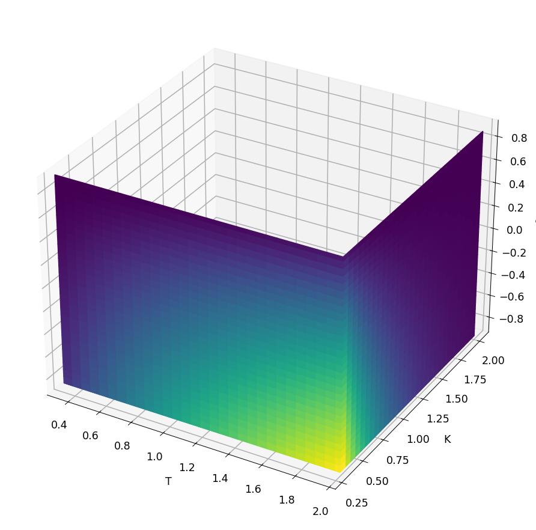

# Spread option in 2D Black-Scholes

[Original MATLAB Chebfun example](https://www.chebfun.org/examples/applics/BlackScholes2D.html)

(Chebfun example applics/BlackScholes2D.m — Kathrin Glau, Behnam
Hashemi, Mirco Mahlstedt, and Christian Poetz, January 2017)

Two stocks follow correlated geometric Brownian motions; the price
of a spread option with payoff $\max(S_1(T)-S_2(T)-K, 0)$ is a 2D
integral. Interpreting the price as a function of the three
calibration parameters $(T, K, \rho)$, we approximate it with a
Chebfun3 at tolerance $10^{-5}$; each sample is a 150×150
Clenshaw-Curtis quadrature of the payoff against the correlated
bivariate normal density.

The resulting Tucker representation has core exactly matching
MATLAB's published `5 x 10 x 7` (MATLAB builds it in 38.8 s):

```text
chebPrice =
   chebfun3 object
 rank (Tucker): 5 x 10 x 7
 domain: [0.3, 2] x [0.3, 2] x [-0.9, 0.9]
Elapsed time is 11.704465 seconds.
```

The function at the slices $T = 2$, $K = 0.3$, $\rho = -0.9$:



## Checking the error

Evaluating the quadrature handle and the chebfun3 on a $15^3$
parameter grid (published: `time_price = 2.07`,
`time_ChebPrice = 0.0076`, `err = 2.5650e-04` — same
$10^{-4}$-level accuracy at the $10^{-5}$ tolerance; the chebfun3
evaluates an order of magnitude faster than the quadrature):

```text
time_price =
    1.8151
time_ChebPrice =
    0.2018
err =
   5.8801e-04
```

## References

1. F. Black and M. Scholes, "The pricing of options and corporate
   liabilities", _Journal of Political Economy_ 81 (1973), 637-654.

2. R. Carmona and V. Durrleman, "Pricing and Hedging Spread
   Options", _SIAM Review_ 45 (2003), 627-685.

3. M. Gass, K. Glau, M. Mahlstedt and M. Mair, "Chebyshev
   interpolation for parametric option pricing", arXiv:1505.04648.

---

*Replica script: [`examples/applics/blackscholes2d_replica.py`](https://github.com/ma-gilles/chebfunjax/blob/main/examples/applics/blackscholes2d_replica.py).
Original example copyright by The University of Oxford and The Chebfun
Developers.*
