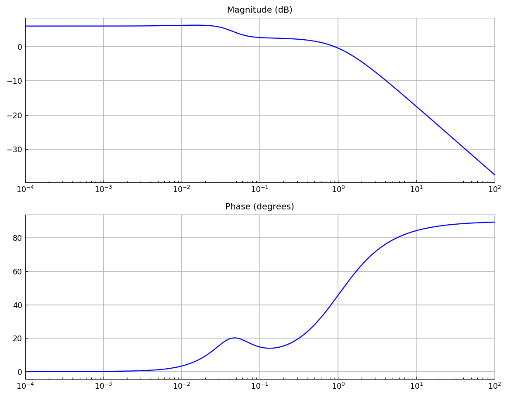
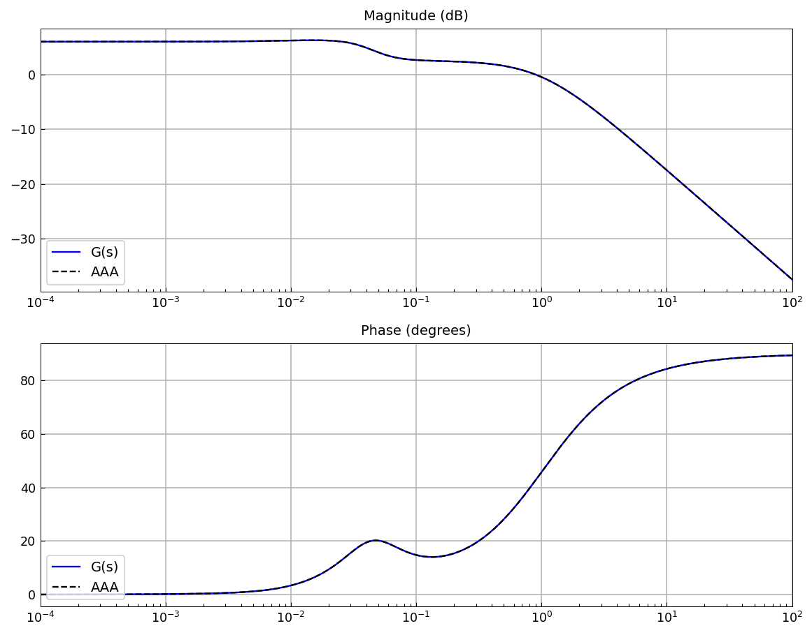
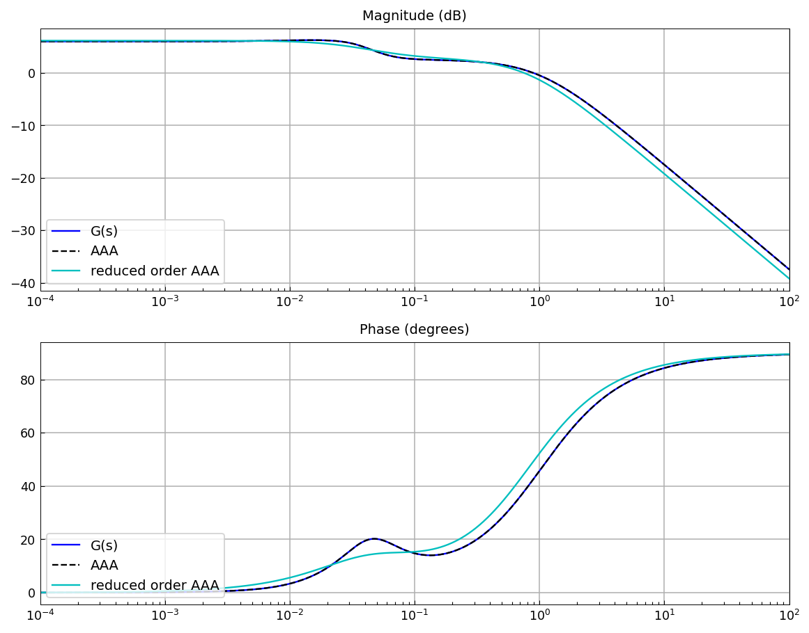
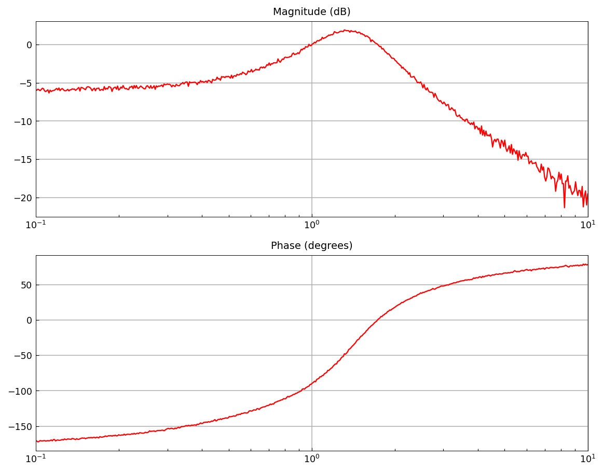
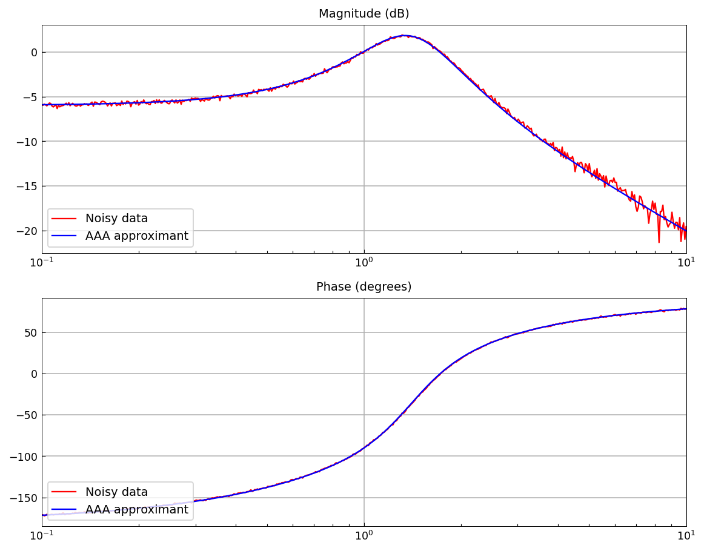
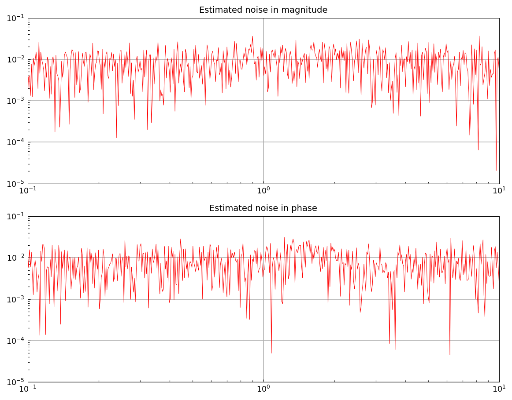

# The AAA algorithm for system identification

[Original MATLAB Chebfun example](https://www.chebfun.org/examples/applics/Bode2tf.html)

(Chebfun example applics/Bode2tf.m — Stefano Costa, August 2021)

The AAA algorithm identifies LTI system parameters — poles, zeros,
DC gain — from Bode plots. Consider the 4th order system with

```text
pol =
 -1.000000000000001 + 0.000000000000000i
 -0.028000000000000 + 0.028565713714171i
 -0.028000000000000 - 0.028565713714171i
 -0.010000000000000 + 0.000000000000000i
zer =
 -0.035000000000000 + 0.035707142142714i
 -0.035000000000000 - 0.035707142142714i
 -0.009523809523810 + 0.000000000000000i
DCgain =
     2
```

Bode plots of magnitude and phase over $10^{-4}\le\omega\le 10^2$:



AAA approximation of the mirrored complex signal recovers the
parameters (all matching the published values to 12+ digits; note
the mirrored signal with negated phase continues to $G(-s)$, so the
identified system parameters are the negatives of the fit's — we
verified in R2025b that MATLAB's `H` likewise has its actual poles
at $+1$ etc. while printing $-1$):

```text
polA =
 -0.999999999999996 - 0.000000000000024i
 -0.027999999999970 - 0.028565713714134i
 -0.010000000000029 - 0.000000000000013i
 -0.028000000000006 + 0.028565713714151i
zerA =
 -0.035000000000000 - 0.035707142142714i
 -0.035000000000000 + 0.035707142142714i
 -0.009523809523810 + 0.000000000000000i
DCgainA =
   1.999999999999999
```



$H(s)$ shows negligible errors in initial data (published
`4.88e-15` / `2.57e-15`):

```text
err_mag =
     3.996802888650564e-15
err_ph =
     2.518167965814833e-15
```

Recomputing poles through real polynomial coefficients keeps them in
complex conjugate pairs:

```text
polA =
 -0.999999999999997 + 0.000000000000000i
 -0.027999999999988 + 0.028565713714142i
 -0.027999999999988 - 0.028565713714142i
 -0.010000000000029 + 0.000000000000000i
```

## Reduced order models

A degree-2 AAA-LS reduction (published `zerAr = -0.294963170363907`,
`polAr = -0.798508392918573, -0.035811189966051`,
`DCgainAr = 2.036869044252427` — all matched to 12-14 digits):

```text
zerAr =
 -0.294963170363625 + 0.000000000000000i
polAr =
 -0.798508392917985 + 0.000000000000000i
 -0.035811189966044 + 0.000000000000000i
DCgainAr =
   2.036869044252420
```



## Noisy data

The scalar example $f(s) = (s-1)/(s^2+s+2)$ sampled at 500 points
with $10^{-2}$ Gaussian noise added to magnitude and phase (seeded
numpy noise; MATLAB's randn stream is not reproducible):



A degree-2 AAA-LS approximant with 30 Lawson iterations filters the
noise:



The denominator coefficients approximate the true $[1, 1, 2]$
(published `[1.000 1.0014 1.9984]` for MATLAB's noise draw):

```text
Dcn =
   1.000000000000000   0.985275415369363   1.973982807942559
```

And the approximant estimates the additive noise itself:



## References

1. S. Costa and L. N. Trefethen, AAA-least squares rational
   approximation and solution of Laplace problems, _Proceedings of
   the 8ECM_, 2021.

2. I. V. Gosea and S. Güttel, Algorithms for the rational
   approximation of matrix-valued functions, arXiv:2003.06410v2,
   2021.

---

*Replica script: [`examples/applics/bode2tf_replica.py`](https://github.com/ma-gilles/chebfunjax/blob/main/examples/applics/bode2tf_replica.py).
Original example copyright by The University of Oxford and The Chebfun
Developers.*
