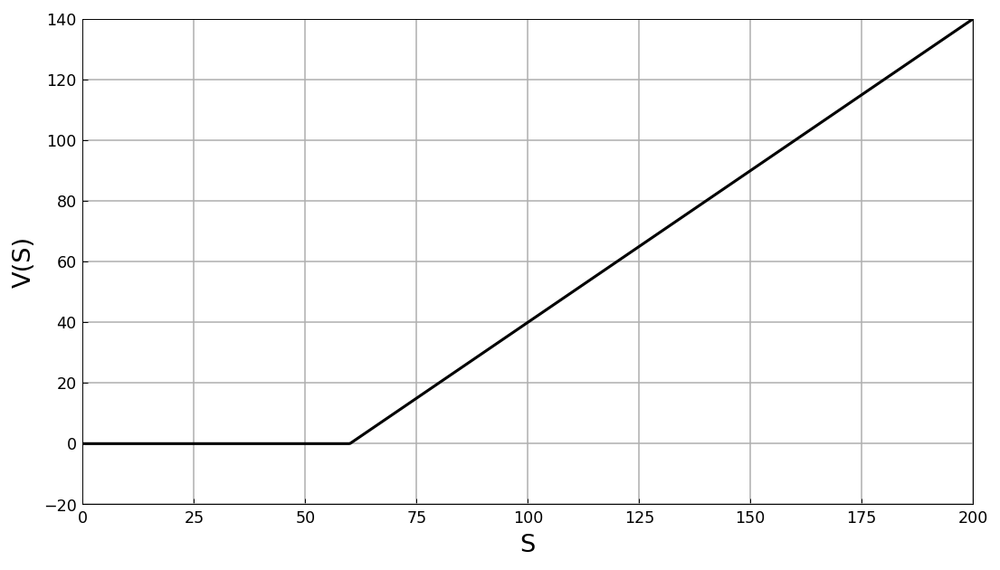
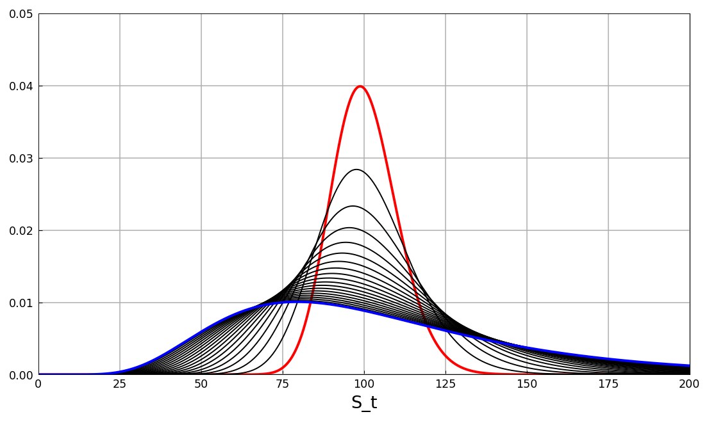
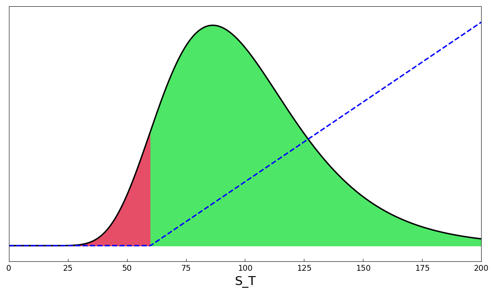
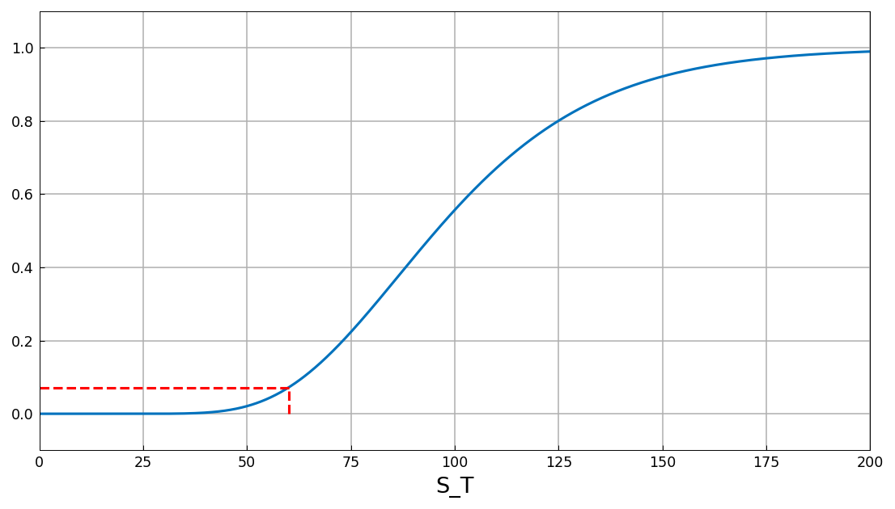
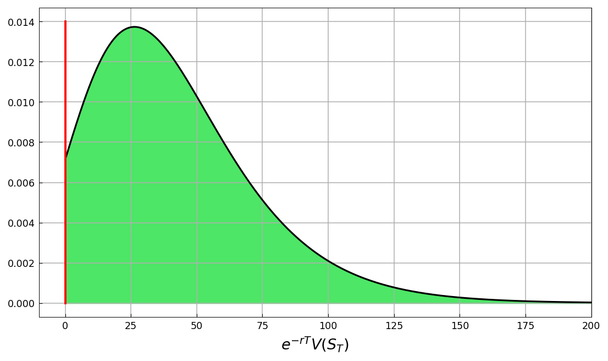
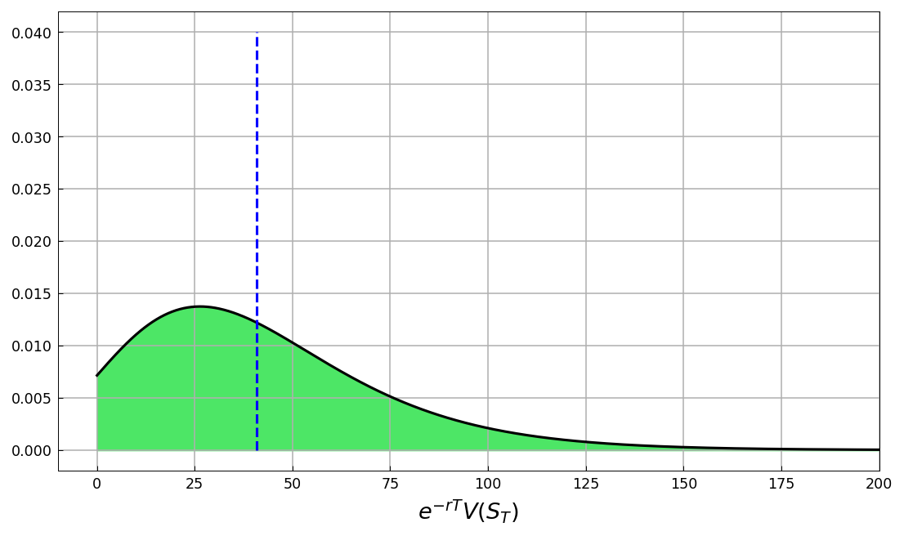

# Pricing of a European Call option

[Original MATLAB Chebfun example](https://www.chebfun.org/examples/applics/EuropeanCall.html)

(Chebfun example applics/EuropeanCall.m — Ricardo Pachon, November
2014)

The price of a European contract is the risk-neutral expectation of
the discounted payoff, $V(S_0) = E^Q[e^{-rT}V(S_T)]$. This example
computes it with chebfuns instead of Monte Carlo.

## A call option on an asset following a GBM

Strike $K = 60$, expiry $T = 0.5$, payoff $\max(0, S_T - K)$:



The geometric Brownian motion gives lognormal densities for the
stock price ($\mu = 0.075$, $\sigma = 0.45$, $S_0 = 100$); red the
PDF at $t = 0.05$, blue at $t = 1$:



The chebfun of the density on $[0, 10000]$ integrates to 1
(published `1.000000000000000`, matched):

```text
ans =
   1.000000000000000
```

## Change to the risk-neutral measure

Replacing the drift $\mu$ by the risk-free rate $r = 0.01$ at
$t = T$ gives the pricing density. The moneyness picture (OOM region
red, ITM green, payoff dashed):



The probability of expiring out-of-the-money, from the CDF at the
strike:

```text
probOOM =
   0.071872726767158
```

(The closed form is $N(z) = 0.071872726767156$: our chebfun value
agrees to 15 digits, while the published `0.071872726768390` carries
a $10^{-12}$ integration error — visible likewise in its total-mass
check below.)



## Distribution of the option payoff at maturity

The PDF of $e^{-rT}V(S_T)$ is a Dirac delta at 0 with weight
`probOOM` plus the shifted ITM density $f(y+K)$:



The undiscounted mass (published `1.000000000001234`; ours):

```text
ans =
   1.000000000000002
```

## Comparison with the Black-Scholes formula

The expected value of the payoff distribution is the call price:

```text
approx = 40.837802467827807
```



Against the Black-Scholes formula (published
`exact = 40.837802467836617`, `approx = 40.837802467835829`):

```text
exact  = 40.837802467836610
approx = 40.837802467827807
```

Both systems price the option to 10-12 significant digits of the
analytic value.

---

*Replica script: [`examples/applics/europeancall_replica.py`](https://github.com/ma-gilles/chebfunjax/blob/main/examples/applics/europeancall_replica.py).
Original example copyright by The University of Oxford and The Chebfun
Developers.*
