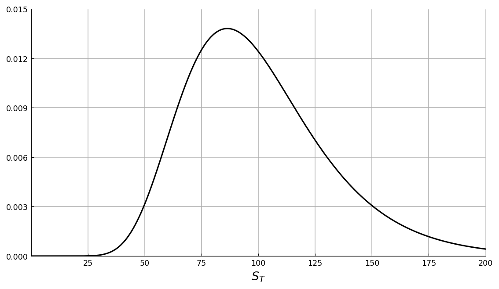
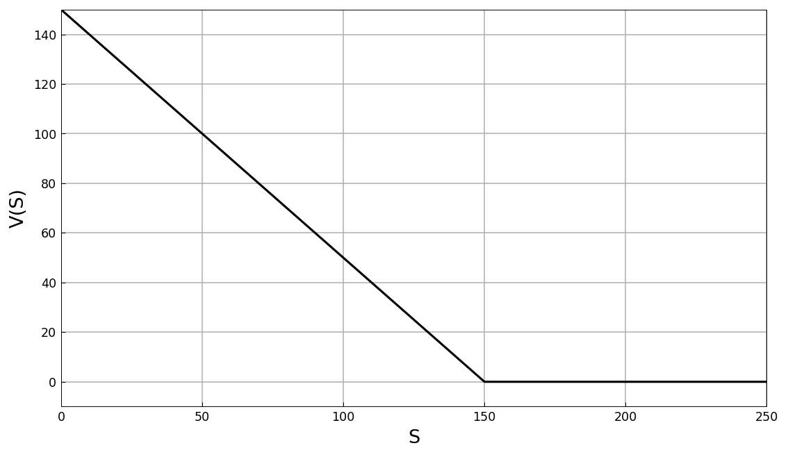
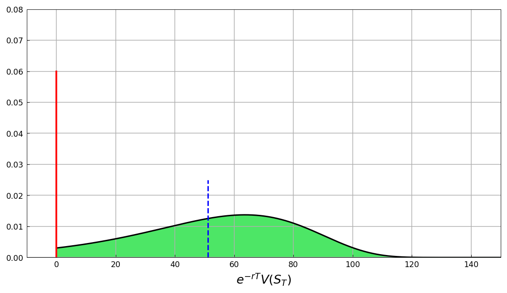
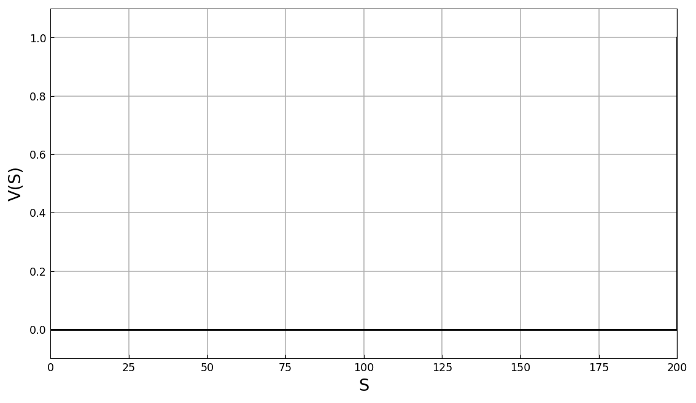
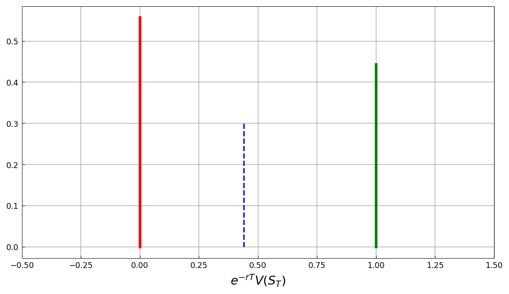
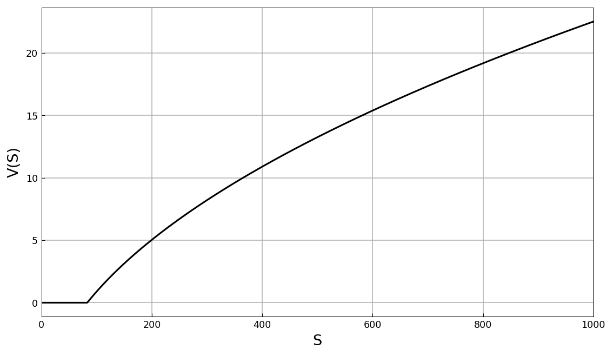
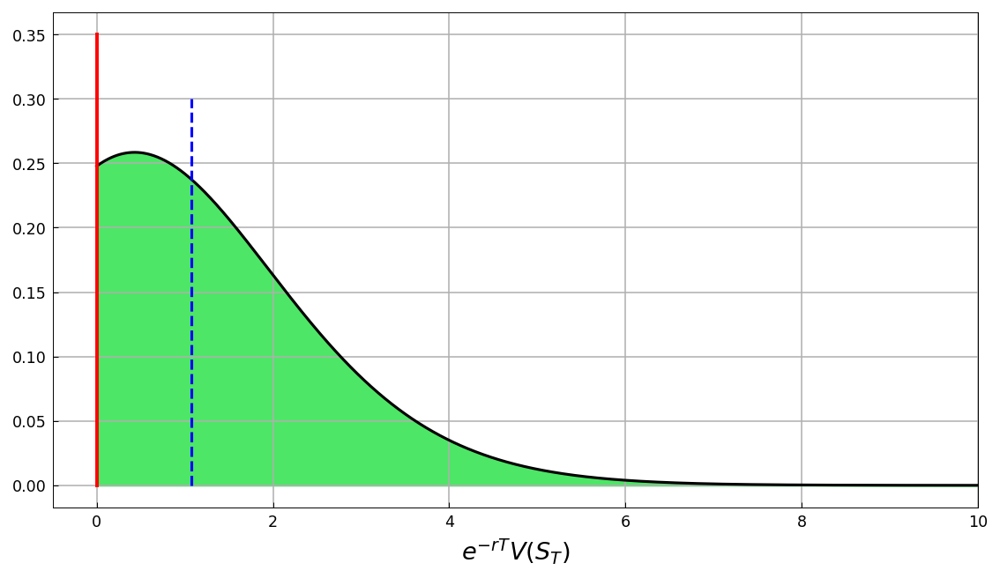

# Pricing other European Options: Puts, Digitals, Powers

[Original MATLAB Chebfun example](https://www.chebfun.org/examples/applics/EuropeanOptions.html)

(Chebfun example applics/EuropeanOptions.m — Ricardo Pachon, December
2014)

The payoff-distribution pricing method of
[Pricing of a European Call option](EuropeanCall.md) applied to
three more contracts, with the lognormal density chebfun on
$[0, 10000]$ ($S_0 = 100$, $\sigma = 0.45$, $r = 0.01$, $T = 0.5$):



## European Put Option

Payoff $\max(0, K-S)$ with $K = 150$:



The OOM region is $[K,\infty)$, with probability (published
`0.078148029367942`, matched to 14 digits):

```text
probOOM =
   0.078148029367944
```

The payoff PDF is a Dirac at 0 plus the transformed ITM density
$f(K-y)$ on $[0, K]$; its expected value prices the put (published
`51.166911483849546`):



```text
approx = 51.166911483849582
exact  = 51.166911483849546
```

## Digital Options

The digital (cash-or-nothing) call pays 1 if $S_T > K$ ($K = 100$):



Its payoff PDF is two Dirac deltas; the price is the discounted ITM
probability (published `0.440783414443267` / exact
`0.440783414443270`):



```text
approx = 0.440783414443268
exact  = 0.440783414443270
```

## Power Options

The power call pays $\max(0, S_T^\alpha - K)$ — here $\alpha = 1/2$,
$K = 9.1$:



The ITM density follows from $g(y) = f(x(y))|dx/dy|$ with
$x = (y+K)^{1/\alpha}$ (published `1.078491451154445`, exact
`1.078491451154441` — ours lands on the exact value to all digits):



```text
approx = 1.078491451154440
exact  = 1.078491451154440
```

---

*Replica script: [`examples/applics/europeanoptions_replica.py`](https://github.com/ma-gilles/chebfunjax/blob/main/examples/applics/europeanoptions_replica.py).
Original example copyright by The University of Oxford and The Chebfun
Developers.*
