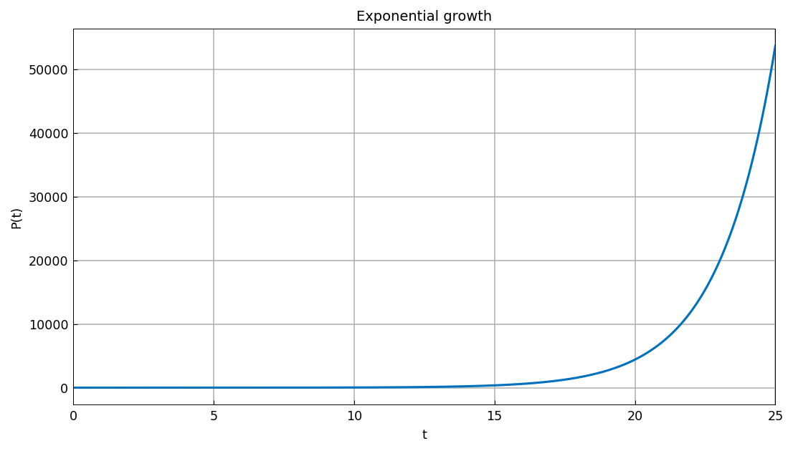
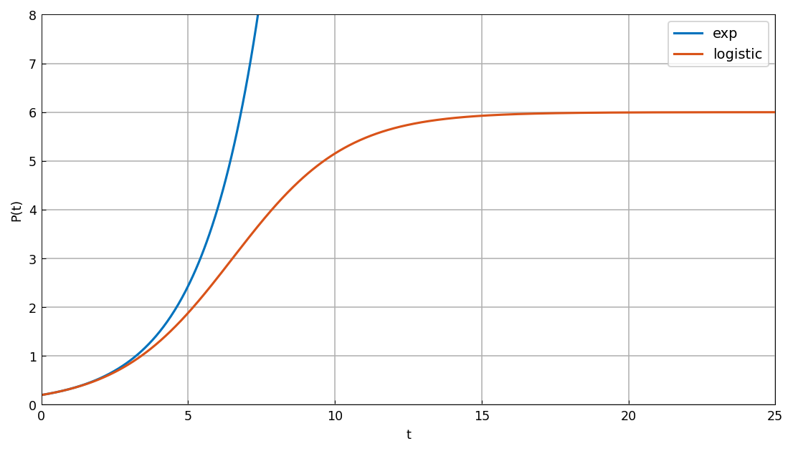
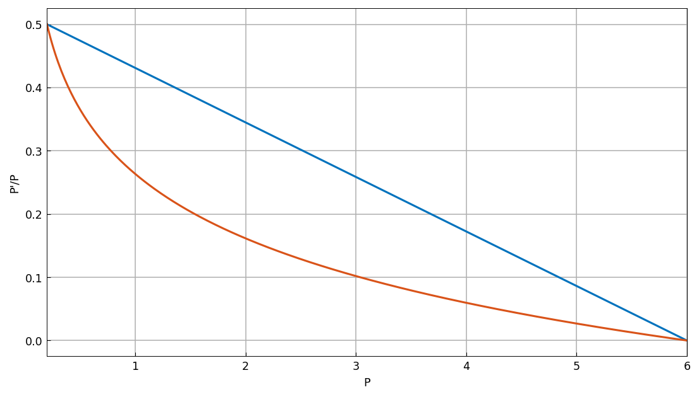
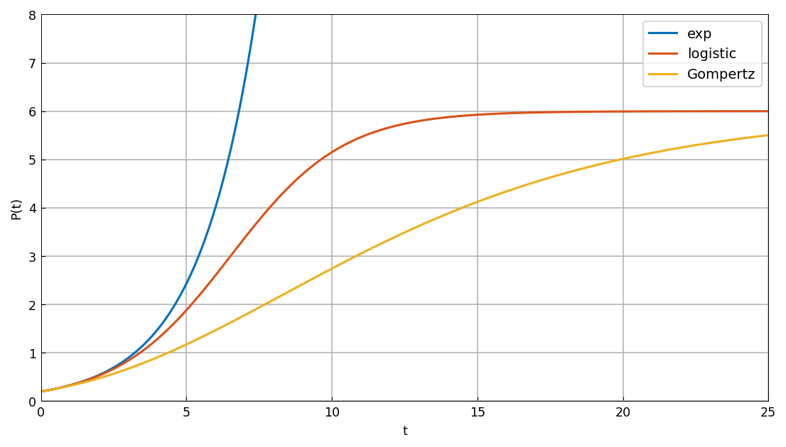

# Exponential, logistic, and Gompertz growth

[Original MATLAB Chebfun example](https://www.chebfun.org/examples/applics/Gompertz.html)

(Chebfun example applics/Gompertz.m — Toby Driscoll, June 15, 2015)

If the per-capita growth rate of a population is held constant,
exponential growth results. Solving the chebop IVP
$P' = 0.5P$, $P(0) = 0.2$ on $[0, 25]$:



The result is unbounded growth, which is not biologically realistic.
The *logistic model* decreases the per-capita rate linearly to zero
as $P$ approaches the carrying capacity (here 6):



The *Gompertz model* instead uses a logarithmic rate, which shuts
down growth more rapidly until $P$ nears the carrying capacity:



The solutions reflect this difference:



Solution accuracy (the exponential case has the analytic solution
$0.2e^{0.5t}$, matched to 9 digits at $t=25$; both limited models
approach the carrying capacity 6):

```text
exponential P(25) = 53667.457336  (exact 53667.4573042)
logistic P(25) = 5.99957865114
Gompertz P(25) = 5.50444713908
```

The Gompertz model has been recognized for some time as a reasonable
model for some tumors [1-2].

## References

1. Laird, A. K. Dynamics of growth in tumors and in normal
   organisms. Natl. Cancer Inst. Monogr. 30: 15-28, 1969.

2. Winsor, C. P. The Gompertz curve as a growth curve. Proc. Natl.
   Acad. Sci. USA 18: 1-7, 1932.

---

*Replica script: [`examples/applics/gompertz_replica.py`](https://github.com/ma-gilles/chebfunjax/blob/main/examples/applics/gompertz_replica.py).
Original example copyright by The University of Oxford and The Chebfun
Developers.*
