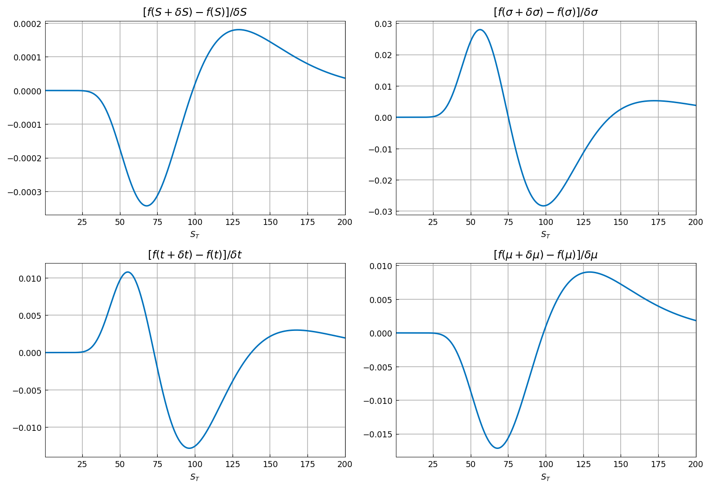
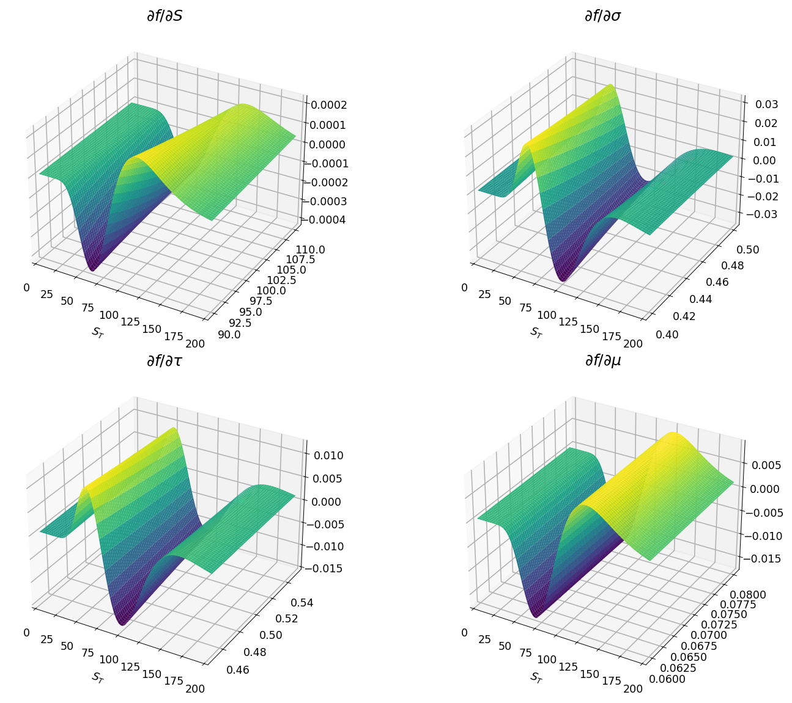
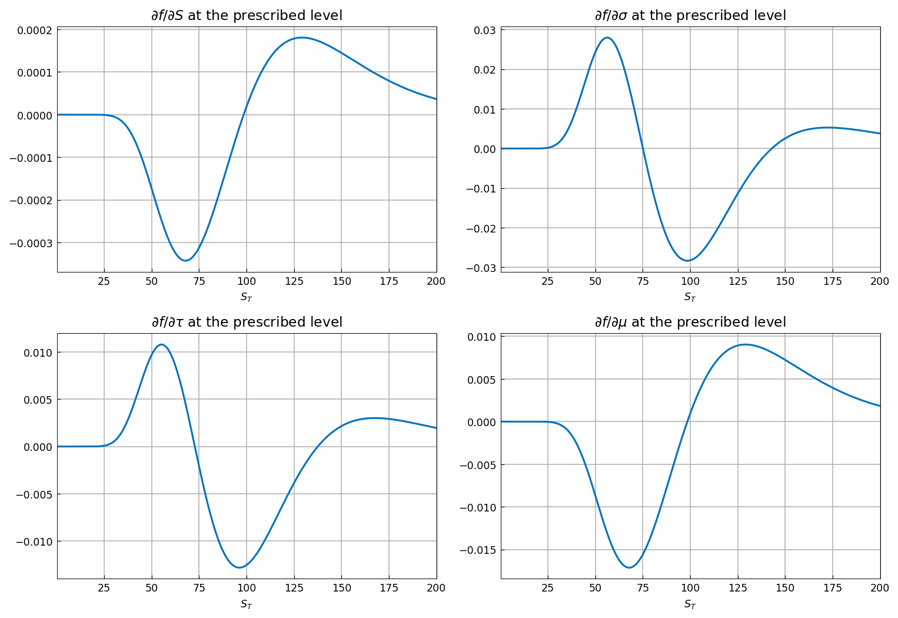
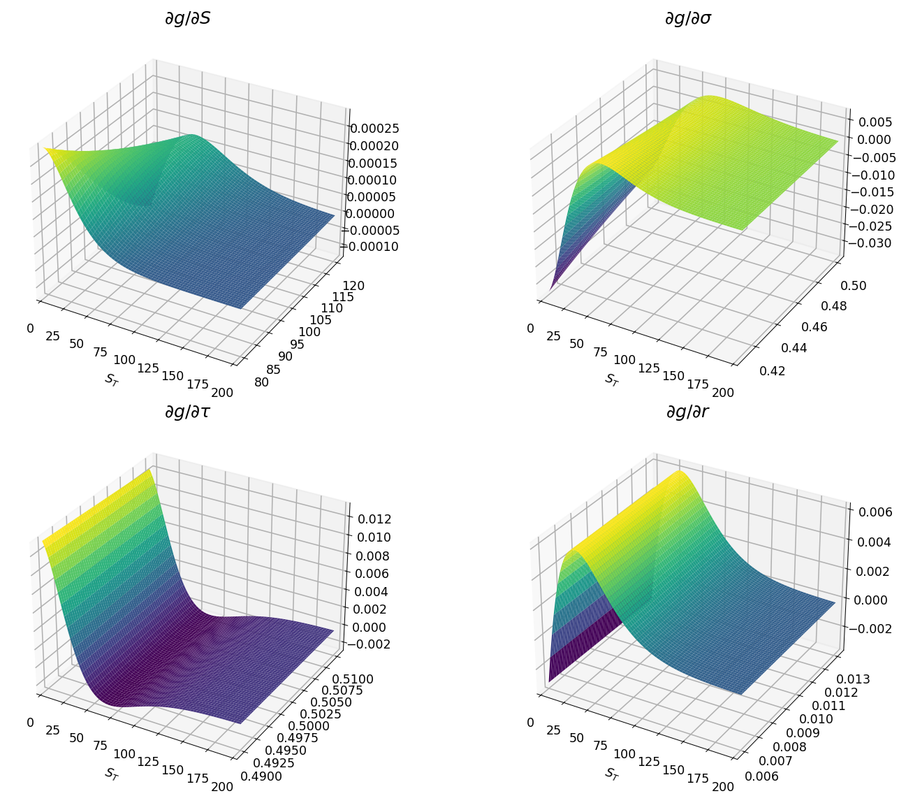
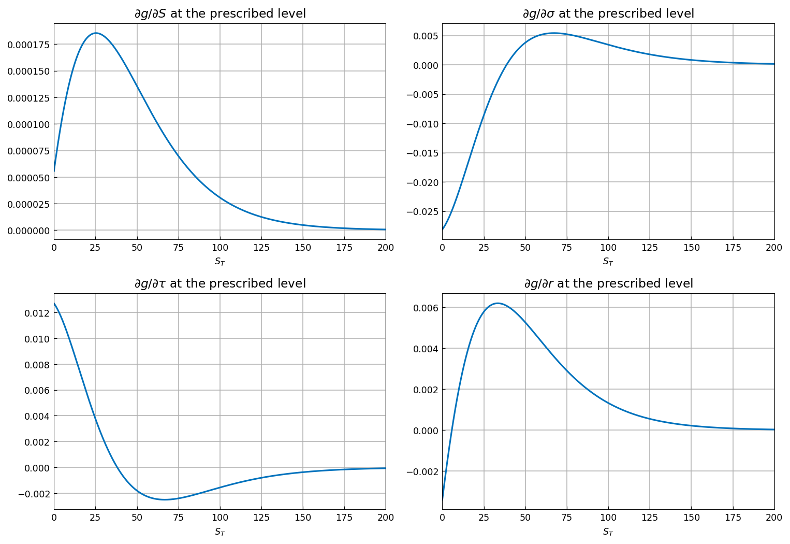

# Accurate Greeks

[Original MATLAB Chebfun example](https://www.chebfun.org/examples/applics/Greeks.html)

(Chebfun example applics/Greeks.m — Ricardo Pachon, December 2014)

The _Greeks_ are the risk sensitivities of a derivative contract —
partial derivatives of its price under small changes of the
underlying or parameters. This example computes them by
differentiating 2D chebfun "slices" of the payoff density.

## Bumping the probability density function

Forward finite differences of the lognormal density in $S_t$,
$\sigma$, $\tau$, and $\mu$:



## Partial derivatives and chebfun2 objects

Chebfun2 slices — two-dimensional sections of the five-dimensional
PDF — differentiated in the second variable with `diff`:



Extracting each partial derivative at the prescribed level
reproduces the finite-difference pictures:



## Calculation of the Greeks

For the call ($K = 100$, domain $[0, 5000]$), the payoff-density
slices in each parameter are differentiated and integrated:




```text
delta approx [call] = 0.569386510531860
vega approx  [call] = 27.781722926082182
theta approx [call] = -12.942559209293456
rho approx   [call] = 22.039170523723868
delta approx [put] = -0.430613479154910
vega approx  [put] = 27.781722919178204
theta approx [put] = -11.947546251017439
rho approx   [put] = -27.711453237195791
```

Against the closed-form Black-Scholes Greeks (put delta matches to
12 digits; the call-side errors sit at $10^{-7}$–$10^{-9}$ — the
same orders as the published table's $10^{-8}$–$10^{-11}$, set by
the chebfun2 construction tolerance on the 5000-wide domain):

```text
                 call                 put
delta exact  : 0.569386520845488    -0.430613479154512
delta approx : 0.569386510531860    -0.430613479154910
delta error  : 1.0314e-08            3.9863e-13
-------------------------------------------------------
vega  exact  : 27.781722924220272    27.781722924220272
vega  approx : 27.781722926082182    27.781722919178204
vega  error  : 1.8619e-09            5.0421e-09
-------------------------------------------------------
theta exact  : -12.942558730342391    -11.947546251149708
theta approx : -12.942559209293456    -11.947546251017439
theta error  : 4.7895e-07            1.3227e-10
-------------------------------------------------------
rho   exact  : 22.039170722163501    -27.711453237470618
rho   approx : 22.039170523723868    -27.711453237195791
rho   error  : 1.9844e-07            2.7483e-10
-------------------------------------------------------
```

---

*Replica script: [`examples/applics/greeks_replica.py`](https://github.com/ma-gilles/chebfunjax/blob/main/examples/applics/greeks_replica.py).
Original example copyright by The University of Oxford and The Chebfun
Developers.*
