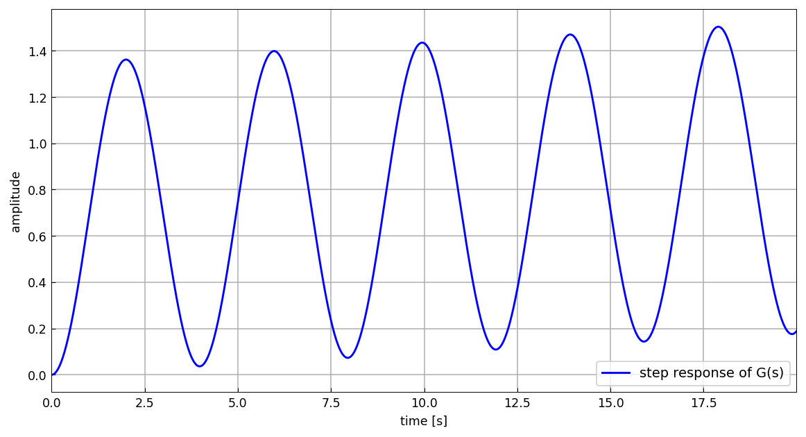
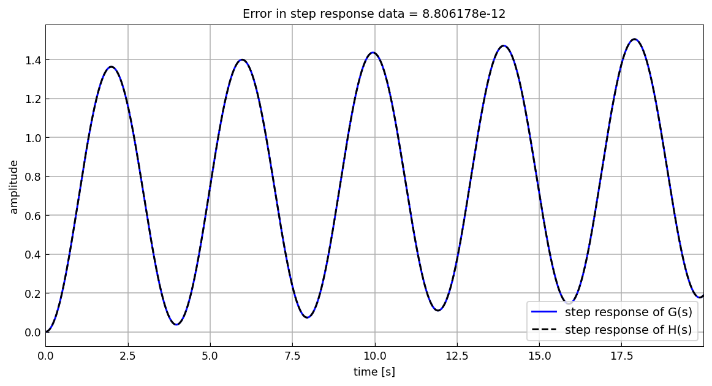
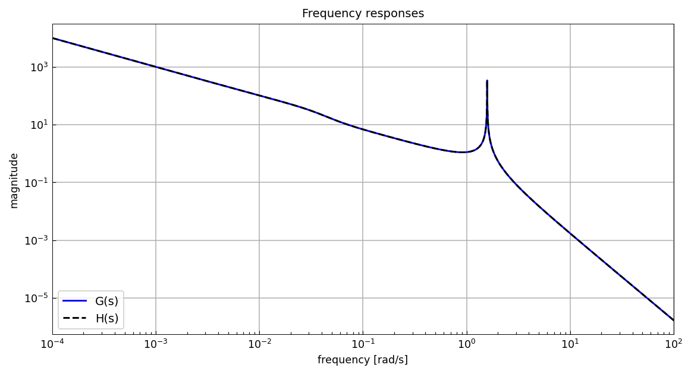
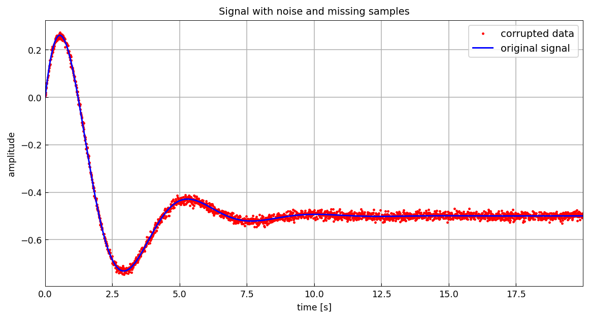
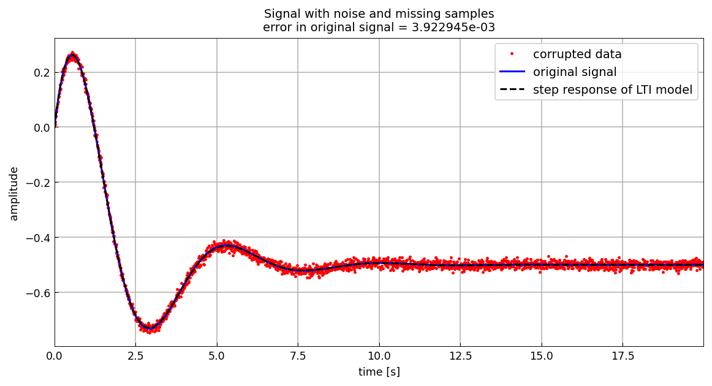

# The AAA algorithm for system identification (2)

[Original MATLAB Chebfun example](https://www.chebfun.org/examples/applics/Step2tf.html)

(Chebfun example applics/Step2tf.m — Stefano Costa, December 2021)

AAA, the FFT, and Vandermonde with Arnoldi (`va_orthog`/`va_eval` in
chebfunjax) together model LTI systems from step-response data. The
test system has an undamped oscillating component. AAA on the
mirrored Laplace-domain step response finds the poles (published
values matched to 12-13 digits; the pure imaginary pair
$\pm 1.581138830084190i$ is exact to all digits):

```text
polG =
  0.000000000000000 + 0.000000000000000i
 -0.000000000000000 - 1.581138830084190i
  0.000000000000000 + 1.581138830084190i
 -0.027999999999936 - 0.028565713713903i
 -0.027999999999530 + 0.028565713714478i
 -0.009999999999668 + 0.000000000000114i
resG =
  0.999999999999995 + 0.000000000000003i
 -0.335984743382253 - 0.002876336047494i
 -0.335984743382235 + 0.002876336047573i
 -0.190680856666953 - 0.018361920803006i
 -0.190680856650043 + 0.018361920803005i
  0.053331200084759 - 0.000000000005555i
```



## Identification from the FFT

Laplace becomes Fourier along the imaginary axis. The single-sided
spectrum of the sampled step response has

```text
fft_length =
  int16
   1281
```

AAA on the mirrored spectrum, with pole recomputation for stability,
catches all poles (published `polH` matched):

```text
polH =
 -0.000000000000026 + 1.581138830084230i
 -0.000000000000026 - 1.581138830084230i
 -0.027999966136515 + 0.028565696081965i
 -0.027999966136515 - 0.028565696081965i
 -0.010001512632876 + 0.000000000000000i
  0.000000000000000 + 0.000000000000000i
```

Least squares directly on the original signal recomputes the
residues, and the identified model deviates from the original step
response by only (published `1.98e-11`):

```text
err =
     8.806178009024279e-12
```




## Noisy data with missing samples

The scalar example $\frac{1}{s}\frac{s-1}{s^2+s+2}$ (original poles
$-0.5 \pm 1.322875655532295i$) is polluted with $10^{-2}$ Gaussian
noise and 15% of samples dropped (seeded numpy draws; MATLAB's
rng(1) stream is not reproducible outside MATLAB):



Vandermonde with Arnoldi smooths the noise on the irregular grid
(published deviation `0.0067` for MATLAB's draw):

```text
err =
   0.005530411461698
```

A degree-4 AAA model of the FFT of the smoothed signal recovers the
dominant conjugate pair near the true $-0.5\pm 1.3229i$ (published
$-0.4937\pm 1.3297i$, plus a small-residue extra pole):

```text
polF =
 -9.301784301164187 + 0.000000000000000i
 -0.506411290449917 + 1.319192957610542i
 -0.506411290449917 - 1.319192957610542i
  0.000000000000000 + 0.000000000000000i
resF =
 -0.011013764183661 + 0.000000000000001i
  0.253978757185333 - 0.472964580162253i
  0.253978757185333 + 0.472964580162252i
 -0.500245090369667 + 0.000000000000000i
err =
   0.003922944724282
```



## References

1. S. Costa and L. N. Trefethen, AAA-least squares rational
   approximation and solution of Laplace problems, _Proceedings of
   the 8ECM_, 2021.

---

*Replica script: [`examples/applics/step2tf_replica.py`](https://github.com/ma-gilles/chebfunjax/blob/main/examples/applics/step2tf_replica.py).
Original example copyright by The University of Oxford and The Chebfun
Developers.*
