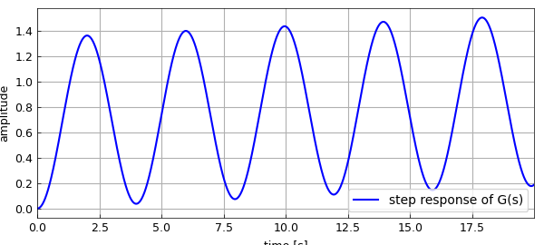
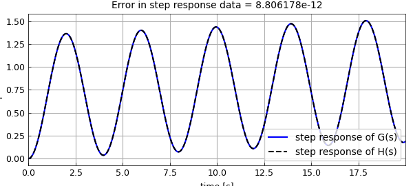
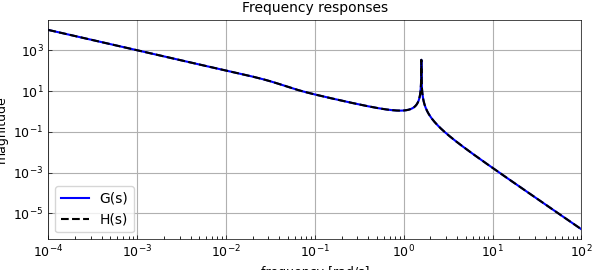
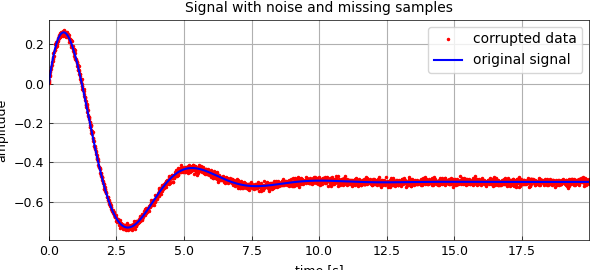
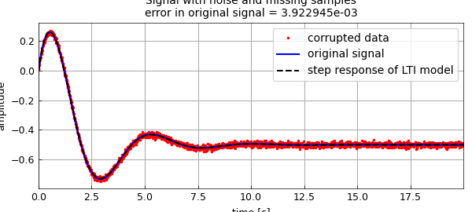

# The AAA algorithm for system identification (2)

*Stefano Costa, December 2021*

[Original MATLAB Chebfun example](https://www.chebfun.org/examples/applics/Step2tf.html)

Python translation: [`examples/applics/step2tf.py`](https://github.com/ma-gilles/chebfunjax/blob/main/examples/applics/step2tf.py)

The AAA algorithm, the FFT, and Vandermonde with Arnoldi can be effectively employed together for modelling LTI (Linear Time-Invariant) systems from their response to standard input signals, typically step functions, which is a common practice in engineering. This example is a companion, and complement, to the previous "The AAA algorithm for system identification".

```matlab
tic
```

The following is a LTI system transfer function in the Laplace domain, featuring an undamped oscillating component: $$ G(s) = \frac{(1+105s)(1+\frac{1.4}{0.05}s+ \frac{1}{0.05^2}s^2)}{(1+100s)(1+\frac{1.4}{0.04}s+\frac{1}{0.04^2}s^2)(1+0.4s^2)}. $$

```matlab
Num = @(s) (1+105*s).*(1+28*s+400*s.^2);
Den = @(s) (1+100*s).*(1+35*s+625*s.^2).*(1+0.4*s.^2);
G = @(s) Num(s)./Den(s);  % system transfer function
Stp = @(s) 1./s;          % L-transform of unit step
```

Here are the numerical conditions:

```matlab
Fs = 128;                 % sampling frequency
t = [0:1/Fs:20-1/Fs];     % time interval
L = length(t);            % nr. of samples
w = logspace(-4,2,6000);  % frequency interval
warning off
```

We compute the step response in the Laplace domain and AAA-approximate the result to find the poles; samples are mirrored in order to enforce symmetry. Hence the signal in the time domain: $$ {\mathcal{L}}^{-1} \left( \sum_n\frac{c_n}{s-a_n}\right) = \sum_n c_n\,e^{a_nt}. $$ Note that the effect of the dominant conjugate poles is almost completely obfuscated by the undamped oscillations due to the purely complex pair.

```matlab
GS = Stp(1i*w).*G(1i*w);
[~,polG,resG] = aaa([fliplr(conj(GS)) GS],1i*[-fliplr(w) w],'lawson',0);
[~,k] = min(abs(polG)); polG(k) = 0           % fix pole of step input
polG = polG.'; resG
g = @(x) real(exp(x(:)*polG)*resG);           % step response

LW = 'linewidth'; MS = 'markersize'; LO = 'location';
SE = 'southeast'; SW = 'southwest'; NE = 'northeast';
plot(t,g(t),'b-',LW,1.5), grid on, xlabel('time [s]'), ylabel('amplitude'),
legend('step response of G(s)',LO,SE)
```

```text
polG =
  0.000000000000000 + 0.000000000000000i
 -0.000000000000000 - 1.581138830084190i
  0.000000000000000 + 1.581138830084190i
 -0.027999999999936 - 0.028565713713903i
 -0.027999999999530 + 0.028565713714478i
 -0.009999999999668 + 0.000000000000114i
resG =
  0.999999999999995 + 0.000000000000003i
 -0.335984743382253 - 0.002876336047494i
 -0.335984743382235 + 0.002876336047573i
 -0.190680856666953 - 0.018361920803006i
 -0.190680856650043 + 0.018361920803005i
  0.053331200084759 - 0.000000000005555i
```



Laplace becomes Fourier along the imaginary axis: $$ {{L}}{g(t)}(s=j\omega) = {{F}}{g(t)}(\omega). $$ We extract the single-sided spectrum from the FFT and AAA-approximate it. We don't even need to restrict the maximum degree, notwithstanding the low coefficient number. All poles are caught nicely, and the AAA-LS procedure [1] can be applied to identify our approximation $H(s)$.

```matlab
Y = fft(g(t)).';
hY = Y(1:L/2+1)/L;
F = 2*pi*Fs*(0:L/2)/L;
fft_length = int16(length(hY))

[~,polH] = aaa([fliplr(conj(hY)) hY],[-fliplr(1i*F) 1i*F],'lawson',0);
polH = roots(real(poly(polH)));                 % pole recomputation
k = find(real(polH)>0); polH(k) = -polH(k)';    % force system stability, Re>0
polH(abs(polH)>max(F)) = [];                    % expunge nonsense frequencies
[~,k] = min(abs(polH)); polH(k) = 0             % fix pole of step input
```

```text
fft_length =
  int16
   1281
polH =
 -0.000000000000026 + 1.581138830084230i
 -0.000000000000026 - 1.581138830084230i
 -0.027999966136515 + 0.028565696081965i
 -0.027999966136515 - 0.028565696081965i
 -0.010001512632876 + 0.000000000000000i
  0.000000000000000 + 0.000000000000000i
```

Here's a better idea: let's do LS directly on the original signal, and exploit all available data to recompute residues!

```matlab
Q = exp(t(:)*polH.');
resH = Q\g(t)

H = @(s) 1./(s(:)-polH.')*resH;     % identified LTI system
h = @(x) (exp(x(:)*polH.'))*resH;   % step response of identified system
err = norm(abs(g(t)-h(t)),inf)      % deviation from original step response

hold on, plot(t,h(t),'k--',LW,1.5), hold off
title(sprintf('Error in step response data = %d',err))
legend('step response of G(s)','step response of H(s)',LO,SE)
snapnow
loglog(w,abs(GS),'b-',LW,1.5), hold on
loglog(w,abs(H(1i*w)),'k--',LW,1.5), grid on, hold off
title(sprintf('Frequency responses')), legend('G(s)','H(s)',LO,SW)
xlabel('frequency [rad/s]'), ylabel('magnitude')
```

```text
resH =
  1.000003916334309 - 0.000000000000021i
 -0.335984743382734 - 0.002876336047692i
 -0.335984743382734 + 0.002876336047692i
 -0.190681541749858 + 0.018361411508316i
 -0.190681541749857 - 0.018361411508328i
  0.053328653942687 + 0.000000000000032i
err =
     8.806178009024279e-12
```





The reconstruction works effectively also in the presence of noisy or missing data. Consider the scalar example with noise found in [2], an LTI system with the following step response in the time domain: $$ {\mathcal{L}}^{-1} \left( \frac{1}{s}\frac{s-1}{s^2+s+2} \right) = \frac{e^{-t/2}\left(5\sin(\sqrt7t/2)+\sqrt7\cos(\sqrt7t/2)\right)}{2\sqrt7}-\frac{1}{2}. $$ The original system poles are a complex conjugate pair:

```matlab
poles = roots([1 1 2])
```

```text
poles =
 -0.500000000000000 + 1.322875655532295i
 -0.500000000000000 - 1.322875655532295i
```

We pollute the signal with normally distributed noise with a standard deviation of $10^{-2}$, and drop a random 15% of samples.

```matlab
f = @(x) exp(-x(:)/2).*(5*sin(sqrt(7)*x(:)/2)+...
  sqrt(7)*cos(sqrt(7)*x(:)/2))/(2*sqrt(7))-0.5;
rng(1)
data = f(t)+0.01*randn(L,1);              % add Gaussian noise
k = unique(randi([1,L],1,ceil(L*0.15)));  % drop 15% of samples
data(k) = [];
tt = t; tt(k) = [];

plot(tt,data,'r.',MS,3), grid on, hold on, plot(t,f(t),'b-',LW,1.5)
title(sprintf('Signal with noise and missing samples'))
legend('corrupted data','original signal',LO,NE)
xlabel('time [s]'), ylabel('amplitude')
```



Here we face two issues. Applying the FFT directly is out of the question, since samples are missing, so we could think of AAA-approximating the noisy data on a regular grid, and exploiting the filtering effect of Lawson iteration at the same time. However, it is difficult to guess a sensible maximum degree, and keep timings reasonable. Here another powerful tool comes to the rescue: Vandermonde with Arnoldi [3] can do away with noise decently in very little time.

```matlab
[Hes,R] = VAorthog(tt(:),30);
y = VAeval(t(:),Hes)*(R\data(:));
err = norm(abs(f(t(:))-y),inf)
```

```text
err =
   0.005530411461698
```

We now proceed just as above, this time with a limit on the order of the model $F(s)$. We require a 3rd order approximation, the original system being of order 2, plus one pole for the step input, degree 4 in total. The extra pole turns up close to the imaginary axis, with a small residue, indicating it has little moment indeed.

```matlab
Yf = fft(y).';
hYf = Yf(1:L/2+1)/L;
Ff = 2*pi*Fs*(0:L/2)/L;

[~,polF] = aaa([fliplr(conj(hYf)) hYf],[-fliplr(1i*Ff) 1i*Ff],'degree',4,'lawson',0);
polF = roots(real(poly(polF)));                 % pole recomputation
k = find(real(polF)>0); polF(k) = -polF(k)';    % force system stability, Re>0
polF(abs(polF)>max(Ff)) = [];                   % expunge nonsense frequencies
[~,k] = min(abs(polF)); polF(k) = 0             % fix pole of step input
Qf = exp(tt(:)*polF.');                         % residues from corrupted data
resF = Qf\data
```

```text
polF =
 -9.301784301164187 + 0.000000000000000i
 -0.506411290449917 + 1.319192957610542i
 -0.506411290449917 - 1.319192957610542i
  0.000000000000000 + 0.000000000000000i
resF =
 -0.011013764183661 + 0.000000000000001i
  0.253978757185333 - 0.472964580162253i
  0.253978757185333 + 0.472964580162252i
 -0.500245090369667 + 0.000000000000000i
```

The original, uncorrupted signal is decently restored, and the LTI system identified.

```matlab
ff = @(x) (exp(x(:)*polF.'))*resF;    % step response of identified system
err = norm(abs(f(t)-ff(t)),inf)       % deviation from uncorrupted step response
plot(t,ff(t),'k--',LW,1.5), hold off
title(sprintf(['Signal with noise and missing samples\n' ...
    'error in original signal = %d'],err))
legend('corrupted data','original signal','step response of LTI model',LO,NE)

disp('For this example:'), toc
```

```text
err =
   0.003922944724282
For this example:
Elapsed time is 1.436843 seconds.
```



[1] S. Costa and L. N. Trefethen, AAA-least squares rational approximation and solution of Laplace problems, *Proceedings of the 8ECM*, 2021.

[2] I. V. Gosea and S. Güttel, Algorithms for the rational approximation of matrix-valued functions, *SIAM J. Sci. Comput.*, 43 (2021).

[3] P. D. Brubeck, Y. Nakatsukasa, and L. N. Trefethen, Vandermonde with Arnoldi, *SIAM Rev.*, 63 (2021).

---

*Translated with [chebfunjax](https://github.com/ma-gilles/chebfunjax); prose and MATLAB code from the original example, copyright The University of Oxford and The Chebfun Developers.  Printed outputs and figures are chebfunjax's.*
