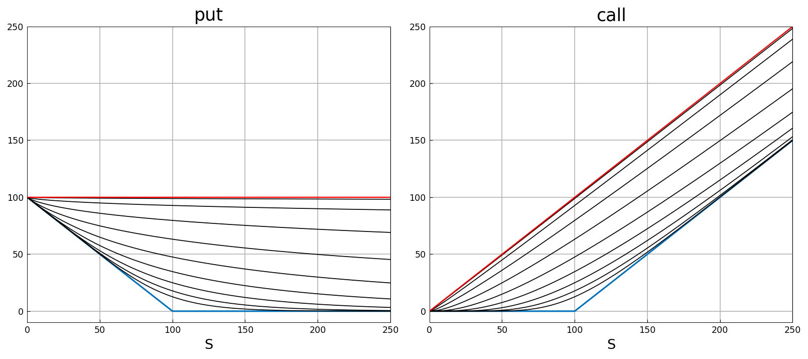
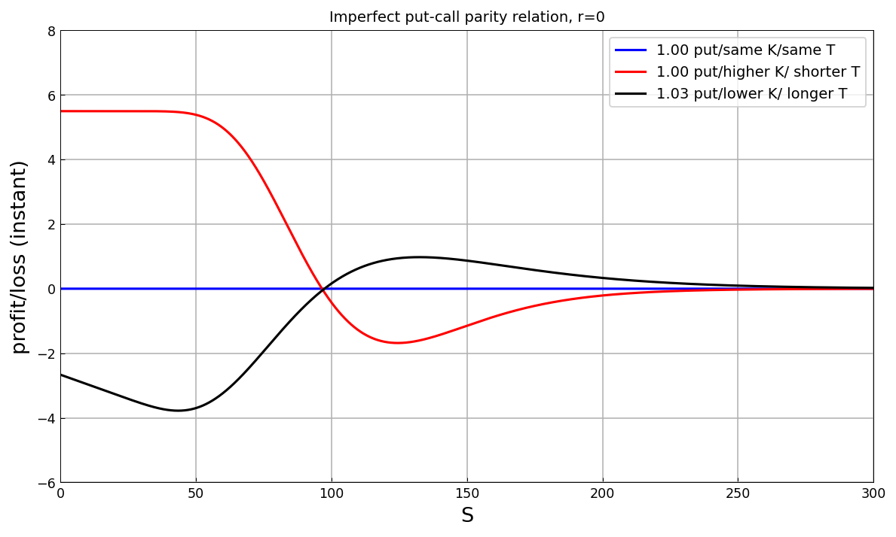
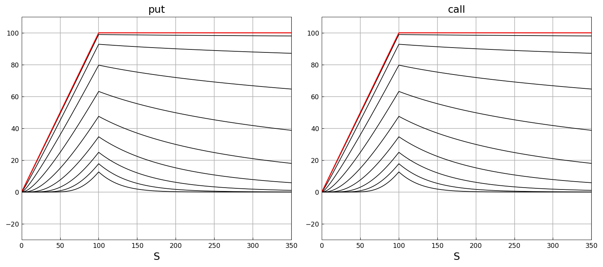
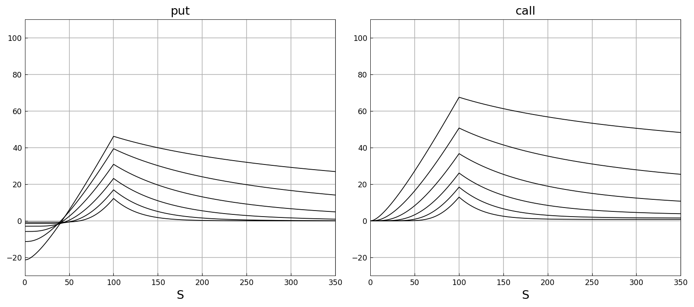
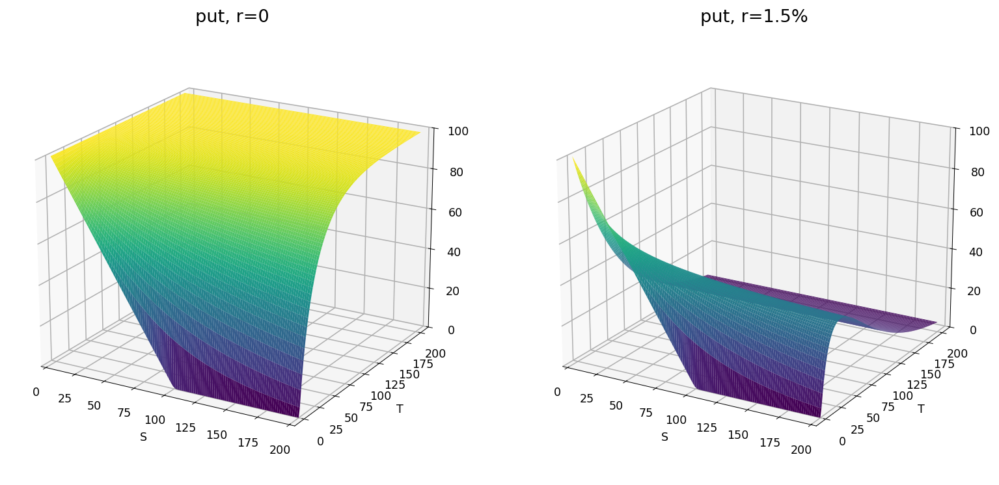
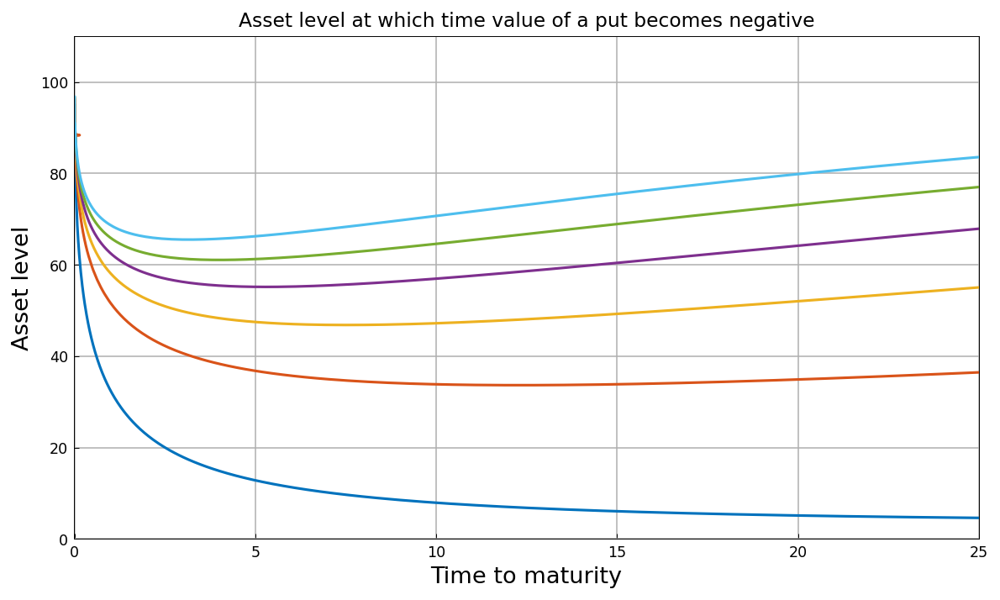
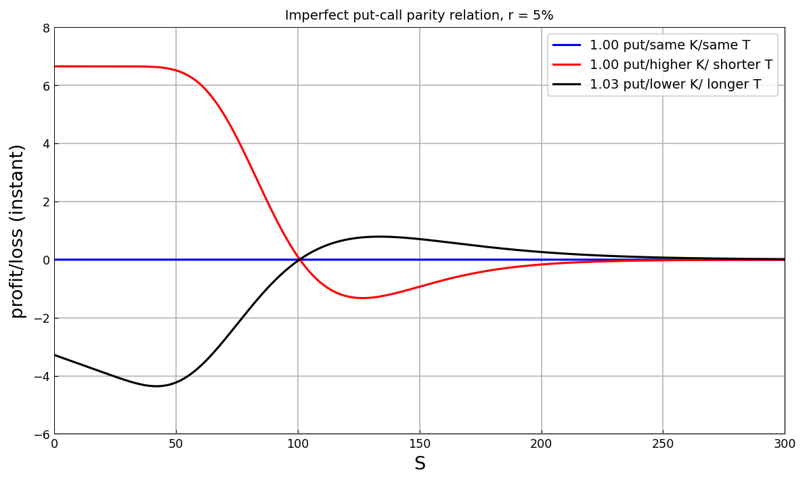

# Exploring Vanilla Options

[Original MATLAB Chebfun example](https://www.chebfun.org/examples/applics/VanillaOptions.html)

(Chebfun example applics/VanillaOptions.m — Ricardo Pachon, December
2014)

Call and put option prices in the Black-Scholes framework, explored
as functions of the underlying with everything else tweakable.

## Zero interest rate

Prices vs the underlying for expiries $2^{-1},\dots,2^8$ (black) and
$T = 1000$ (red), payoffs in blue ($K = 100$, $\sigma = 0.45$):



## Put-call parity

$C = P + S - K$ suggests hedging a sold call with a put, the asset,
and a loan. Three imperfect variants (different put strikes and
maturities):



Maximum instant losses and their price levels (published
`-1.6817 at 124.433` and `-3.7783 at 43.4027` — matched exactly):

```text
Max loss stgy 2: -1.6817 at 124.4330
Max loss stgy 3: -3.7783 at 43.4027
```

## Implicit and time value

The time value (price minus implicit value) is the same for calls
and puts when rates are zero, always positive, greatest at the
strike:



## Non-zero interest rates

At $r = 1.5\%$ the behaviour changes completely — the call's time
value plateaus at $K - Ke^{-rT}$ to the right of the strike, and the
put's time value goes negative to the left (the germ of the American
option's early-exercise feature):



The put price as a chebfun2 of $(S, T)$, with $r = 0$ and
$r = 1.5\%$:



The asset level at which the time value of a put becomes negative,
from the `roots` of a chebfun2, for rates from 0.05% to 5.5%:



## Put-call parity (again)

With $r = 5\%$ the parity is $C = P + S - Ke^{-rT}$; repeating the
imperfect hedges (published `-1.3221 at 126.6522` and
`-4.3586 at 41.9083` — matched exactly):



```text
Max loss stgy 2: -1.3221 at 126.6522
Max loss stgy 3: -4.3586 at 41.9083
```

---

*Replica script: [`examples/applics/vanillaoptions_replica.py`](https://github.com/ma-gilles/chebfunjax/blob/main/examples/applics/vanillaoptions_replica.py).
Original example copyright by The University of Oxford and The Chebfun
Developers.*
