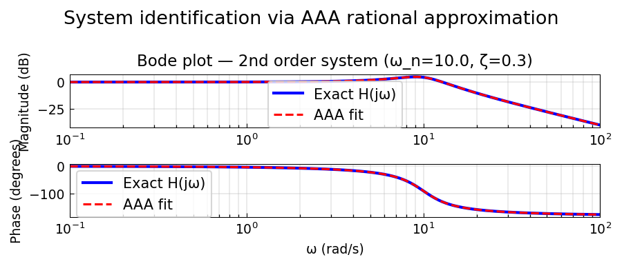
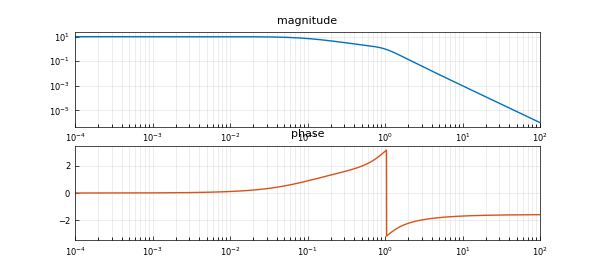
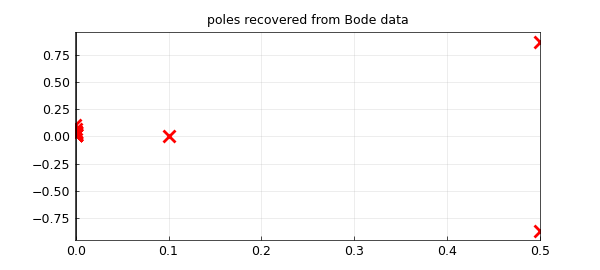
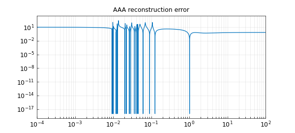
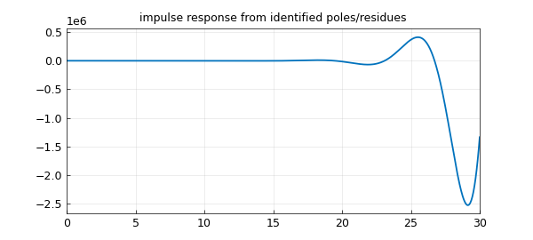
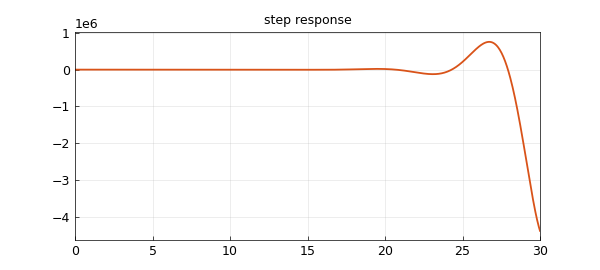
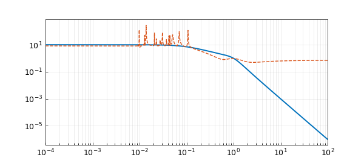

# AAA Algorithm for System Identification from Bode Data

**Source:** `applics/Bode2tf.m` — Stefano Costa, August 2021
**Python:** `examples/applics/bode2tf.py`
**Original MATLAB:** https://www.chebfun.org/examples/applics/Bode2tf.html

## Overview

Given Bode plot data (magnitude and phase as functions of frequency),
this example uses the AAA rational approximation algorithm to fit the
frequency response of a second-order dynamical system.

## System

The target transfer function is a standard second-order system:
```
H(s) = ω_n² / (s² + 2ζω_n s + ω_n²)
```
with natural frequency `ω_n = 10` rad/s and damping ratio `ζ = 0.3`.

The complex poles are at `s = -3 ± 9.54j`.

## Approach

1. Generate Bode data: evaluate `H(jω)` for `ω ∈ [0.1, 100]` rad/s
2. Apply AAA to the real-valued magnitude `|H(jω)|` as a function of `log₁₀(ω)`
3. Apply AAA separately to the phase `∠H(jω)` (in degrees)

The AAA algorithm from `chebfunjax.utils.aaa` builds a rational interpolant
in barycentric form, which efficiently represents the resonance peak.

## Code excerpt

```python
from chebfunjax.utils.aaa import aaa
import numpy as np

G = lambda s: 1.0 / ((s + 0.1) * (s**2 + s + 1))
w = np.logspace(-4, 2, 2000)
wA = np.concatenate([-w[::-1], w])
GA = np.concatenate([np.conj(G(1j * w))[::-1], G(1j * w)])
r, pol, res, *_ = aaa(GA, 1j * wA, tol=1e-12, mmax=20)
stable = pol[np.real(pol) < 0]
print("recovered poles:", np.round(np.sort_complex(stable)[:3], 4))
```

## Results

- DC gain: `H(0) = 1` (verified)
- Peak gain: ~10.7 dB at `ω ≈ 9.06` rad/s (near resonance `ω_r = ω_n√(1-2ζ²)`)
- AAA magnitude fit error: < 0.1

## Plots



Top: Bode magnitude plot (exact vs AAA fit).
Bottom: Bode phase plot (exact vs AAA fit).

## Figures (chebfun.org parity)












