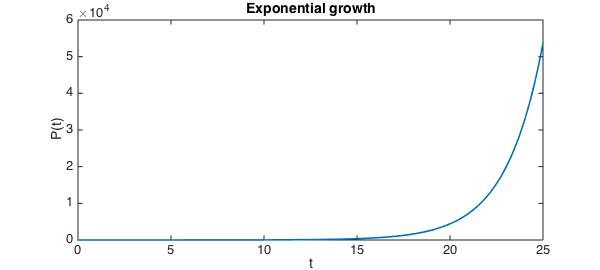
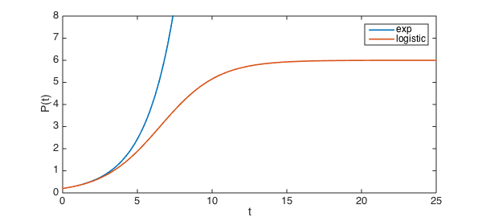
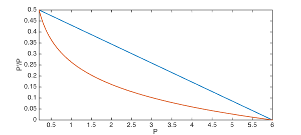
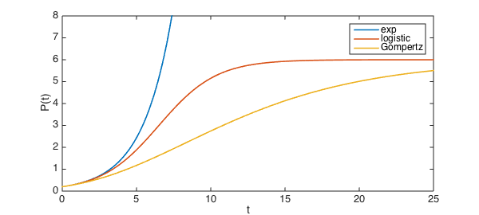

<!-- Generated by scripts/sync_chebfun_examples.py. -->
<!-- Source: https://www.chebfun.org/examples/applics/Gompertz.html -->

<h1>Exponential, logistic, and Gompertz growth</h1>
<h2>Toby Driscoll, June 15, 2015 in <a href='../'>applics</a><a href='/examples/applics/Gompertz.m'>download</a>·<a href='//github.com/chebfun/examples/blob/master/applics/Gompertz.m'>view on GitHub</a></h2>

If the per-capita growth rate of a population is held constant, exponential growth of the population results.

<pre class="mcode-input">exponentialPCRate = @(P) 0.5;
N = chebop( @(t,P) diff(P) - P.*exponentialPCRate(P), [0 25] );
N.lbc = 0.2;
exponentialResult = N\0;
plot( exponentialResult )
xlabel('t'), ylabel('P(t)'), title('Exponential growth')</pre>

The result is unbounded growth, which is not biologically realistic. A common way to remedy this defect is the <em>logistic model</em>. In this model, the per capita growth rate decreases linearly to zero as the population $P$ approaches a fixed value, known as the <em>carrying capacity</em>. For example, a carrying capacity of $P=6$ is imposed through

<pre class="mcode-input">logisticPCRate = @(P) 0.5*(6-P)/5.8;</pre>

Here is the resulting growth.

<pre class="mcode-input">N = chebop( @(t,P) diff(P) - P.*logisticPCRate(P), [0 25] );
N.lbc = 0.2;
logisticResult = N\0;
plot( [exponentialResult, logisticResult] )
ylim([0 8])
xlabel('t'), ylabel('P(t)'), legend('exp','logistic')</pre>

The logistic model is appealingly simple and adequate for some situations, but it is far too generic to capture other phenomena. Another way to limit growth is the <em>Gompertz model</em>, in which, for example,

<pre class="mcode-input">GompertzPCRate = @(P) 0.5*log(6./P)/log(6/0.2);</pre>

Compared to the logistic model, the Gompertz model shuts down growth more rapidly until $P$ gets close to the carrying capacity.

<pre class="mcode-input">plot( chebfun(logisticPCRate,[0.2 6]) ), hold on
plot( chebfun(GompertzPCRate,[0.2 6]) )
xlabel('P'), ylabel('P''/P')</pre>

The solutions reflect this difference, of course.

<pre class="mcode-input">N = chebop( @(t,P) diff(P) - P.*GompertzPCRate(P), [0 25] );
N.lbc = 0.2;
GompertzResult = N\0;
clf, plot( [exponentialResult, logisticResult, GompertzResult] )
ylim([0 8])
xlabel('t'), ylabel('P(t)'), legend('exp','logistic','Gompertz')</pre>

The Gompertz model has been recognized for some time as a reasonable model for some tumors [1-2]. However, it too is considered inadequate for many realistic uses. At least some of the attention paid to the logistic and Gompertz models has to be attributed to the fact that they have analytic solutions.

References:

<ol>
<li>

Laird, A. K. Dynamics of growih in tumors and in normal organisms. Nati. Cancer Inst. Monogr. 30: 15-28, 1969.

</li>
<li>

Winsor, C. P. The Gompertz curve as a growih curve. Proc. Natl. Acad. Sci. USA 18: 1-7, 1932.

</li>
</ol>

