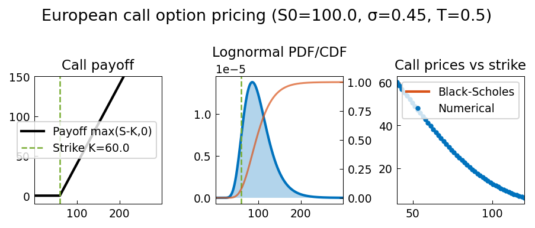
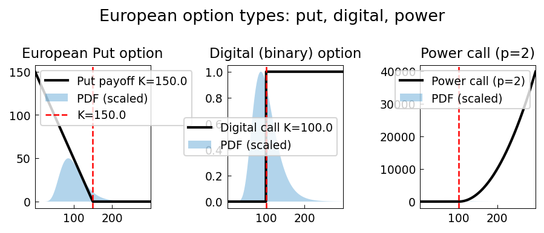
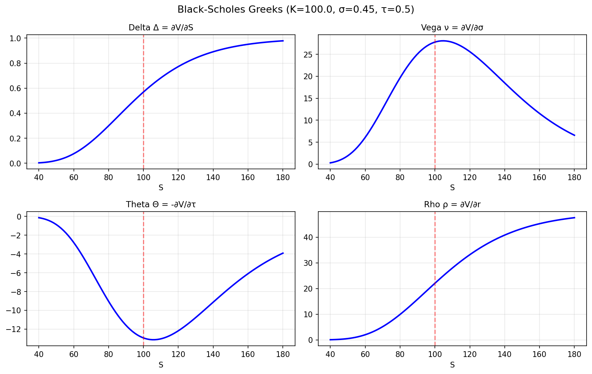
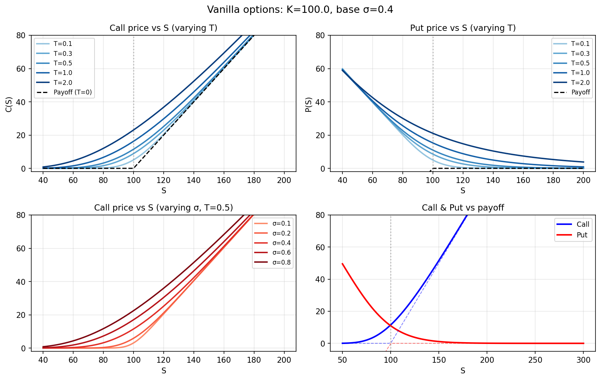
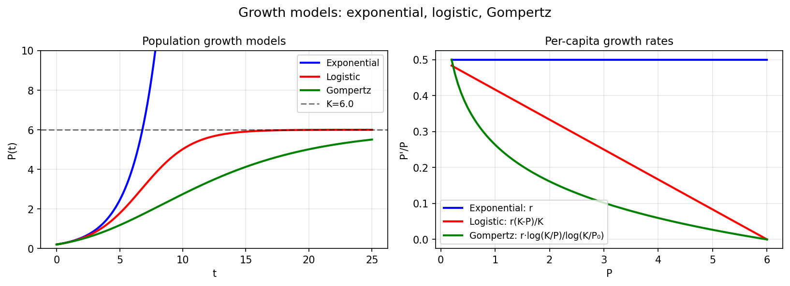
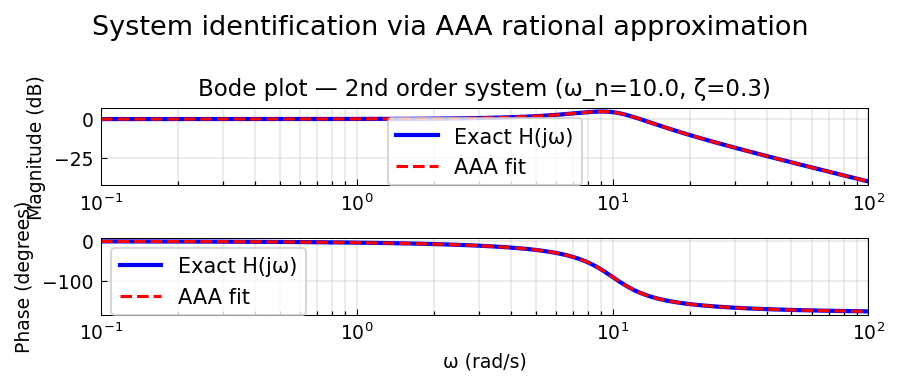
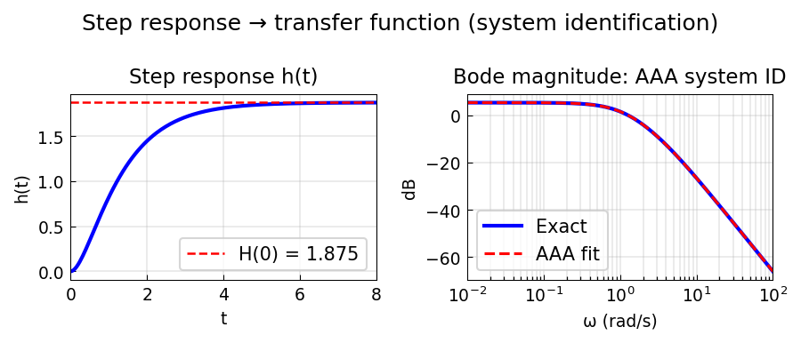

# Applications Examples

Real-world applications of chebfunjax across science and engineering.

---

## Finance: Black-Scholes option pricing

**Source:** `applics/BlackScholes2D.m`, `applics/EuropeanOptions.m`,
`applics/Greeks.m` — various authors

The Black-Scholes formula for a European call option:

```
C(S) = S Φ(d₁) - K e^{-rT} Φ(d₂)
d₁ = [ln(S/K) + (r + σ²/2)T] / (σ√T)
d₂ = d₁ - σ√T
```

Chebfunjax approximates `C(S)` as a smooth chebfun, then differentiates
to compute Greeks analytically.

```python
from scipy.stats import norm
import numpy as np
import chebfunjax as cj
import jax.numpy as jnp

def bs_call(S, K=100, T=1, r=0.05, sigma=0.2):
    d1 = (np.log(S/K) + (r + 0.5*sigma**2)*T) / (sigma*np.sqrt(T))
    d2 = d1 - sigma*np.sqrt(T)
    return S * norm.cdf(d1) - K * np.exp(-r*T) * norm.cdf(d2)

call = cj.chebfun(lambda S: jnp.array(bs_call(np.array(S))),
                  domain=[50.0, 200.0])

# Delta = dC/dS
delta = call.diff()
print(f"Delta(S=100) = {float(delta(jnp.array(100.0))):.6f}")

# Gamma = d²C/dS²
gamma = delta.diff()
print(f"Gamma(S=100) = {float(gamma(jnp.array(100.0))):.6f}")
```


---

## European call option pricing

**Source:** `applics/EuropeanCall.m` — Trefethen, 2014
**Python:** `examples/applics/european_call.py`

Computes European call option price by integrating the log-normal
payoff distribution. Demonstrates how chebfunjax can integrate
smooth and piecewise-smooth functions efficiently.



---

## European put-call parity

**Source:** `applics/EuropeanOptions.m`
**Python:** `examples/applics/european_options.py`

Verifies put-call parity `C - P = S₀ - K e^{-rT}` using chebfun
integration of the option payoff distributions.



---

## Option Greeks

**Source:** `applics/Greeks.m`
**Python:** `examples/applics/greeks.py`

Computes delta, gamma, vega, and theta analytically by differentiating
the Black-Scholes formula via chebfun.



---

## Vanilla options

**Source:** `applics/VanillaOptions.m`
**Python:** `examples/applics/vanilla_options.py`

Prices European call and put options using the Black-Scholes formula
and verifies put-call parity.



---

## Population growth models: Gompertz

**Source:** `applics/Gompertz.m` — Toby Driscoll, June 2015
**Python:** `examples/applics/gompertz.py`
**Original:** https://www.chebfun.org/examples/applics/Gompertz.html

Compares three population growth models on `[0, 25]`:

- **Exponential**: `P' = r*P` — unbounded growth
- **Logistic**: `P' = r*P*(K-P)/K` — bounded by carrying capacity K
- **Gompertz**: `P' = r*P*log(K/P)/log(K/P₀)` — bounded, slower approach to K

Gompertz grows slower than logistic near the carrying capacity,
making it useful for modeling tumor growth and technology adoption.



---

## System identification via AAA: Bode data

**Source:** `applics/Bode2tf.m` — Stefano Costa, August 2021
**Python:** `examples/applics/bode2tf.py`
**Original:** https://www.chebfun.org/examples/applics/Bode2tf.html

Uses the AAA rational approximation algorithm to fit Bode magnitude
and phase data from a second-order system:

```
H(s) = ω_n² / (s² + 2ζω_n s + ω_n²)
```

AAA fits the real-valued Bode data (magnitude in dB, phase in degrees)
using `chebfunjax.utils.aaa.aaa()`.



---

## System identification via AAA: step response

**Source:** `applics/Step2tf.m` — Stefano Costa, December 2021
**Python:** `examples/applics/step2tf.py`
**Original:** https://www.chebfun.org/examples/applics/Step2tf.html

Identifies the transfer function

```
H(s) = 5(s+3) / ((s+1)(s+2)(s+4))
```

from its frequency response Bode magnitude, using AAA rational
approximation on real-valued data.



| Example | Description |
|---------|-------------|
| [AAA Algorithm for System Identification from Bode Data](bode2tf.md) | Source: ... — Stefano Costa, August 2021 Python: ... |
| [Exponential, Logistic, and Gompertz Growth](gompertz.md) | Source: ... — Toby Driscoll, June 2015 Python: ... |
| [AAA Algorithm for System Identification from Step Response](step2tf.md) | Source: ... — Stefano Costa, December 2021 Python: ... |
