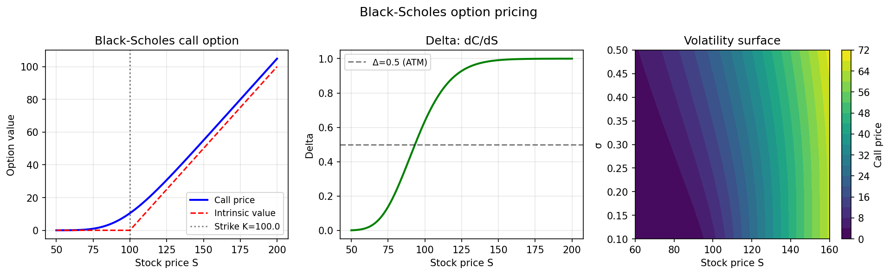

# Applications Examples

Real-world applications of chebfunjax across science and engineering.

---

## Finance: Black-Scholes option pricing

**Source:** `applics/BlackScholes2D.m`, `applics/EuropeanOptions.m`,
`applics/Greeks.m` — various authors

The Black-Scholes formula for a European call option:

```
C(S) = S Φ(d₁) - K e^{-rT} Φ(d₂)
d₁ = [ln(S/K) + (r + σ²/2)T] / (σ√T)
d₂ = d₁ - σ√T
```

Chebfunjax approximates `C(S)` as a smooth chebfun, then differentiates
to compute Greeks analytically.

```python
from scipy.stats import norm
import numpy as np
import chebfunjax as cj
import jax.numpy as jnp

def bs_call(S, K=100, T=1, r=0.05, sigma=0.2):
    d1 = (np.log(S/K) + (r + 0.5*sigma**2)*T) / (sigma*np.sqrt(T))
    d2 = d1 - sigma*np.sqrt(T)
    return S * norm.cdf(d1) - K * np.exp(-r*T) * norm.cdf(d2)

call = cj.chebfun(lambda S: jnp.array(bs_call(np.array(S))),
                  domain=[50.0, 200.0])

# Delta = dC/dS
delta = call.diff()
print(f"Delta(S=100) = {float(delta(jnp.array(100.0))):.6f}")

# Gamma = d²C/dS²
gamma = delta.diff()
print(f"Gamma(S=100) = {float(gamma(jnp.array(100.0))):.6f}")
```



---

## Other applications

| MATLAB example | Description |
|---|---|
| `applics/Bode2tf.m` | Bode plot to transfer function |
| `applics/EuropeanCall.m` | European call option |
| `applics/Gompertz.m` | Gompertz growth model |
| `applics/Step2tf.m` | Step response to transfer function |
| `applics/VanillaOptions.m` | Vanilla option pricing |
