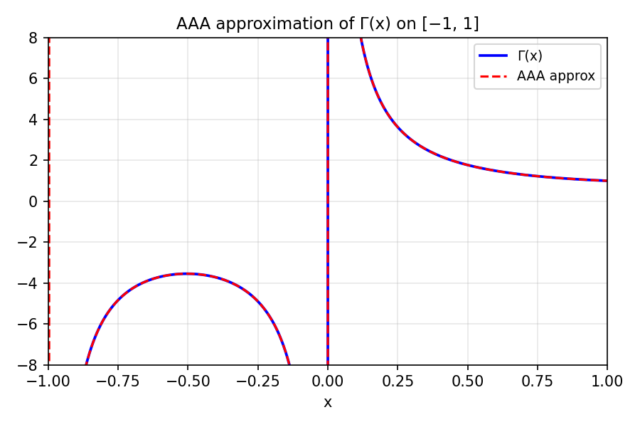
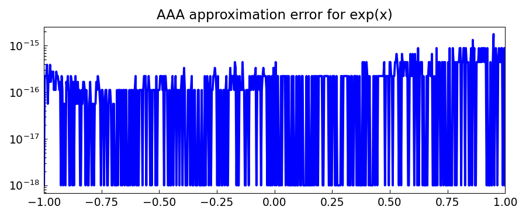

# AAA Rational Approximation

*Nick Trefethen, December 2016*

[Original MATLAB Chebfun example](https://www.chebfun.org/examples/approx/AAAApprox.html)

## A new kind of rational approximation

Chebfun has a number of methods for rational approximation of a function on an interval. Version 5.6.0 introduced the AAA (Adaptive Antoulas-Anderson) algorithm, which is the most general of all, applying by default on an interval but equally well on a general set in the real line or complex plane.

The AAA algorithm returns a function handle corresponding to a type $(m-1, m-1)$ rational function $r$ represented as a **barycentric quotient**: a ratio of one $m$-term partial fraction divided by another. This representation is extremely flexible and numerically well-behaved, avoiding completely any representation of numerator or denominator polynomials.

## Approximation on an interval

In chebfunjax, the `aaa` function works analogously:

```python
import jax.numpy as jnp
import numpy as np
from scipy.special import gamma
import chebfunjax as cj
from chebfunjax.utils.aaa import aaa

# Sample gamma on [-1, 1]
xs = jnp.linspace(-1.0, 1.0, 500)
ys = jnp.array([float(gamma(float(x))) for x in xs])

r, pol, res, zer, zj, fj, w, errvec = aaa(ys, xs)
print(f"Type ({len(pol)-1}, {len(pol)-1}) approximant")
print(f"Poles: {pol}")
```

Note that the poles at $0$ and $-1$ with their residues $1$ and $-1$ are closely captured.

## Approximation of exp(x) — error curve

```python
xs2 = jnp.linspace(-1.0, 1.0, 500)
ys2 = jnp.exp(xs2)
r2, pol2, *_ = aaa(ys2, xs2)

import numpy as np
xx = np.linspace(-1.0, 1.0, 600)
err = np.array([abs(float(jnp.exp(jnp.array(x)) - r2(jnp.array(x)))) for x in xx])
print(f"Max error: {np.max(err):.2e}")
```

The AAA approximant achieves machine precision in $O(1)$ poles, whereas polynomials require $O(n)$ terms.

## Approximation in the complex plane

The true power of AAA lies in its ability to work on arbitrary domains in the complex plane. One can pass a set $Z$ of 2000 random complex points and approximate a function with singularities — the algorithm automatically locates the poles.



*Left: AAA approximation of Γ(x). Right: error curve for AAA approximation of exp(x).*



## References

1. Y. Nakatsukasa, O. Sète, and L. N. Trefethen, The AAA algorithm for rational approximation, *SIAM J. Sci. Comput.*, 40 (2018), A1494-A1522.
