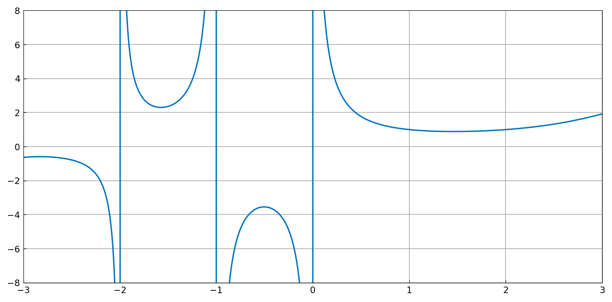
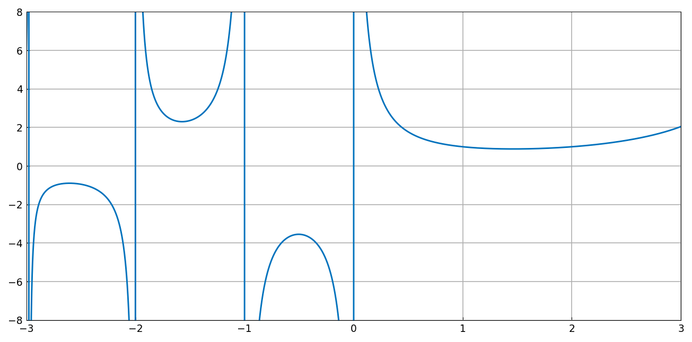
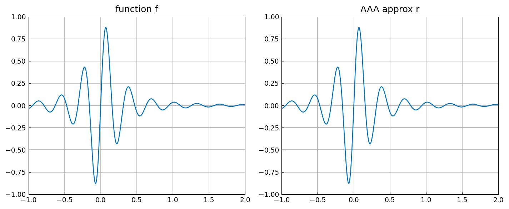
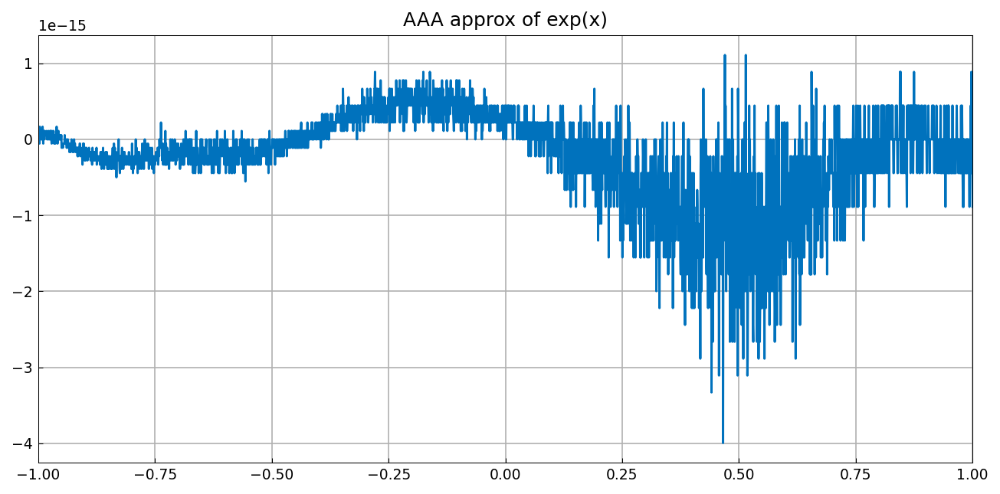
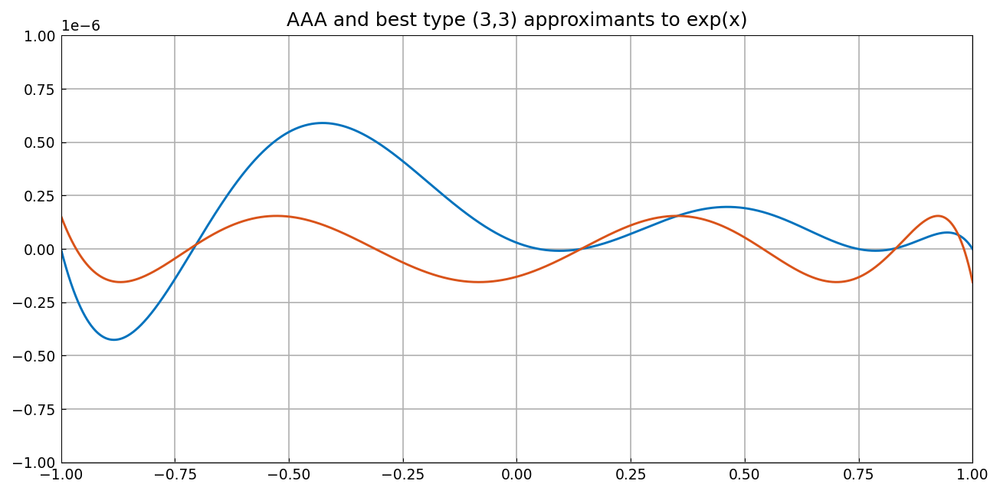
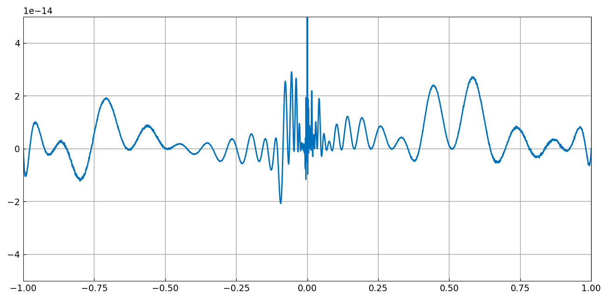
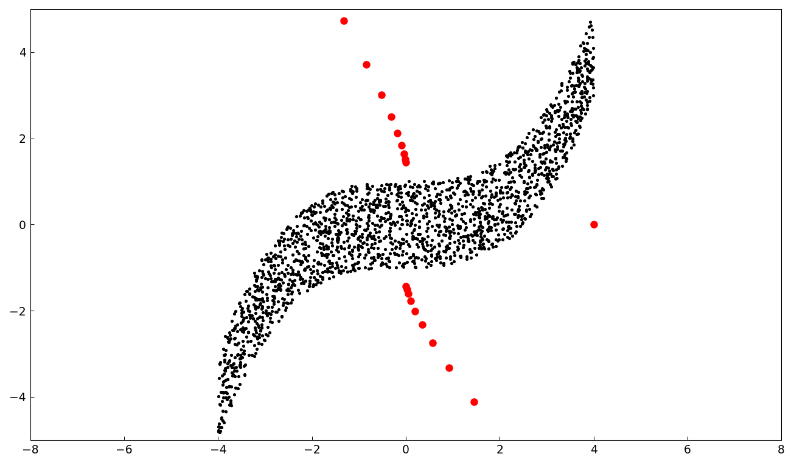

# AAA rational approximation

*Nick Trefethen, December 2016*

[Original MATLAB Chebfun example](https://www.chebfun.org/examples/approx/AAAApprox.html)

(Chebfun example approx/AAAApprox.m)

## 1. A new kind of rational approximation

Chebfun has a number of methods for rational approximation of a function
on an interval, including `ratinterp`, `minimax`, `cf`, and `chebpade`;
see the example "Eight shades of rational approximation".  For rational
approximation on the unit circle, one can use `ratinterp` with the
`'unitroots'` flag, and for rational approximation based on a Taylor
series at a point, there is `padeapprox`.  Chebfun Version 5.6.0
introduced another method, AAA approximation, which is the most general
of all, applying by default on an interval but equally well on a general
set in the real line or complex plane.  The code is called `aaa`.

We will not describe the mathematics here except to say that `aaa`
returns a function handle corresponding to a type $(m-1,m-1)$ rational
function $r$ represented as a barycentric quotient: a ratio of one
$m$-term partial fraction divided by another, both with the same poles.
This representation is extremely flexible and numerically well-behaved,
avoiding completely any representation of numerator or denominator
polynomials.  See [1] for details.

## 2. Approximation on an interval

If no approximation set is specified, `aaa` works on a real interval.
For example, suppose we write

```python
import numpy as np
import jax.numpy as jnp
from scipy.special import gamma
from chebfunjax.utils.aaa import aaa

r, pol, res, *_ = aaa(lambda z: jnp.asarray(gamma(np.asarray(z))))
```

The result is a function handle for a rational function that
approximates $\Gamma(z)$ on $[-1,1]$.  We can plot it and get a pretty
good result!



To learn more about the approximation we can output the poles and
residues as well as the function handle.  The AAA approximant is
normally of type $(m-1,m-1)$ for some value $m\ge 1$, and here we see
that the approximant is of type $(6,6)$:

```
        poles             residues
   -3.4612 + 0.0000i   -0.1991 + 0.0000i
   -1.9959 - 0.0000i    0.4876 - 0.0000i
   -1.0000 + 0.0000i   -1.0000 - 0.0000i
   -0.0000 - 0.0000i    1.0000 - 0.0000i
    3.9834 + 1.2129i    0.2985 - 1.9200i
    3.9834 - 1.2129i    0.2985 + 1.9200i
```

(The published MATLAB values are identical at display precision except
for last-digit rounding in two entries.)

Note that the poles at $0$ and $-1$ with their residues $1$ and $-1$
have been closely captured, and the pole at $-2$ with residue $0.5$ is
approximately captured.  If we approximate on $[-2,2]$ rather than the
default $[-1,1]$, the type increases to $(7,7)$ and the approximant is a
close match to the gamma function in the interval $[-3,3]$ displayed:

```python
r, pol, res, *_ = aaa(gam, dom=(-2.0, 2.0))
```
```
        poles             residues
   -2.9760 - 0.0000i   -0.1512 + 0.0000i
   -2.0000 + 0.0000i    0.5000 + 0.0000i
   -1.0000 - 0.0000i   -1.0000 - 0.0000i
   -0.0000 - 0.0000i    1.0000 + 0.0000i
    3.6952 + 1.6173i    0.5068 - 0.7978i
    3.6952 - 1.6173i    0.5068 + 0.7978i
    3.7682 + 0.0000i   -0.9543 - 0.0000i
```



Instead of a function handle, we can pass a chebfun to `aaa` for
approximation.  For example, here are the function
$f(x) = \sin(20x)/(1+25x^2)$ and its AAA approximant on $[-1,2]$:

```python
import chebfunjax as cj
x = cj.chebfun(lambda t: t, domain=(-1.0, 2.0))
f = (20*x).sin() / (1 + 25*x**2)
xs = np.linspace(-1, 2, 3000)
r, pol, *_ = aaa(jnp.asarray(np.asarray(f(jnp.asarray(xs)))), jnp.asarray(xs))
```



The approximation has type $(31,31)$,

```
ans =
    31
```

and the inner two poles closely match the exact values $\pm 0.2i$:

```
ans =
  0.000000000000062 + 0.200000000000184i
  0.000000000000062 - 0.200000000000184i
```

(The published values, from a different sample grid, carry the same
$\sim 10^{-13}$ noise: `0.000000000000102 ± 0.199999999999571i`.)

## 3. Approximations of restricted type (n,n)

In these examples `aaa` has attempted to find an approximation to full
precision (actually 13 digits of relative accuracy).  Here is the error
curve for an approximation of this kind to $e^x$ on $[-1,1]$:



Alternatively, we can ask `aaa` to find approximations of lower type or
accuracy by specifying values of `mmax` or `tol`, respectively.  For
example, here is the error curve for the type $(3,3)$ AAA approximant to
$e^x$.  The error curve for best type $(3,3)$ approximation is shown for
comparison:

```python
from chebfunjax.utils.minimax import minimax
r3, *_ = aaa(lambda z: jnp.exp(z), mmax=4, lawson=0)
rbest = minimax(lambda t: jnp.exp(t), 3, rational=True, denom=3).r
```



In this example, the best approximant is more accurate, but computation
of best approximations is a much more fragile process, easily broken,
and restricted in Chebfun to real intervals.  An example of a more
difficult problem on a real interval is the approximation of $|x|$ on
$[-1,1]$.  Here `aaa` does a pretty good job.  A warning indicates that
the desired tolerance has not been achieved, though it has come pretty
close:

```
Warning: Function not resolved using 16385 pts.
```



## 4. Approximation in the complex plane

The true power of AAA approximation lies in its ability to work on
arbitrary domains in the complex plane.  For example, here we make a set
$Z$ consisting of 2000 random points in a moustache shape.  Then we
approximate $f(z) = (2+z^2)^{1/2}/(z-4)$ on $Z$ and plot the poles:

```python
npts = 2000
rs = np.random.RandomState(0)      # matches MATLAB rng(0) 'twister'
X = 8*rs.random_sample(npts) - 4
Y = 2*rs.random_sample(npts) - 1 + X**3/16
Z = X + 1j*Y
ff = lambda z: np.sqrt(2 + z**2)/(z - 4)
r, pol, *_ = aaa(jnp.asarray(ff(Z)), jnp.asarray(Z))
```



Here we check the approximation at $5+5i$, $5$, and $5-5i$:

```
  Column 1
  1.138695267175776 - 0.792456849446122i
  5.196152422706632 + 0.000000000000000i
  1.138695267175776 + 0.792456849446122i
  Column 2
  1.138695266592532 - 0.792456849730762i
  5.196152408570123 + 0.000000027325005i
  1.152196205136640 + 0.790396032904778i
```

(Column 1 — the exact values — matches the published output
digit-for-digit, confirming the identical random point set.  Column 2 is
an extrapolation outside the moustache: like MATLAB's published values,
the first two points reproduce $f$ to $\sim 10^{-8}$ while the third is
accurate only to a few digits.)

## 5. References

1. Y. Nakatsukasa, O. Sète, and L. N. Trefethen, The AAA algorithm for
   rational approximation, _SIAM J. Sci. Comput._, 40 (2018),
   A1494-A1522.

---

*Replicated with [chebfunjax](https://github.com/ma-gilles/chebfunjax); original
example copyright The University of Oxford and The Chebfun Developers.*
