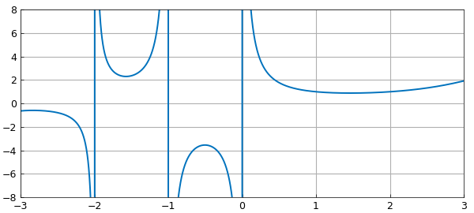
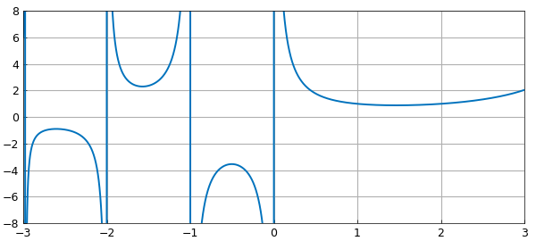
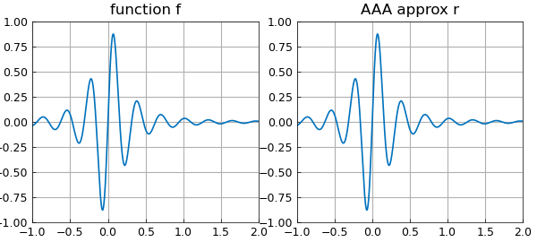
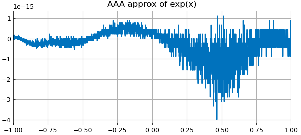
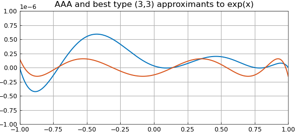
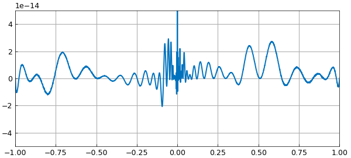
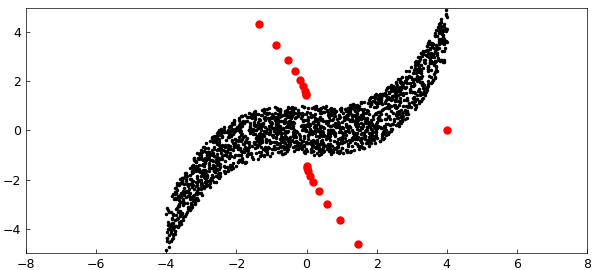

# AAA rational approximation

*Nick Trefethen, December 2016*

[Original MATLAB Chebfun example](https://www.chebfun.org/examples/approx/AAAApprox.html)

Python translation: [`examples/approx/aaa_approx.py`](https://github.com/ma-gilles/chebfunjax/blob/main/examples/approx/aaa_approx.py)

## 1. A new kind of rational approximation

Chebfun has a number of methods for rational approximation of a function on an interval, including `ratinterp`, `minimax`, `cf`, and `chebpade`; see the example "Eight shades of rational approximation". For rational approximation on the unit circle, one can use `ratinterp` with the `'unitroots'` flag, and for rational approximation based on a Taylor series at a point, there is `padeapprox`. Chebfun Version 5.6.0 introduces another method, AAA approximation, which is the most general of all, applying by default on an interval but equally well on a general set in the real line or complex plane. The code is called `aaa`.

We will not describe the mathematics here except to say that `aaa` returns a function handle corresponding to a type $(m-1,m-1)$ rational function $r$ represented as a barycentric quotient: a ratio of one $m$-term partial fraction divided by another, both with the same poles. This representation is extremely flexible and numerically well-behaved, avoiding completely any representation of numerator or denominator polynomials. See [1] for details.

## 2. Approximation on an interval

If no approximation set is specified, `aaa` works on a real interval. For example, suppose we write

```matlab
r = aaa(@gamma);
```

The result is a function handle for a rational function that approximates $\Gamma(z)$ on $[-1,1]$. We can plot it with `ezplot` and get a pretty good result!

```matlab
h = ezplot(r); axis([-3 3 -8 8]), grid on, title(' '), xlabel(' ')
```



To learn more about the approximation we can output the poles and residues as well as the function handle. The AAA approximant is normally of type $(m-1,m-1)$ for some value $m\ge 1$, and here we see that the approximant is of type $(6,6)$.

```matlab
format short
[r,pol,res] = aaa(@gamma);
disp('        poles             residues')
disp([pol res])
```

```text
        poles             residues
   -3.4612 + 0.0000i   -0.1991 + 0.0000i
   -1.9959 - 0.0000i    0.4876 - 0.0000i
   -1.0000 + 0.0000i   -1.0000 - 0.0000i
   -0.0000 - 0.0000i    1.0000 - 0.0000i
    3.9834 + 1.2129i    0.2985 - 1.9200i
    3.9834 - 1.2129i    0.2985 + 1.9200i
```

Note that the poles at $0$ and $-1$ with their residues $1$ and $-1$ have been closely captured, and the pole at $-2$ with residue $0.5$ is approximately captured. If we approximate on $[-2,2]$ rather than the default $[-1,1]$, the type increases to $(7,7)$ and the approximant is a close match to the gamma function in the interval $[-3,3]$ displayed.

```matlab
[r,pol,res] = aaa(@gamma,'dom',[-2,2]);
disp('        poles             residues')
disp([pol res])
h = ezplot(r); axis([-3 3 -8 8]), grid on, title(' '), xlabel(' ')
```

```text
        poles             residues
   -2.9760 - 0.0000i   -0.1512 + 0.0000i
   -2.0000 + 0.0000i    0.5000 + 0.0000i
   -1.0000 - 0.0000i   -1.0000 - 0.0000i
   -0.0000 - 0.0000i    1.0000 + 0.0000i
    3.6952 + 1.6173i    0.5068 - 0.7978i
    3.6952 - 1.6173i    0.5068 + 0.7978i
    3.7682 + 0.0000i   -0.9543 - 0.0000i
```



Instead of a function handle, we can pass a chebfun to `aaa` for approximation. For example, here are the function $f(x) = \sin(20x)/(1+25x^2)$ and its AAA approximant on $[-1,2]$:

```matlab
x = chebfun('x',[-1 2]);
f = sin(20*x)./(1+25*x.^2);
subplot(1,2,1), plot(f), grid on, ylim([-1 1])
title('function f')
[r,pol] = aaa(f);
subplot(1,2,2), ezplot(r,[-1 2]), grid on, ylim([-1 1])
title('AAA approx r'), xlabel(' ')
```



The approximation has type $(31,31)$,

```matlab
length(pol)
```

```text
ans =
    31
```

and the inner two poles closely match the exact values $\pm 0.2i$.

```matlab
format long, pol(abs(pol)<1)
```

```text
ans =
  0.000000000000161 + 0.200000000000190i
  0.000000000000161 - 0.200000000000190i
```

## 3. Approximations of restricted type (n,n)

In these examples `aaa` has attempted to find an approximation to full precision (actually 13 digits of relative accuracy). Here is the error curve for an approximation of this kind to $e^x$ on $[-1,1]$:

```matlab
r = aaa(@exp);
clf, ezplot(@(x) exp(x)-r(x),[-1 1]), grid on
title('AAA approx of exp(x)'), xlabel(' ')
```



Alternatively, we can ask `aaa` to find approximations of lower type or accuracy by specifying values of `'mmax'` or `'tol'`, respectively. For example, here is the error curve for the type $(3,3)$ AAA approximant to $e^x$. The error curve for best type $(3,3)$ approximation is shown for comparison.

```matlab
f = chebfun('exp(x)');
r = aaa(@exp,'mmax',4,'lawson',0);
ezplot(@(x) exp(x)-r(x),[-1,1]), grid on, xlabel(' ')
title('AAA and best type (3,3) error curves')
[p,q,rbest] = minimax(f,3,3); hold on
ezplot(@(x) f(x)-rbest(x),[-1,1]), hold off
grid on, ylim(1e-6*[-1 1]), xlabel(' ')
title('AAA and best type (3,3) approximants to exp(x)')
```



In this example, the best approximant is more accurate, but computation of best approximations is a much more fragile process, easily broken, and restricted in Chebfun to real intervals. An example of a more difficult problem on a real interval is the approximation of $|x|$ on $[-1,1]$. Here `aaa` does a pretty good job, issuing a message indicating that one Froissart doublet (spurious pole-zero pair) has been removed along the way. A warning indicates that the desired tolerance has not been achieved, though it has come pretty close.

```matlab
r = aaa(@abs);
ezplot(@(x) abs(x)-r(x),[-1,1]), grid on
ylim(5e-14*[-1 1]), xlabel(' ')
```

```text
(no matching output)
```



## 4. Approximation in the complex plane

The true power of AAA approximation lies in its ability to work on arbitrary domains in the complex plane. For example, here we make a set $Z$ consisting of 2000 random points in a moustache shape. Then we approximate $f(z) = (2+z^2)^{1/2}/(z-4)$ on $Z$ and plot the poles.

```matlab
npts = 2000; rng(0)
X = 8*rand(npts,1)-4; Y = 2*rand(npts,1) - 1 + X.^3/16;
Z = X + 1i*Y;
plot(Z,'.k','markersize',3), ylim([-5 5]), axis([-8 8 -5 5]), hold on
ff = @(z) sqrt(2+z.^2)./(z-4);
[r,pol] = aaa(ff,Z);
plot(pol,'.r','markersize',10), hold off
```



Here we check the approximation at $5+5i$, $5$, and $5-5i$:

```matlab
disp([ff(5+5i) r(5+5i); ff(5) r(5); ff(5-5i) r(5-5i)])
```

```text
  Column 1
  1.138695267175776 - 0.792456849446122i
  5.196152422706632 + 0.000000000000000i
  1.138695267175776 + 0.792456849446122i
  Column 2
  1.138695267218128 - 0.792456849405802i
  5.196152429256967 - 0.000000005076496i
  1.135680958126955 + 0.790757401201530i
```

## 5. References

[1] Y. Nakatsukasa, O. Sète, and L. N. Trefethen, The AAA algorithm for rational approximation, SIAM J. Sci. Comput., 40 (2018), A1494-A1522.

---

*Translated with [chebfunjax](https://github.com/ma-gilles/chebfunjax); prose and MATLAB code from the original example, copyright The University of Oxford and The Chebfun Developers.  Printed outputs and figures are chebfunjax's.*
