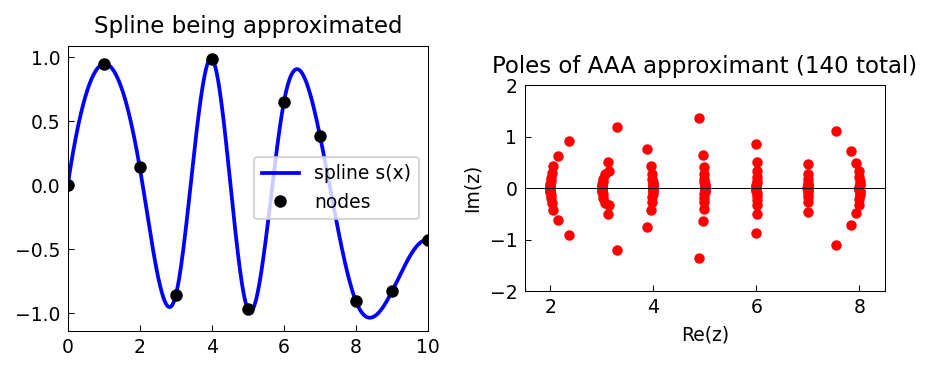

# AAA Approximation of a Spline

*Nick Trefethen, April 2021*

[Original MATLAB Chebfun example](https://www.chebfun.org/examples/approx/AAASpline.html)

## Poles near the knots

When AAA approximates a spline function, its poles cluster exponentially near
the nodes of non-analytic behaviour — the spline knots. This geometric clustering
is mathematically necessary for achieving high accuracy with a compact rational form.

```python
import numpy as np
from scipy.interpolate import CubicSpline
from chebfunjax.utils.aaa import aaa
import jax.numpy as jnp

nodes = np.arange(0, 11)
data = np.sin(nodes + nodes**2 / 4.0)
cs = CubicSpline(nodes, data)

X = np.linspace(0, 10, 1000)
Y = cs(X)
r, poles, *_ = aaa(jnp.array(Y), jnp.array(X), mmax=200, tol=1e-10)
print(f"Poles: {len(poles)} total")
```

The poles line up near the integers 2 through 8 — the interior knots of the spline.



