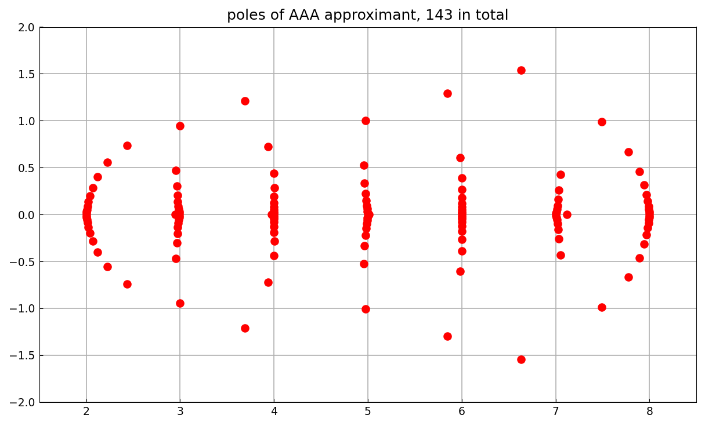
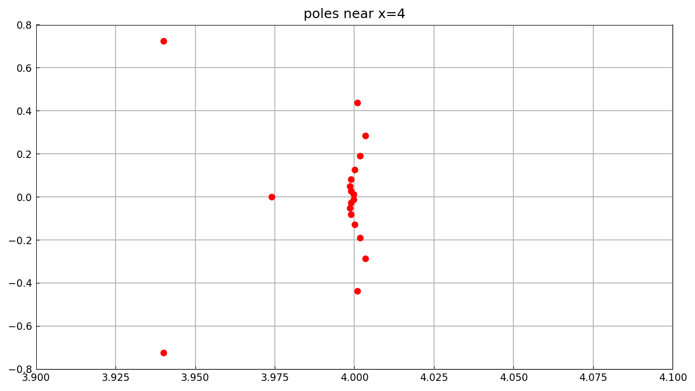
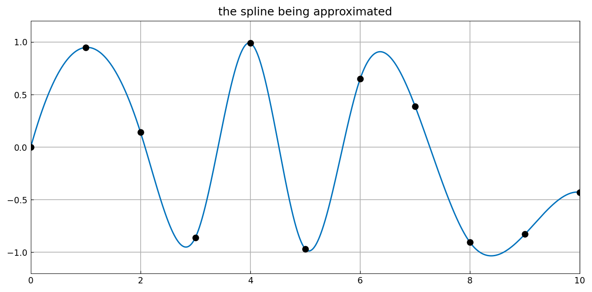

# AAA approximation of a spline

*Nick Trefethen, April 2021*

[Original MATLAB Chebfun example](https://www.chebfun.org/examples/approx/AAASpline.html)

(Chebfun example approx/AAASpline.m)

The other day I attended Heather Wilber's defense of her PhD thesis at
Cornell [2].  One of the demonstrations Wilber showed was of AAA
approximation of a spline function.  Where does AAA place the poles?
Near the spline nodes, of course, because these are the points of
nonanalyticity.

To illustrate, here is the spline function from the Chebfun example
"Splines" of February 2013, with nodes at the integers $0,1,\dots,10$:

```python
import numpy as np
import jax.numpy as jnp
from chebfunjax.chebfun1d.chebfun import Chebfun
from chebfunjax.utils.aaa import aaa

nodes = np.arange(0, 11, dtype=np.float64)
data = np.sin(nodes + nodes**2/4)
s = Chebfun.spline(jnp.asarray(nodes), jnp.asarray(data))
```

We compute the AAA approximation to $s$ based on 1000 sample points in
$[0,10]$, and plot the poles in the complex plane.  They line up near
$2,3,\dots,8$, because for this problem there are no singularities at
$x=0,1,9,10$:

```python
X = np.linspace(0, 10, 1000)
r, poles, *_ = aaa(jnp.asarray(np.asarray(s(jnp.asarray(X)))),
                   jnp.asarray(X), mmax=200, tol=1e-10)
```



(The published MATLAB run finds 135 poles; this replica finds 143 — the
greedy AAA path differs in a few late support points, with the same
cluster structure and the same handful of stray outer poles.)

We zoom in near $x=4$:



Here is the function we have been approximating, with the nodes shown
as black dots:



The mathematics of this example is pretty striking.  The function $r$
approximates a piecewise polynomial by a single global rational
function, and it does it with great accuracy:

```python
error = np.linalg.norm(np.asarray(s(jnp.asarray(X))) - np.real(r(X)))
```
```
error =
     3.390116665297889e-10
```

(Published: `3.171004439451891e-10` — the same order of accuracy from a
slightly different approximant.)

For details of how this is possible, see [1].

## References

1. L. N. Trefethen, Y. Nakatsukasa, and J. A. C. Weideman, Exponential
   node clustering at singularities for rational approximation,
   quadrature, and PDEs, _Numerische Mathematik_, 147 (2021), 227-254.

2. H. Wilber, _Computing Numerically with Rational Functions_, PhD
   thesis, Cornell University, 2021.

---

*Replicated with [chebfunjax](https://github.com/ma-gilles/chebfunjax); original
example copyright The University of Oxford and The Chebfun Developers.*
