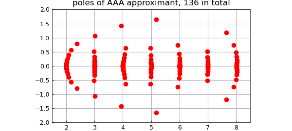
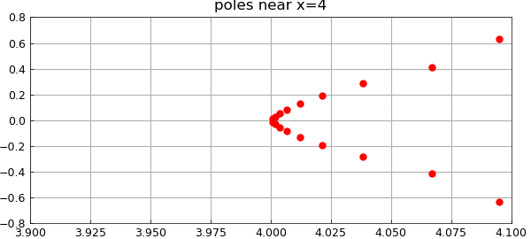
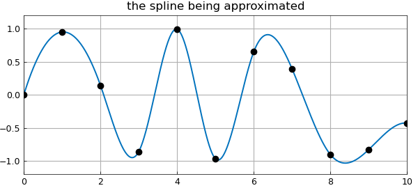

# AAA approximation of a spline

*Nick Trefethen, April 2021*

[Original MATLAB Chebfun example](https://www.chebfun.org/examples/approx/AAASpline.html)

Python translation: [`examples/approx/aaa_spline.py`](https://github.com/ma-gilles/chebfunjax/blob/main/examples/approx/aaa_spline.py)

The other day I attended Heather Wilber's defense of her PhD thesis at Cornell [2]. One of the demonstrations Wilber showed was of AAA approximation of a spline function. Where does AAA place the poles? Near the spline nodes, of course, because these are the points of nonanalyticity.

To illustrate, here is the spline function from the Chebfun example "Splines" of February 2013, with nodes at the integers $0,1,\dots, 10$:

```matlab
nodes = 0:10;
data = sin(nodes + nodes.^2/4);
s = chebfun.spline(nodes,data);
```

We compute the AAA approximation to $s$ based on 1000 sample points in $[0,10]$, and plot the poles in the complex plane. They line up near $2,3,\dots, 8$, because for this problem there are no singularities at $x= 0,1,9,10$.

```matlab
X = linspace(0,10,1000)';
[r,poles] = aaa(s(X),X,'mmax',200,'tol',1e-10);
MS = 'markersize';
plot(poles,'.r',MS,12)
grid on, axis equal, axis([1.5 8.5 -2 2])
title(['poles of AAA approximant, ' int2str(length(poles)) ' in total'])
```



We zoom in near $x=4$:

```matlab
clf, plot(poles,'.r',MS,10), axis([3.9 4.1 -.8 .8]), grid on
title(['poles near x=4'])
```



Here is the function we have been approximating, with the nodes shown as black dots.

```matlab
plot(s), grid on
hold on, plot(nodes,data,'.k',MS,12), ylim([-1.2 1.2]), hold off
title('the spline being approximated')
```



The mathematics of this example is pretty striking. The function $r$ approximates a piecewise polynomial by a single global rational function, and it does it with great accuracy:

```matlab
error = norm(s(X) - r(X))
```

```text
error =
     2.206052319211139e-10
```

For details of how this is possible, see [1].

## References

[1] L. N. Trefethen, Y. Nakatsukasa, and J. A. C. Weideman, Exponential node clustering at singularities for rational approximation, quadrature, and PDEs, *Numerische Mathematik*, 147 (2021), 227-254.

[2] H. Wilber, *Computing Numerically with Rational Functions*, PhD thesis, Cornell University, 2021.

---

*Translated with [chebfunjax](https://github.com/ma-gilles/chebfunjax); prose and MATLAB code from the original example, copyright The University of Oxford and The Chebfun Developers.  Printed outputs and figures are chebfunjax's.*
