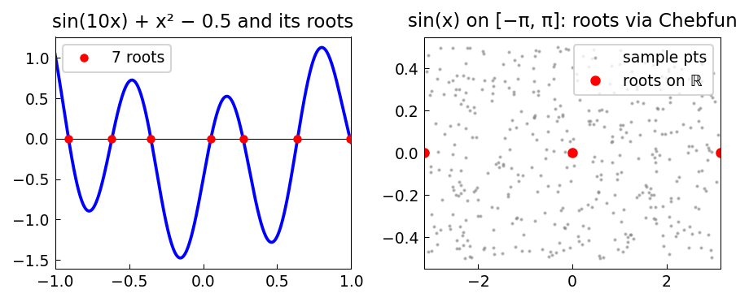

# Rootfinding with the AAA Algorithm

*Stefano Costa, June 2022*

[Original MATLAB source](https://github.com/chebfun/examples/blob/master/approx/AAAZeros.m)

## Rootfinding via rational approximation

The AAA algorithm returns not only function values but also explicit zeros and poles of
the rational approximant.  For analytic functions these zeros closely approximate
the true zeros of the function.

```python
import chebfunjax as cj
import jax.numpy as jnp

# Roots of sin(10x) + x^2 - 0.5 on [-1,1]
f = cj.chebfun(lambda x: jnp.sin(10.0*x) + x**2 - 0.5)
roots = f.roots()
print(f"Found {len(roots)} roots")
```



