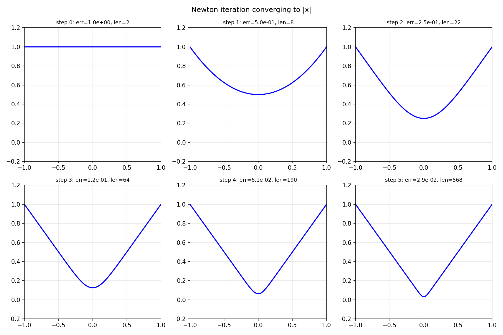

# Absolute Value Approximations by Rationals

*Nick Trefethen, May 2011*

[Original MATLAB Chebfun example](https://www.chebfun.org/examples/approx/AbsoluteValue.html)

## Newton's method for the square root

Peter Lax observed that one can approximate $|x|$ by applying Newton's method to
the equation $r^2 = x^2$, starting from $r=1$.  The iteration is

$$r := \frac{r^2 + x^2}{2r}.$$

After $k$ steps we have a rational function of type $(2^k, 2^k)$.

```python
import chebfunjax as cj
import jax.numpy as jnp

dom = (-1.0, 0.0, 1.0)  # breakpoint at 0 for efficiency
x = cj.chebfun(lambda t: t, domain=dom)
r = cj.chebfun(lambda t: jnp.ones_like(t), domain=dom)

for k in range(6):
    r = (r**2 + x**2) / (2.0 * r)
    print(f"step {k}: len(r) = {len(r)}")
```

The Chebyshev lengths grow rapidly without the breakpoint, but with a breakpoint
at zero the lengths remain manageable.

## Error analysis

Donald Newman showed that the optimal type $(n,n)$ rational approximants to $|x|$
achieve accuracy $O(\exp(-C\sqrt{n}))$, while Newton's method gives exactly
$2^{-k}$ in the $\infty$-norm after $k$ steps.  Away from $x=0$, however,
the accuracy is $O(\exp(-Cn))$ due to quadratic convergence of Newton.



