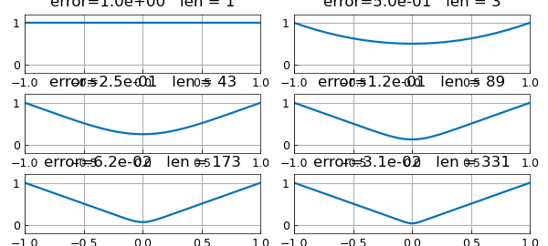
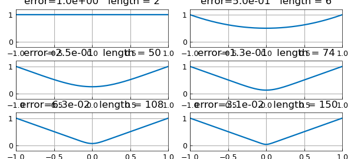
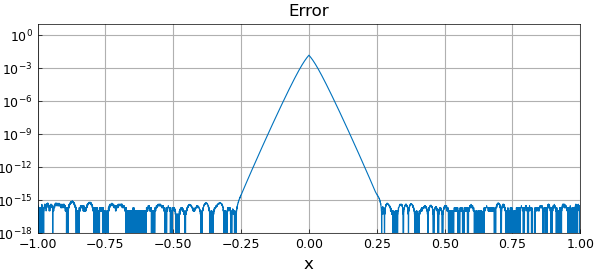
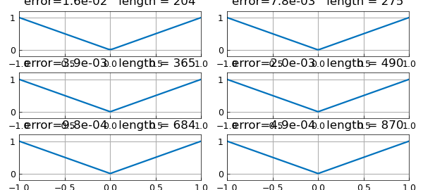
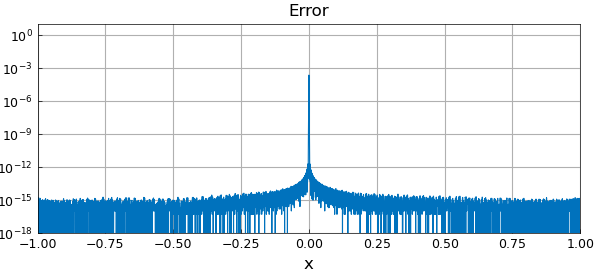

# Absolute value approximations by rationals

*Nick Trefethen, May 2011*

[Original MATLAB Chebfun example](https://www.chebfun.org/examples/approx/AbsoluteValue.html)

Python translation: [`examples/approx/absolute_value.py`](https://github.com/ma-gilles/chebfunjax/blob/main/examples/approx/absolute_value.py)

Peter Lax mentioned to me recently an example that no doubt various people have thought about over the years. Suppose we think of $x^2$ as a given number and we try to find its square root by solving the equation

$$ r^2 = x^2 $$

for $r$ using Newton's method beginning from the guess $r=1$. The successive iterates are given by the formula

$$ r := (r^2+x^2)/2r . $$

After $k$ steps we have a rational function of type $(2^k,2^k)$, and these functions will approach the function $|x|$.

Let's see the iteration in action:

```matlab
x = chebfun('x');
r = chebfun('1');
LW = 'linewidth'; lw = 1.6; FS = 'fontsize'; fs = 12;
for k = 0:5
    subplot(3,2,k+1)
    plot(r,LW,lw), axis([-1 1 -.2 1.2]), grid on
    err = norm(r-abs(x),inf);
    s = sprintf('error=%4.1e   len=%d',err,length(r));
    title(s,FS,fs)
    r = (r.^2+x.^2)./(2*r);
end
```



The curves look nice, but the exponentially growing chebfun lengths do not. To improve this, we can put a breakpoint at $x=0$:

```matlab
x = chebfun('x',[-1 0 1]);
r = chebfun('1',[-1 0 1]);
for k = 0:5
    subplot(3,2,k+1)
    plot(r,LW,lw), axis([-1 1 -.2 1.2]), grid on
    err = norm(r-abs(x),inf);
    s = sprintf('error=%4.1e   length = %d',err,length(r));
    title(s,FS,fs)
    r = (r.^2+x.^2)./(2*r);
end
```



It's interesting to look at the error. In the outer half of the interval, we've already achieved machine precision, whereas near $x=0$ the errors remain large.

```matlab
clf, semilogy(abs(r-abs(x)),LW,lw)
axis([-1 1 1e-18 10]), grid on
xlabel('x',FS,fs)
title('Error',FS,fs)
```



Let's take six more steps of the iteration:

```matlab
for k = 0:5
    subplot(3,2,k+1)
    plot(r,LW,lw), axis([-1 1 -.2 1.2]), grid on
    err = norm(r-abs(x),inf);
    s = sprintf('error=%4.1e   length = %d',err,length(r));
    title(s,FS,fs)
    r = (r.^2+x.^2)./(2*r);
end
```



Here is the error:

```matlab
clf, semilogy(abs(r-abs(x)),LW,lw)
axis([-1 1 1e-18 10]), grid on
xlabel('x',FS,fs)
title('Error',FS,fs)
```



Evidently we are getting convergence to $|x|$, for all $x$. In the $\infty$-norm, the rate looks pretty disappointing. Donald Newman showed that the optimal type $(n,n)$ rational approximants to $|x|$ achieve accuracy $O(\exp(-C \sqrt n))$ [1,2], whereas here the maximum error is exactly $2^{-k}$ after $k$ steps, which corresponds to $1/n$ for the type $(n,n)$ approximation. Away from $x=0$, however, the accuracy is $O(\exp(-Cn))$, thanks to the quadratic convergence of Newton's method.

Incidentally, note that this last curve is not very close to symmetrical about $x=0$. I wonder why not?

## References

1. D. J. Newman, Rational approximation of $|x|$, *Michigan Mathematical Journal*, 11 (1964), 11-14.
2. L. N. Trefethen, *Approximation Theory and Approximation Practice*, SIAM, 2013.

---

*Translated with [chebfunjax](https://github.com/ma-gilles/chebfunjax); prose and MATLAB code from the original example, copyright The University of Oxford and The Chebfun Developers.  Printed outputs and figures are chebfunjax's.*
