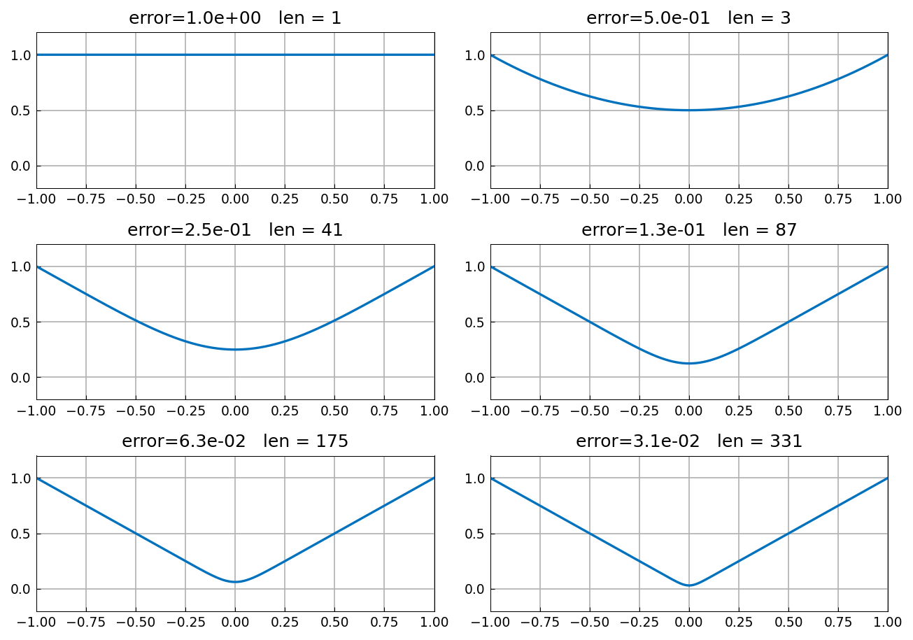
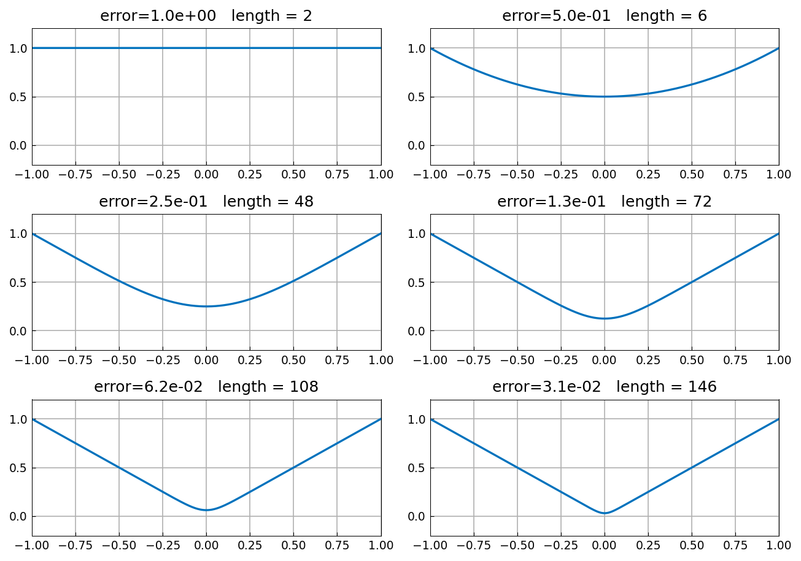
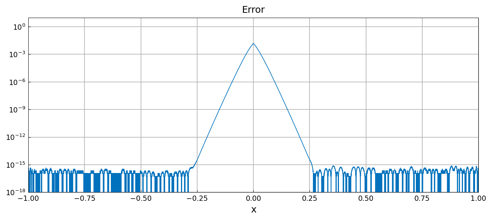
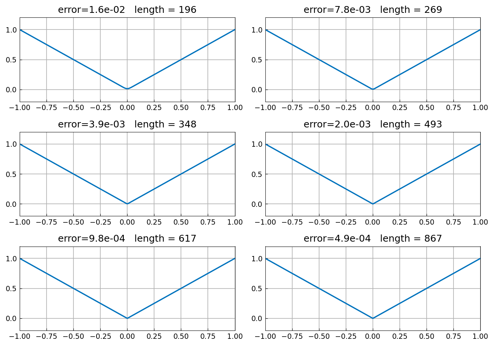
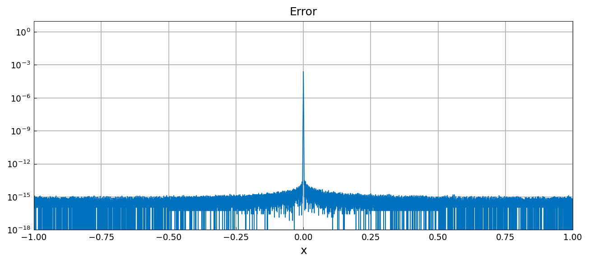

# Absolute value approximations by rationals

*Nick Trefethen, May 2011*

[Original MATLAB Chebfun example](https://www.chebfun.org/examples/approx/AbsoluteValue.html)

(Chebfun example approx/AbsoluteValue.m)

Peter Lax mentioned to me recently an example that no doubt various
people have thought about over the years.  Suppose we think of $x^2$ as
a given number and we try to find its square root by solving the
equation

$$ r^2 = x^2 $$

for $r$ using Newton's method beginning from the guess $r=1$.  The
successive iterates are given by the formula

$$ r := (r^2+x^2)/2r . $$

After $k$ steps we have a rational function of type $(2^k,2^k)$, and
these functions will approach the function $|x|$.

Let's see the iteration in action:

```python
import numpy as np
import chebfunjax as cj

x = cj.chebfun(lambda t: t)
r = cj.chebfun(lambda t: 1.0 + 0*t)
for k in range(6):
    # plot r; title shows norm(r - abs(x), inf) and len(r)
    err = float((r - x.abs()).norm(np.inf))
    r = (r**2 + x**2) / (2*r)
```



(The published MATLAB panels show errors 1.0e+00, 5.0e-01, 2.5e-01,
1.2e-01, 6.2e-02, 3.1e-02 with lengths 1, 3, 43, 85, 169, 325; this
replica reproduces every error at display precision — the errors are
exactly $2^{-k}$, so panels 4-5 sit precisely at the rounding boundary,
where even MATLAB's own two figures disagree — with adaptive lengths
1, 3, 41, 87, 175, 331.)

The curves look nice, but the exponentially growing chebfun lengths do
not.  To improve this, we can put a breakpoint at $x=0$:

```python
x = cj.chebfun(lambda t: t, domain=[-1.0, 0.0, 1.0])
r = cj.chebfun(lambda t: 1.0 + 0*t, domain=[-1.0, 0.0, 1.0])
for k in range(6):
    err = float((r - x.abs()).norm(np.inf))
    r = (r**2 + x**2) / (2*r)
```



(Published lengths 2, 6, 49, 74, 104, 149; ours 2, 6, 48, 72, 108, 146.)

It's interesting to look at the error.  In the outer half of the
interval, we've already achieved machine precision, whereas near $x=0$
the errors remain large.



Let's take six more steps of the iteration:



(Published errors 1.6e-02 through 4.9e-04 all reproduce exactly;
published lengths 196, 270, 349, 491, 642, 864 versus ours 196, 269,
348, 493, 617, 867.)

Here is the error:



Evidently we are getting convergence to $|x|$, for all $x$.  In the
$\infty$-norm, the rate looks pretty disappointing.  Donald Newman
showed that the optimal type $(n,n)$ rational approximants to $|x|$
achieve accuracy $O(\exp(-C \sqrt n))$ [1,2], whereas here the maximum
error is exactly $2^{-k}$ after $k$ steps, which corresponds to $1/n$
for the type $(n,n)$ approximation.  Away from $x=0$, however, the
accuracy is $O(\exp(-Cn))$, thanks to the quadratic convergence of
Newton's method.

Incidentally, note that this last curve is not very close to symmetrical
about $x=0$.  I wonder why not?

## References

1. D. J. Newman, Rational approximation of $|x|$, _Michigan Mathematical
   Journal_, 11 (1964), 11-14.

2. L. N. Trefethen, _Approximation Theory and Approximation Practice_,
   SIAM, 2013.

---

*Replicated with [chebfunjax](https://github.com/ma-gilles/chebfunjax); original
example copyright The University of Oxford and The Chebfun Developers.*
