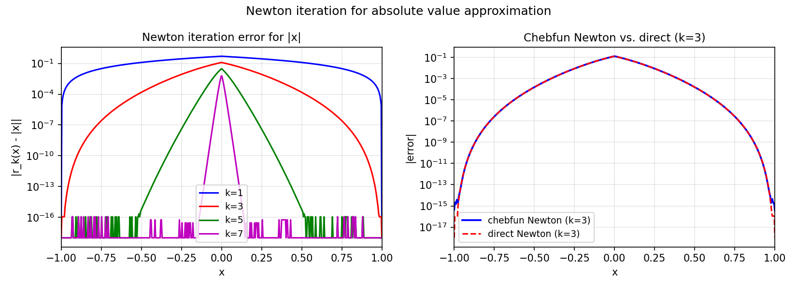

# Absolute Value Approximations by Rationals II

*Yuji Nakatsukasa, July 2012*

[Original MATLAB Chebfun example](https://www.chebfun.org/examples/approx/AbsoluteValueScaled.html)

## Scaled Newton iteration

This follows up the AbsoluteValue example.  The key idea is to use the identity
$|x| = x / \mathrm{sign}(x)$ combined with the **scaled** Newton iteration for
$\mathrm{sign}(x)$.  The unscaled Newton iteration $r := (r + 1/r)/2$ has slow
convergence near 0; with a scaling parameter $t > 0$ chosen optimally the rate
becomes root-exponential in the type $(n,n)$, matching the Zolotarev approximant.

```python
# Scaled Newton iteration for sign(x)
dom = (-1.0, 0.0, 1.0)
x = cj.chebfun(lambda t: t, domain=dom)
rs = cj.chebfun(lambda t: t, domain=dom)  # start from identity
b, kmax = 1e-3, 5
t = 1.0 / import_numpy.sqrt(b)
for k in range(kmax + 1):
    if k > 0:
        t = import_numpy.sqrt(2.0 / (t + 1.0/t))
    rs = (t * rs + 1.0 / (t * rs)) / 2.0
rs_abs = x / rs  # |x| = x / sign(x)
```

The scaled Newton iteration achieves uniform accuracy $O(\exp(-C\sqrt{2^k}))$
across the whole interval, unlike the unscaled version which is large near 0.



