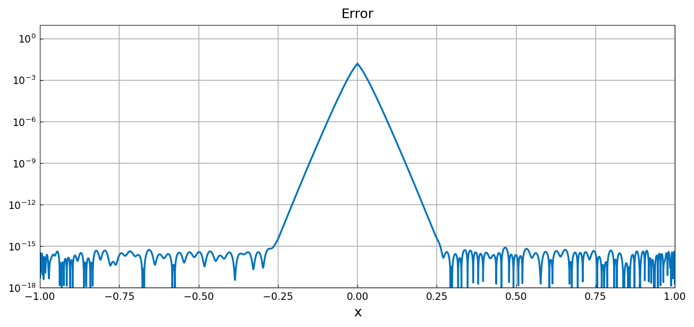
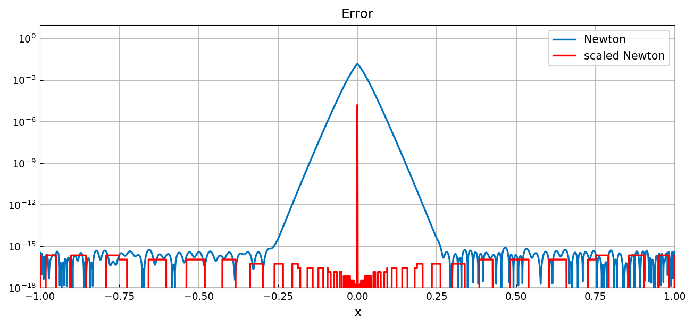
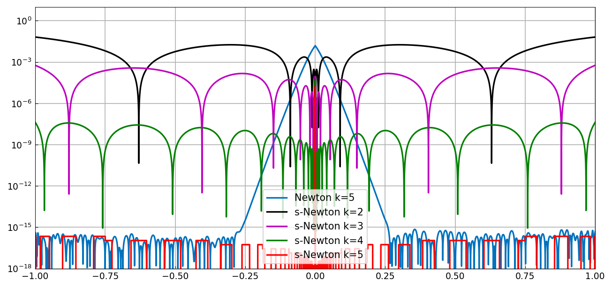

# Absolute value approximations by rationals II

*Yuji Nakatsukasa, July 2012*

[Original MATLAB Chebfun example source](https://github.com/chebfun/examples/blob/master/approx/AbsoluteValueScaled.m)
(this example is in the Chebfun examples repository but is not on the
published chebfun.org site, so there are no published reference outputs;
values below are computed by this replica)

(Chebfun example approx/AbsoluteValueScaled.m)

This is a follow-up of Example [approx/AbsoluteValue](AbsoluteValue.md).
The goal is to find a rational approximation to the absolute value
function $|x|$.  That example used Newton's method applied to $x^2=r^2$
with the initial guess $r=1$, given by the iteration $r := (r^2+x^2)/2r$.
After $k$ steps we have a rational function of type $(2^k,2^k)$, which
approaches $|x|$ as $k\rightarrow \infty$.

Let's rerun the code in that example and plot the error:

```python
import numpy as np
import chebfunjax as cj

dom = [-1.0, 0.0, 1.0]
x = cj.chebfun(lambda t: t, domain=dom)
r = cj.chebfun(lambda t: 1.0 + 0*t, domain=dom)
kmax = 5
for k in range(kmax + 1):
    r = (r**2 + x**2) / (2*r)
```



The main issue here is that the error is large near the origin, given
that the optimal type $(2^k,2^k)$ rational approximants to $|x|$ achieve
root-exponential accuracy $O(\exp(-C\sqrt{2^k}))$ in the infinity norm
[5,6].

Here we try another approach, which is to combine the formula
$|x|=x/\mathrm{sign}(x)$ with the scaled Newton iteration for
approximating the sign function.  Newton's iteration for
$\mathrm{sign}(x)$ is defined by $r := (r+1/r)/2$ and the scaled Newton
iteration is its scaled variant $r := (tr+1/(tr))/2$, where $t>0$ is
determined so as to optimize the convergence.  It requires a parameter
$0<b<1$ such that the sign function is approximated on the interval
$[b,1]$.  For details see [2], [3, Ch. 8].  Once $r$ approximates
$\mathrm{sign}(x)$ well, we get an approximation to $|x|$ via $r:=x/r$.
As above, after $k$ steps we have a type $(2^k,2^k)$ rational function
that approximates $|x|$:

```python
# The intermediate iterates have a pole at x = 0, so this replica
# evaluates the recurrence pointwise (mathematically identical to the
# MATLAB chebfun arithmetic).
b = 1e-3
t = 1/np.sqrt(b)
rv = xs.copy()          # xs: dense evaluation grid on [-1, 1]
for k in range(kmax + 1):
    if k > 0:
        t = np.sqrt(2/(t + 1/t))
    rv = ((t*rv) + 1.0/(t*rv))/2
rs_vals = xs / rv       # approximant to abs(x) via abs(x) = x/sign(x)
```



Now the error is uniformly small across the interval $[-1,1]$ (max
error 1.62e-05 versus 1.56e-02 for plain Newton at $k=5$).  In fact,
it can be shown that for a given $k$, the scaled Newton iteration yields
the type $(2^k,2^k-1)$ best rational approximation to $\mathrm{sign}(x)$
on the interval $[b,1]$ due to Zolotarev.  Since the best type $(n,n)$
approximation to $\mathrm{sign}(x)$ yields accuracy
$O(\exp(-C\sqrt{n}))$ [5, Ch.4], we can show that also for $|x|$, the
above process (with an appropriately chosen $b$) yields the optimal
accuracy $O(\exp(-C\sqrt{2^k}))$.

The asymmetry, also observed in the example approx/AbsoluteValue, seems
more pronounced in the red plot.  This is due to rounding errors: to
observe this, let's see the plots for varying $k$:



Clearly for $k\leq 3$ the error is symmetric about the imaginary axis,
exhibiting a near-equioscillating property.  It is still curious that in
the red plot, the effect of rounding error is present at a much larger
value than the machine precision $10^{-16}$.

## References

1. [approx/AbsoluteValue](AbsoluteValue.md)

2. R. Byers and H. Xu. A new scaling for Newton's iteration for the
   polar decomposition and its backward stability. _SIAM Journal on
   Matrix Analysis and Applications_, 30 (2008), 822-843.

3. N. J. Higham. _Functions of Matrices: Theory and Computation_, SIAM,
   2008.

4. D. J. Newman, Rational approximation of $|x|$, _Michigan Mathematical
   Journal_, 11 (1964), 11-14.

5. P. P. Petrushev and V. A. Popov, _Rational Approximation of Real
   Functions_, Cambridge University Press, 2011.

6. L. N. Trefethen, _Approximation Theory and Approximation Practice_,
   SIAM, 2013.

---

*Replicated with [chebfunjax](https://github.com/ma-gilles/chebfunjax); original
example copyright The University of Oxford and The Chebfun Developers.*
