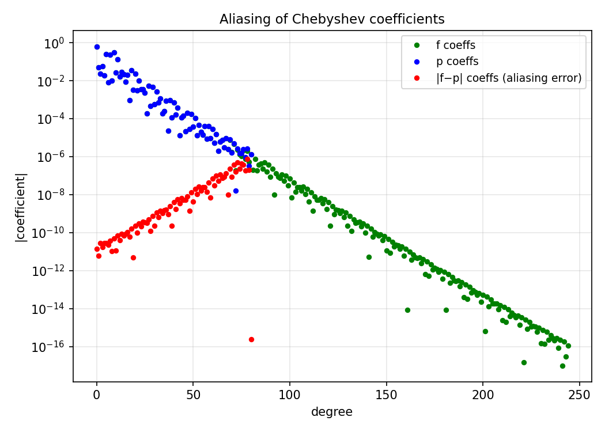

# Accuracy of Chebyshev Coefficients via Aliasing

*Yuji Nakatsukasa, April 2016*

[Original MATLAB Chebfun example](https://www.chebfun.org/examples/approx/AliasingCoefficients.html)

## Aliasing formulae

The Chebyshev coefficients of a degree-$n$ polynomial interpolant $p$ of a
function $f$ are related to the exact coefficients by aliasing:
$$\hat{c}_i - c_i = (c_{2n-i} + c_{4n-i} + \cdots) + (c_{2n+i} + c_{4n+i} + \cdots).$$

The exceptions are the zeroth and $n$th coefficients, which have *higher* accuracy
because the dominant aliased term vanishes.

```python
import chebfunjax as cj
import jax.numpy as jnp
import numpy as np

def fori(x): return jnp.log(jnp.sin(10.0*x) + 2.0)

f = cj.chebfun(fori)
p = cj.chebfun(fori, n=len(f)//3)

fc = np.array(f.coeffs)
pc = np.array(p.coeffs)
print("Aliasing errors:", np.abs(pc - fc[:len(pc)]))
```

Note the last (degree $n$) coefficient has far higher accuracy than the others —
a consequence of the aliasing formula.



