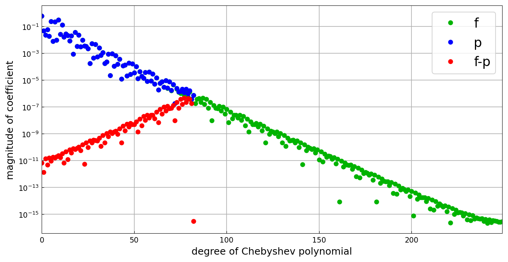
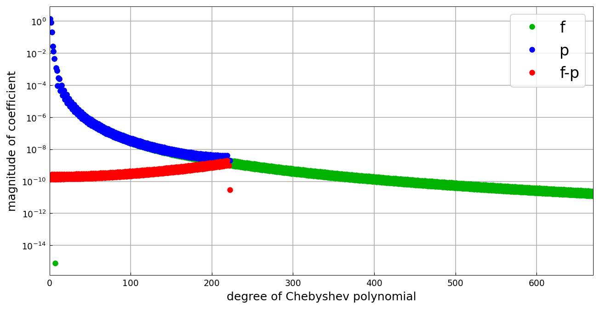

# Accuracy of Chebyshev coefficients via aliasing

*Yuji Nakatsukasa, April 2016*

[Original MATLAB Chebfun example](https://www.chebfun.org/examples/approx/AliasingCoefficients.html)

(Chebfun example approx/AliasingCoefficients.m)

## 1. One dimension

As shown in [1, Thm. 4.2], the Chebyshev coefficients of the degree $n$
polynomial interpolant

$$ p=\sum_{i=0}^n \hat c_iT_i(x) $$

of a (Lipschitz continuous) function $f$ with Chebyshev expansion

$$ f=\sum_{i=0}^\infty c_iT_i(x) $$

are obtained by aliasing the coefficients for the higher-degree
Chebyshev polynomials.  Specifically, the coefficient $c_i$ has error

$$ \hat c_i- c_i = (c_{2n-i}+c_{4n-i}+\cdots)+(c_{2n+i}+c_{4n+i}+\cdots), $$

except for the 0th coefficient,

$$ \hat c_0-c_0 = c_{2n}+c_{4n}+\cdots, $$

and the $n$th coefficient,

$$ \hat c_n-c_n = c_{3n}+c_{5n}+\cdots. $$

Now, smooth functions have rapidly decaying Chebyshev coefficients, and
in particular, if $f$ is analytic, its Chebyshev coefficients decay
geometrically at the rate $c_n=O(\exp(-kn))$ for some constant $k>0$.
This geometric decay, combined with the aliasing formulae above, tells
us that the Chebyshev coefficients of the interpolant $p$ have errors
$\hat c_i-c_i$ of predictably varying magnitude, for the dominant term
in the error is $c_{2n}$ for $c_0-\hat c_0$, $c_{3n}$ for
$c_n-\hat c_n$, and $c_{2n-i}$ for the rest.  From this we expect that a
Chebyshev interpolant for an analytic $f$ would have high accuracy in
$c_0$ and very high accuracy in $c_n$, relative to the other $c_i$.

Here is an illustration.  For an analytic function $f$, we find its
Chebyshev expansion coefficients.  We then compute a low-degree
interpolant $p$ and examine the accuracy of its Chebyshev coefficients:

```python
import numpy as np
import jax.numpy as jnp
import chebfunjax as cj

fori = lambda x: jnp.log(jnp.sin(10*x) + 2)
f = cj.chebfun(fori)
p = cj.chebfun(fori, n=round(len(f)/3))

pc = np.asarray(p.coeffs)
fc = np.asarray(f.coeffs)
# plotcoeffs of f and p, plus abs(pc - fc[:len(pc)]) + eps in red
```



The green and blue dots show the absolute values of the Chebyshev
coefficients for $f$ and the interpolant $p$.  Our focus here is on the
red dots, showing the error in Chebyshev coefficients.  Two observations
can be made: (i) the error grows geometrically with the degree until
degree $n-1$, and (ii) (note the rightmost red dot) at the end the error
is much much smaller.  These effects clearly reflect the aliasing
formulae given above.

Let us note the connection between the aliasing in $\hat c_0$ and Gauss
quadrature.  The exact integral of $f$ is equal to the degree 0
coefficient $d_0$ in its Legendre expansion
$f(x)=\sum_{i=0}^\infty d_iP_i(x)$, where $P_i(x)$ is the Legendre
polynomial of degree $i$.  Gauss quadrature approximates this by
$\hat d_0$, the degree 0 coefficient of the degree $n$ polynomial
interpolant.  The error in Gauss quadrature, $\hat d_0 - d_0$, can
accordingly be interpreted as the result of aliasing the term
$d_{2n+2}P_{2n+2}(x)$ and terms of higher degree.  See section 8 of [2]
for more details.

The extremely high accuracy of the $n$th coefficient is peculiar to the
Chebyshev interpolation process, and this coefficient is exact if $f$ is
a polynomial of degree up to $3n-1$.  Although we are unaware of a
practical application of this fact, it does suggest that if only the
$n$th Chebyshev coefficient is of interest, then an $n+1$-point
Chebyshev interpolation could suffice, even if the corresponding
interpolant is rather poor.

Let's repeat the computation with a non-analytic function:

```python
fori = lambda x: jnp.abs((x - 0.5)**3)   # twice differentiable, not analytic
f = cj.chebfun(fori)
p = cj.chebfun(fori, n=round(len(f)/6))
```



For non-analytic functions the difference in accuracy is less prominent,
because the Chebyshev coefficients decay more slowly.  The red plot is
still roughly a 'mirrored' version of the green one, and the first and
$n$th coefficients still have higher accuracy than most of the rest.
Again, these are all consequences of the aliasing formula.

## 2. Two dimensions

Let's try an analogous experiment in Chebfun2.  As before we start with
a smooth bivariate function, form its chebfun2, and construct a
low-degree interpolant (degree 5 in each direction).  Then we examine
the accuracy in the coefficients, which we show in matrix form:

```python
from chebfunjax.utils.quadrature import chebpts2

p = cj.chebfun2(lambda x, y: jnp.sin(x + y) + jnp.cos(x - y))
pc = np.asarray(p.chebcoeffs2())

x, y = chebpts2(6)   # chebfun2 of degree [5 5] from values on 6x6 grid
pt = cj.chebfun2(jnp.asarray(np.asarray(p(jnp.asarray(x), jnp.asarray(y)))))
ptc = np.asarray(pt.chebcoeffs2())

ptc - pc[:6, :6]
```
```
ans =
  -8.0518e-10   7.5521e-09   1.4432e-07  -2.2991e-06  -3.2044e-05  -2.6283e-13
   7.5521e-09   1.8437e-08   1.6345e-07  -2.6448e-06  -3.6856e-05   5.2322e-12
   1.4432e-07   1.6345e-07  -8.6613e-08   6.8312e-07   9.6245e-06   9.4133e-11
  -2.2991e-06  -2.6448e-06   6.8312e-07   2.3513e-07   1.6237e-06  -1.5009e-09
  -3.2044e-05  -3.6856e-05   9.6245e-06   1.6237e-06  -4.1310e-07  -2.0918e-08
  -2.6280e-13   5.2322e-12   9.4133e-11  -1.5009e-09  -2.0918e-08  -1.0006e-20
```

(All entries match the published MATLAB output; the three entries at or
below $10^{-13}$ — including the exceptionally accurate lower-right
corner at $10^{-20}$ — differ only in rounding noise.)

The $(i,j)$ entry of this matrix is the error in the coefficient for
$T_{j-1}(x)T_{i-1}(y)$.  Observations similar to the 1-d case can be
made: looking horizontally or vertically, the low-degree coefficients
are more accurate than the higher ones, except at the very ends, where
the accuracy is much better.  Note the exceptional accuracy at the
lower-right corner.

## References

1. L. N. Trefethen, _Approximation Theory and Approximation Practice_,
   SIAM, 2013.

2. L. N. Trefethen and J. A. C. Weideman, The exponentially convergent
   trapezoidal rule, _SIAM Review_ 56 (2014), 385-458.

---

*Replicated with [chebfunjax](https://github.com/ma-gilles/chebfunjax); original
example copyright The University of Oxford and The Chebfun Developers.*
