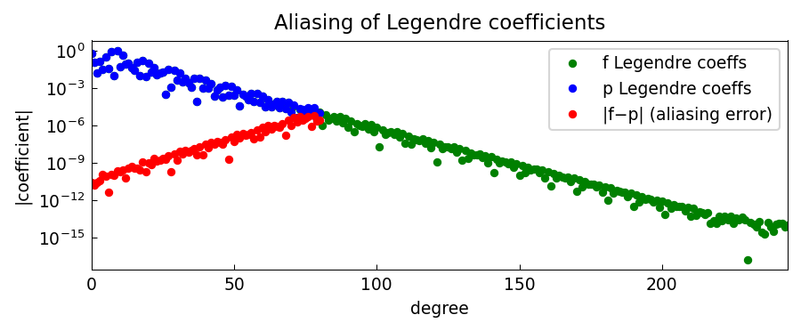

# Accuracy of Legendre Coefficients via Aliasing

*Yuji Nakatsukasa, April 2016*

[Original MATLAB Chebfun example](https://www.chebfun.org/examples/approx/AliasingCoefficientsLeg.html)

## Legendre aliasing

The same aliasing phenomenon arises for Legendre coefficients: the 0th and $n$th
coefficients of the degree-$n$ interpolant have higher accuracy than the rest.
This is connected to Gauss quadrature: the error in $\hat{d}_0 - d_0$ is the
quadrature error, which is $O(c_{2n+2})$ for the dominant aliased term.

```python
from chebfunjax.utils.transforms import cheb2leg
import jax.numpy as jnp
import numpy as np
import chebfunjax as cj

f = cj.chebfun(lambda x: jnp.log(jnp.sin(10.0*x) + 2.0))
p = cj.chebfun(lambda x: jnp.log(jnp.sin(10.0*x) + 2.0), n=len(f)//3)

fc_leg = np.array(cheb2leg(jnp.array(f.coeffs)))
pc_leg = np.array(cheb2leg(jnp.array(p.coeffs)))
print("Legendre aliasing:", np.abs(pc_leg - fc_leg[:len(pc_leg)]))
```



