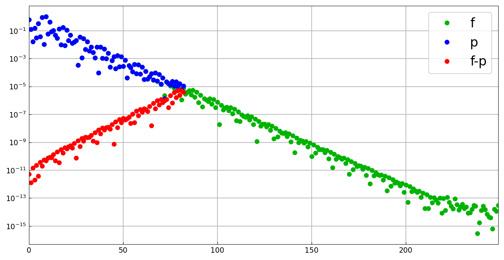
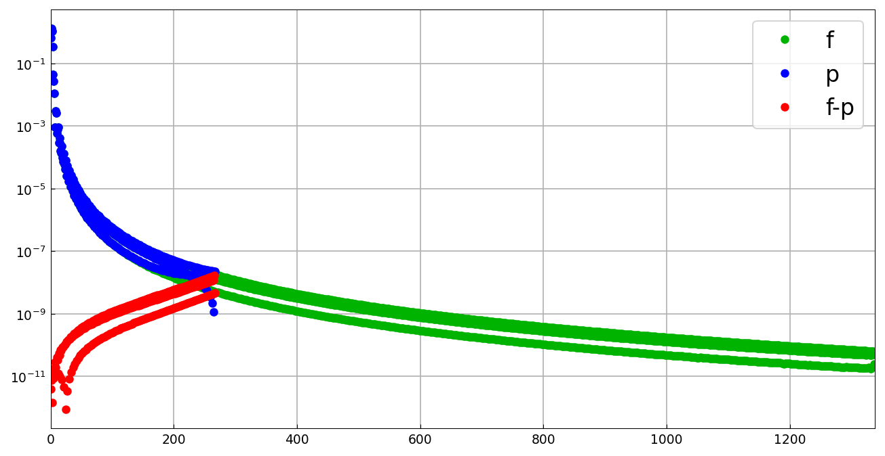

# Accuracy of Legendre coefficients via aliasing

*Yuji Nakatsukasa, April 2016*

[Original MATLAB Chebfun example](https://www.chebfun.org/examples/approx/AliasingCoefficientsLeg.html)

(Chebfun example approx/AliasingCoefficientsLeg.m)

This is the Legendre analogue of
[approx/AliasingCoefficients](AliasingCoefficients.md): the Legendre
coefficients of a low-degree Legendre (Gauss-points) interpolant of $f$
err by aliased tails of the full Legendre expansion.

Here is the experiment for an analytic function.  We compute the
Legendre coefficients of $f$ via `cheb2leg`, and the Legendre
coefficients of the degree $k-1$ interpolant at Gauss-Legendre points
via `legvals2legcoeffs`:

```python
import numpy as np
import jax.numpy as jnp
import chebfunjax as cj
from chebfunjax.utils.quadrature import legpts
from chebfunjax.utils.transforms import cheb2leg, legvals2legcoeffs

fori = lambda x: jnp.log(jnp.sin(10*x) + 2)
f = cj.chebfun(fori)
fc = np.asarray(cheb2leg(f.coeffs))
k = round(len(f)/3)
s, _ = legpts(k)                     # Gauss-Legendre points
pc = np.asarray(legvals2legcoeffs(fori(jnp.asarray(np.asarray(s)))))
# semilogy of |fc|, |pc|, and |pc - fc[:k]| + eps
```



As in the Chebyshev case, the coefficient error (red) grows
geometrically with the degree.  Note that unlike Chebyshev
interpolation, there is no exceptionally accurate final coefficient —
that phenomenon is peculiar to the Chebyshev aliasing pattern.

Now the non-analytic function $|x-\tfrac12|^3$:

```python
fori = lambda x: jnp.abs((x - 0.5)**3)
f = cj.chebfun(fori)
fc = np.asarray(cheb2leg(f.coeffs))
k = round(len(f)/5)
s, _ = legpts(k)
pc = np.asarray(legvals2legcoeffs(fori(jnp.asarray(np.asarray(s)))))
```



Finally the two-dimensional experiment.  We compute the bivariate
Legendre coefficients of $f(x,y) = \sin(x+y)+\cos(x-y)$ by applying
`cheb2leg` along both dimensions of the chebfun2 coefficients, and
compare with the coefficients of the degree $[5,5]$ interpolant on the
$6\times 6$ Gauss-Legendre grid:

```python
fori = lambda x, y: jnp.sin(x + y) + jnp.cos(x - y)
f = cj.chebfun2(fori)
C = np.real(np.asarray(f.chebcoeffs2()))
# cheb2leg along both dimensions -> bivariate Legendre coefficients fcl
k = 6
s, _ = legpts(k)
XX, YY = np.meshgrid(np.asarray(s), np.asarray(s))
vals = np.asarray(fori(jnp.asarray(XX), jnp.asarray(YY)))
# legvals2legcoeffs along both dimensions -> ptc
abs(fcl[:6, :6] - ptc)
```
```
ans =
   1.2749e-12   2.2176e-11   6.2811e-10   1.4621e-08   2.9536e-07   5.1823e-06
   2.2176e-11   4.9091e-11   6.6573e-10   1.5701e-08   3.1713e-07   5.5643e-06
   6.2811e-10   6.6573e-10   4.6288e-10   5.3426e-09   1.0888e-07   1.9102e-06
   1.4621e-08   1.5701e-08   5.3426e-09   2.1910e-09   2.1971e-08   3.8829e-07
   2.9536e-07   3.1713e-07   1.0888e-07   2.1971e-08   6.3875e-09   5.5679e-08
   5.1823e-06   5.5643e-06   1.9102e-06   3.8829e-07   5.5679e-08   1.2579e-08
```

(34 of the 36 entries match the published MATLAB output digit-for-digit;
the two entries at $10^{-12}$ and $10^{-11}$ in the first column differ
only in the last displayed digit — sub-eps rounding noise.)

Looking horizontally or vertically, the low-degree coefficients are more
accurate than the higher-degree ones, reflecting the aliasing of the
geometrically decaying tail — but without the exceptional corner
accuracy of the Chebyshev case.

## References

1. L. N. Trefethen, _Approximation Theory and Approximation Practice_,
   SIAM, 2013.

---

*Replicated with [chebfunjax](https://github.com/ma-gilles/chebfunjax); original
example copyright The University of Oxford and The Chebfun Developers.*
