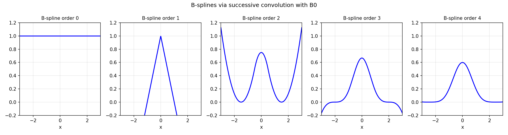

# B-splines and Convolution

*Nick Trefethen, July 2012*

[Original MATLAB Chebfun example](https://www.chebfun.org/examples/approx/BSplineConv.html)

## B-splines via convolution

The degree-$n$ B-spline is obtained by convolving the box function $B_0 = \mathbf{1}_{[-1/2,1/2]}$
with itself $n+1$ times:
$$B_n = B_0 * B_{n-1}.$$

Each convolution increases the smoothness class by one: $B_n$ is $C^{n-1}$.

```python
import chebfunjax as cj
import jax.numpy as jnp

B0 = cj.chebfun(lambda x: jnp.ones_like(x), domain=(-0.5, 0.5))
B1 = B0.conv(B0)  # hat function, C^0
B2 = B1.conv(B0)  # C^1 piecewise parabola
B3 = B2.conv(B0)  # C^2 cubic B-spline
B4 = B3.conv(B0)  # C^3 quartic B-spline
```

## Connection to the Central Limit Theorem

As $n \to \infty$, $B_n$ converges to a Gaussian — exactly as in the Central
Limit Theorem, since $B_0$ represents a uniform distribution and each convolution
corresponds to adding independent samples.



