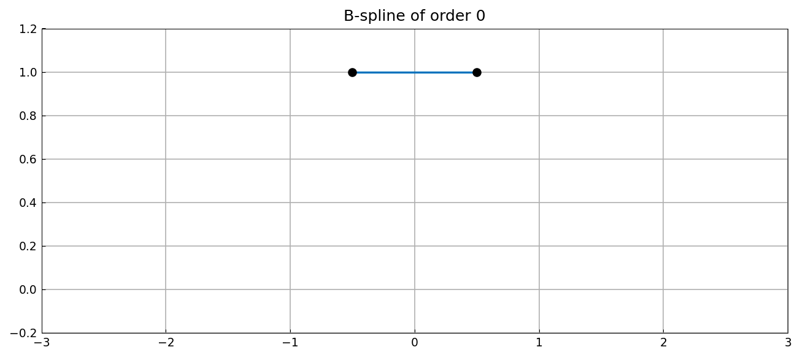
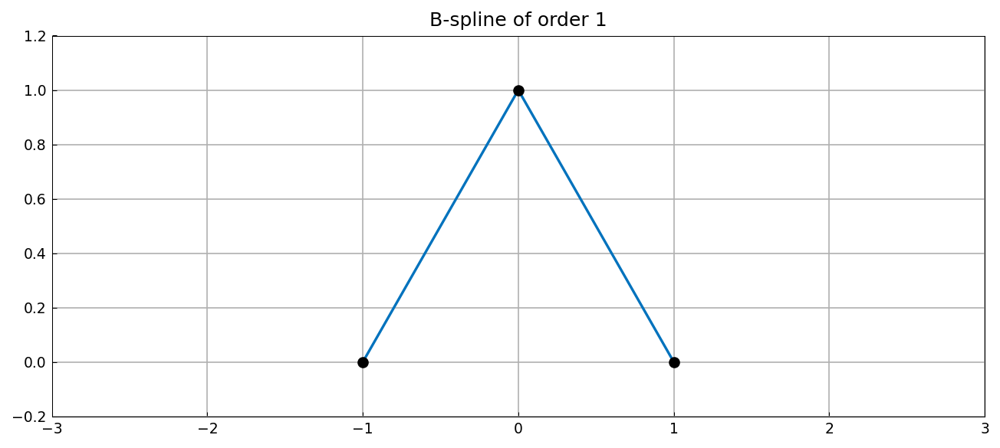
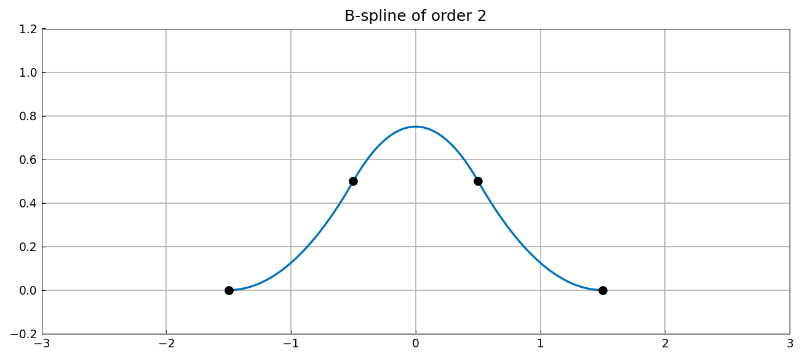
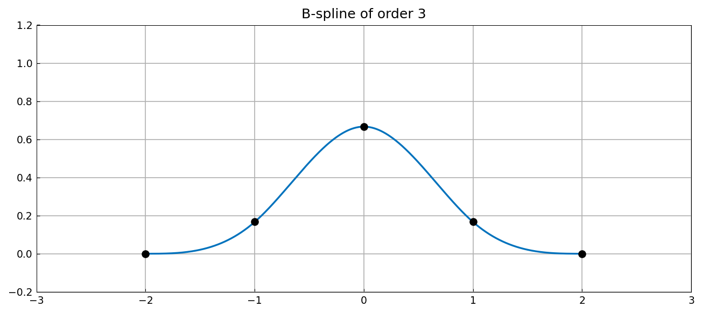
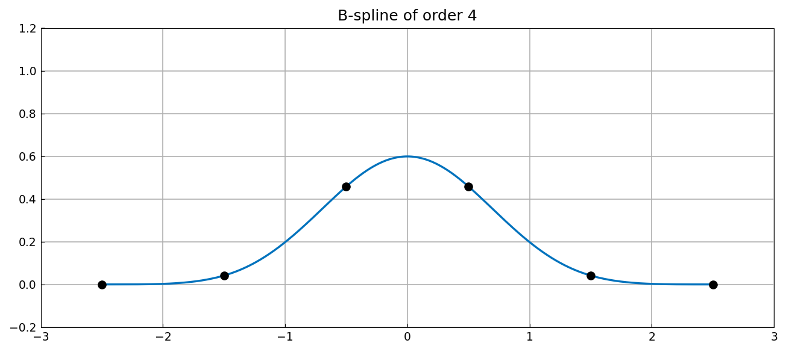

# B-splines and convolution

*Nick Trefethen, July 2012*

[Original MATLAB Chebfun example](https://www.chebfun.org/examples/approx/BSplineConv.html)

(Chebfun example approx/BSplineConv.m)

Here is the characteristic function on the interval $[-1/2,1/2]$:

```python
import chebfunjax as cj
B0 = cj.chebfun(lambda x: 1.0 + 0*x, domain=(-0.5, 0.5))
```



If we convolve `B0` with itself, we get a hat function:

```python
B1 = B0.conv(B0)
```



Convolving this result with `B0` gives us a $C^1$ function, piecewise
parabolic:



As the titles of the plots indicate, these functions are known as
B-splines.  In our notation the B-spline $B_n$ is a $C^{n-1}$ piecewise
polynomial of degree $n$ with support $[-(n+1)/2,(n+1)/2]$ and
breakpoints uniformly spaced with separation $1$ on this interval.  The
B-splines form a good basis for numerical computation with splines.
Here is `B3`:



And here is `B4`:



(Each $B_n$ integrates to exactly 1, as befits the density of a sum of
$n+1$ independent uniform random variables — the connection to the
central limit theorem is visible in the increasingly Gaussian shape.)

B-splines were introduced by Schoenberg and became a standard method
for numerical computation following the work of de Boor [1] and Cox [2]
in 1972.

## References

1. C. de Boor, On calculating with B-splines, _J. Approx. Theory_, 6
   (1972), 50-62.

2. M. G. Cox, The numerical evaluation of B-splines, _IMA J. Appl.
   Math._, 10 (1972), 134-149.

---

*Replicated with [chebfunjax](https://github.com/ma-gilles/chebfunjax); original
example copyright The University of Oxford and The Chebfun Developers.*
