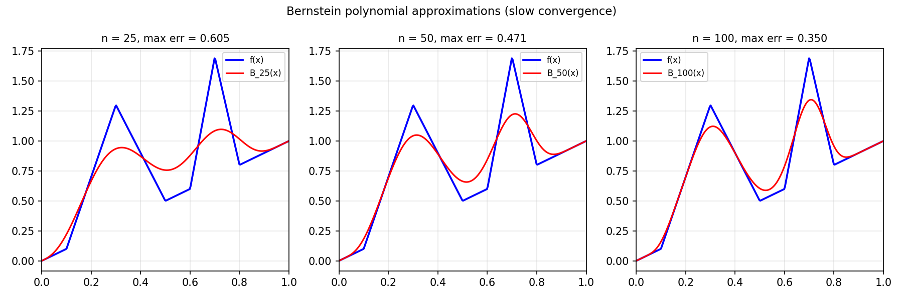

# Bernstein Polynomials

*Nick Trefethen, May 2012*

[Original MATLAB Chebfun example](https://www.chebfun.org/examples/approx/BernsteinPolys.html)

## The Weierstrass Approximation Theorem

Weierstrass proved in 1885 that any continuous function on $[a,b]$ can be
uniformly approximated by polynomials. Bernstein gave an elegant constructive
proof in 1912 using the **Bernstein polynomials**:

$$B_n(x) = \sum_{k=0}^n f(k/n) \binom{n}{k} x^k (1-x)^{n-k}.$$

This is a weighted sum: to evaluate $B_n(x)$, imagine tossing a biased coin
$n$ times with probability $x$ of heads, and evaluate $f$ at the fraction of heads.

```python
from math import comb
import numpy as np

def bernstein(f_fn, n, x_pts):
    result = np.zeros_like(x_pts)
    for k in range(n + 1):
        result += f_fn(k/n) * comb(n, k) * x_pts**k * (1-x_pts)**(n-k)
    return result
```

## Signature features

Bernstein approximations have a beautiful monotonicity property — they never
overshoot — and there is **no Gibbs phenomenon**. However, they take no advantage
of smoothness, so even for entire functions the convergence is only $O(1/n)$.

By contrast, Chebyshev interpolation achieves machine precision with only 13
points for $e^x$.



