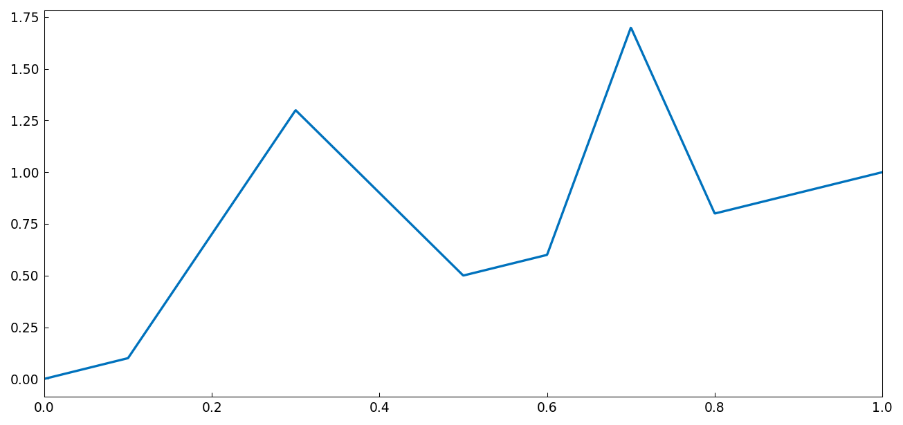
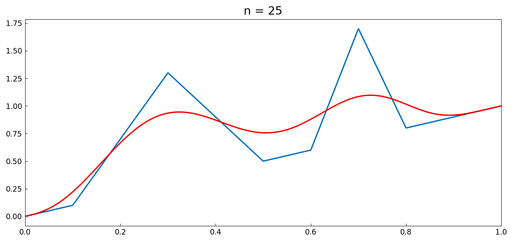
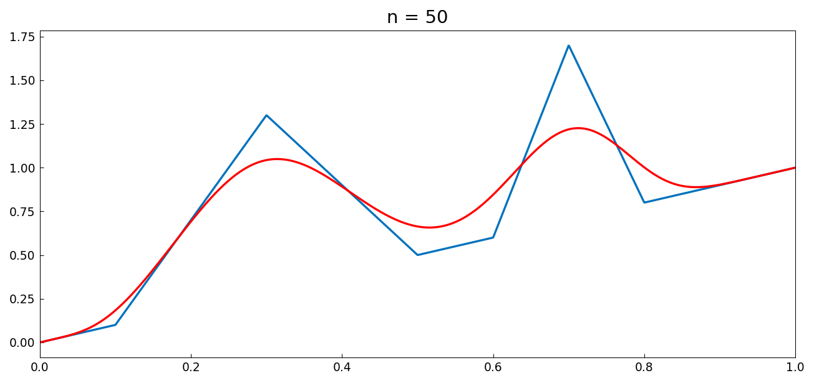
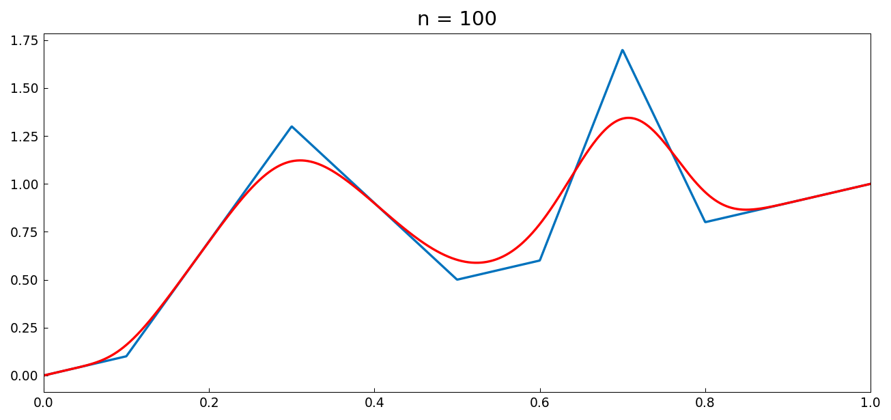
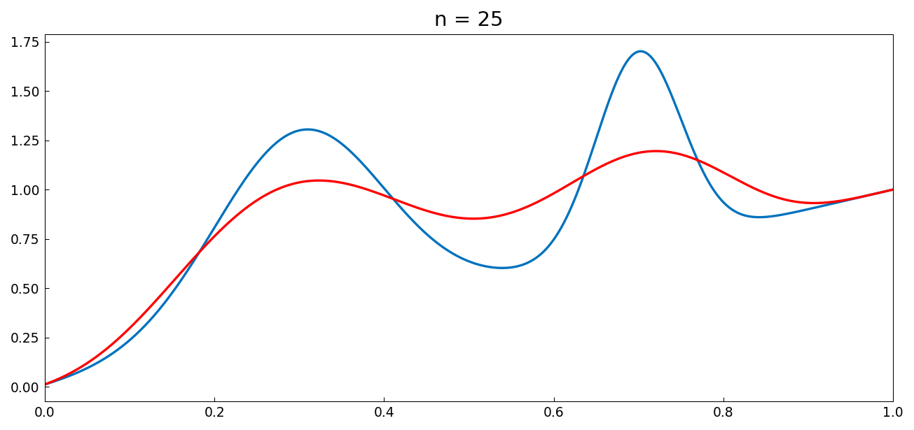
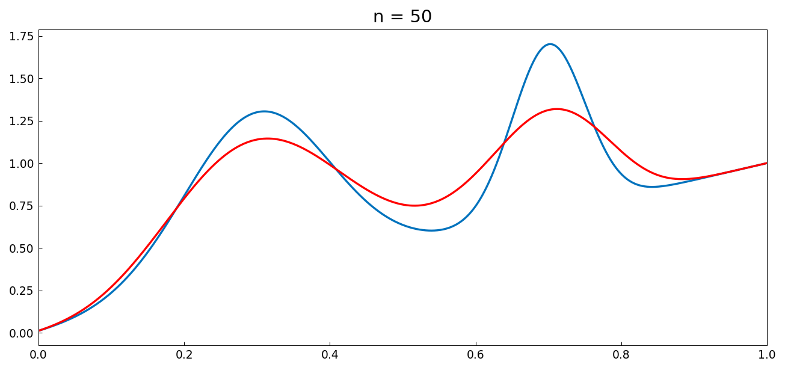
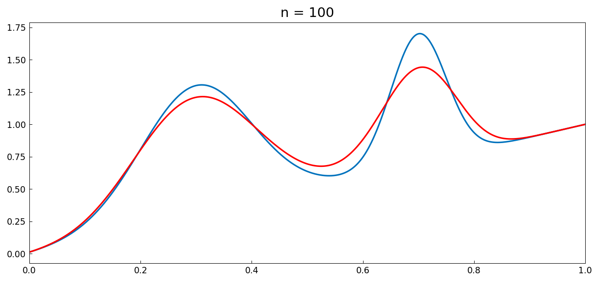

# Bernstein polynomials

*Nick Trefethen, May 2012*

[Original MATLAB Chebfun example](https://www.chebfun.org/examples/approx/BernsteinPolys.html)

(Chebfun example approx/BernsteinPolys.m)

The Weierstrass Approximation Theorem asserts that a continuous function
$f$ on a bounded interval like $[0,1]$ can be approximated by polynomials
(i.e., approximated as closely as you like in the supremum norm).
Weierstrass proved this in 1885 by a diffusion argument: if $f$ diffuses
however little, it becomes an entire function, which can be approximated
by truncating the Taylor series.  (Before the diffusion, one first
extends $f$ to a continuous function with compact support on the whole
real line.)

Bernstein gave a proof of the Weierstrass Approximation Theorem in 1912
that is a kind of discrete version of this diffusion proof: it replaces
the continuous diffusion by a random walk on an equispaced grid in
$[0,1]$.  While this is perhaps a little more complicated conceptually,
it is mathematically more elementary since you don't need any analysis
and you don't need to truncate a series, for the polynomials emerge
directly.

Specifically, for each positive integer $n$, the degree $n$ Bernstein
polynomial for $f$ is

$$ B_n(x) = \sum_{k=0}^n f(k/n) {n\choose k} x^k (1-x)^{n-k}. $$

Note that this is basically a binomial expansion.  The formula tells us
that to evaluate $B_n(x)$, we can imagine a biased coin that comes up
heads with probability $x$ and tails with probability $1-x$.  Then
$B_n(x)$ is the expected result that you'll get if you start at $x=0$
and toss the coin $n$ times, moving right on the grid if you get a
heads, and evaluate $f$ when you finish tossing.

Let's demonstrate in Chebfun.  Here is a continuous function on $[0,1]$:

```python
import numpy as np
import chebfunjax as cj

s = cj.chebfun(lambda t: t, domain=(0.0, 1.0))
f = (s - 0.3).abs().minimum(2.0*(s - 0.7).abs())
f = s + (1.0 - 5.0*f).maximum(0.0)
```



Since $B_n$ is a polynomial of degree $n$, we can construct it by
evaluating it on a grid of $n+1$ points and then interpolating.  For
stability these should be Chebyshev points, not equispaced.  Here is an
elementary code to do this at least for small values of $n$:

```python
import jax.numpy as jnp
from scipy.special import comb
from chebfunjax.chebfun1d.chebfun import Chebfun, Domain
from chebfunjax.utils.quadrature import chebpts_ab

def Bn(f, n):
    x = np.asarray(chebpts_ab(n + 1, 0.0, 1.0))
    data = np.zeros_like(x)
    for k in range(n + 1):
        fk = float(f(jnp.asarray(k/n)))
        data = data + fk * comb(n, k) * x**k * (1 - x)**(n - k)
    return Chebfun.from_values(jnp.asarray(data), domain=Domain((0.0, 1.0)))
```

To illustrate the behavior of Bernstein polynomials, here we see slow
convergence as $n$ increases:







Note a signature feature of Bernstein polynomial approximations, their
monotonicity in various senses.  There is never any Gibbs phenomenon.

On the other hand, since these approximations depend on the central
limit theorem to give accuracy as $n$ gets large, they take no advantage
at all of smoothness.  Here for example is a repetition of the last
experiment for a far smoother function:

```python
f = s + ((-50*(s - 0.3)**2).exp() + (-200*(s - 0.7)**2).exp())
```







Though $f$ is now entire, the convergence is not really better than
before.  By contrast we know that $n=100$ is more than enough for
Chebyshev interpolation to nail this function to machine precision:

```python
len(f)
```
```
ans =
    87
```

(The published MATLAB output is 85; the two-point difference is an
adaptive-chop artifact of the construction.)

---

*Replicated with [chebfunjax](https://github.com/ma-gilles/chebfunjax); original
example copyright The University of Oxford and The Chebfun Developers.*
