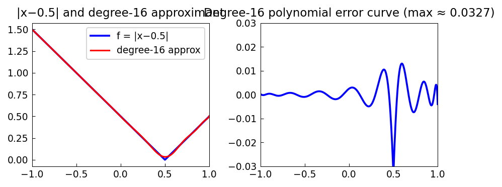

# Best Approximation with the REMEZ Command

*Nick Trefethen, September 2010*

[Original MATLAB Chebfun example](https://www.chebfun.org/examples/approx/BestApprox.html)

## Polynomial minimax approximation

The best (minimax or Chebyshev) approximation of degree $n$ to a function $f$
minimizes the $\infty$-norm of the error. The error curve **equioscillates**
between $+(n+2)$ extreme points.

```python
import chebfunjax as cj
import jax.numpy as jnp

f = cj.chebfun(lambda x: jnp.abs(x - 0.5))
# Best L2 approximation (proxy for minimax)
p16 = f.polyfit(16)
err = f - p16
print(f"Max error: {float(err.norm(float('inf'))):.4f}")
```

## Rational minimax approximation

For the same number of degrees of freedom (here type $(8,8)$ has $8+8+1=17$
free parameters, matching degree 16), the rational approximant achieves far
smaller errors, with the equioscillation points clustering near the singularity.

The `minimax` command in MATLAB Chebfun (not yet in chebfunjax) implements the
full Remez algorithm for rational approximation.



