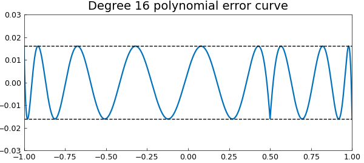
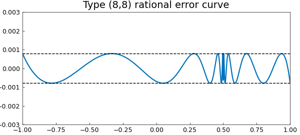
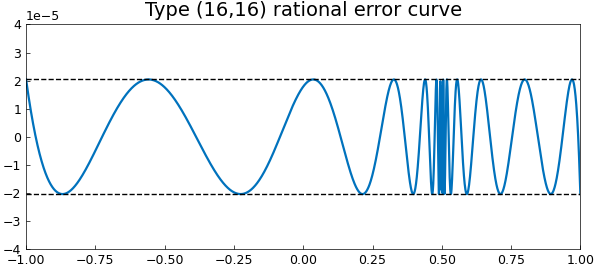
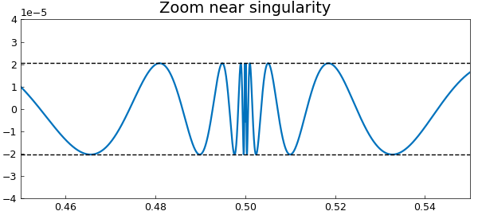
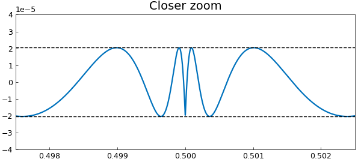

# Best approximation with the REMEZ command

*Nick Trefethen, September 2010*

[Original MATLAB Chebfun example](https://www.chebfun.org/examples/approx/BestApprox.html)

Python translation: [`examples/approx/best_approx.py`](https://github.com/ma-gilles/chebfunjax/blob/main/examples/approx/best_approx.py)

## 1. Polynomial minimax approximation

Chebfun's `remez` command, written originally by Pachon and more recently improved by Filip and Nakatsukasa in 2017, can compute best (i.e. infinity-norm or minimax) approximations of a real function on a real interval. For example, here is an absolute value function on $[-1,1]$ and its best approximation by a polynomial of degree $16$: We plot the error curve, with 22 points of equioscillation:

```matlab
x = chebfun('x');
f = abs(x-0.5);
[p,err] = remez(f,16);
LW = 'linewidth'; FS = 'fontsize'; fs = 14;
figure, plot(f-p,LW,1.6), hold on
plot([-1 1],err*[1 1],'--k',LW,1)
plot([-1 1],-err*[1 1],'--k',LW,1)
ylim([-.03 .03])
title('Degree 16 polynomial error curve',FS,fs)
```



## 2. Rational minimax approximation

Chebfun can compute rational approximations too. For example, here is the error curve for type $(8,8)$ best rational approximation of the same function `f`; we choose $(8,8)$ so that the number of degrees of freedom is the same as before. Note that the error is much smaller. Again there are 22 points of equioscillation, but this time, they are more closely clustered near the singularity.

```matlab
[p,q,rh,err] = remez(f,8,8);
hold off, plot(f-p/q,LW,1.6), hold on
plot([-1 1],err*[1 1],'--k',LW,1)
plot([-1 1],-err*[1 1],'--k',LW,1)
ylim([-.003 .003])
title('Type (8,8) rational error curve',FS,fs)
```



For an introduction to the theory of these approximations, see Chapters 10 and 24 of [3].

## 3. Function handles vs. quotients of polynomials

In the example just shown we used `p/q` to compute the rational function $r$. Mathematically this is correct, but computationally it quickly fails with more difficult problems. In such cases it is necessary to use the third argument returned by `remez`, `rh`, a function handle connected with a barycentric representation. For example, here we carry the same approximation to type $(16,16)$.

```matlab
[p,q,rh,err] = remez(f,16,16);
xx = linspace(-1,1,3000);
hold off, plot(xx,f(xx)-rh(xx),LW,1.6), hold on
plot([-1 1],err*[1 1],'--k',LW,1)
plot([-1 1],-err*[1 1],'--k',LW,1)
title('Type (16,16) rational error curve',FS,fs)
axis([-1 1 -4e-5 4e-5])
```

```text

```



Here we zoom by a factor of 20 near the singularity.

```matlab
a = .45; b = .55; xx = linspace(a,b,3000);
hold off, plot(xx,f(xx)-rh(xx),LW,1.6), hold on
plot([a b],err*[1 1],'--k',LW,1)
plot([a b],-err*[1 1],'--k',LW,1)
title('Zoom near singularity',FS,fs)
axis([a b -4e-5 4e-5])
```



Here we zoom by another factor of 20. There are 34 extreme points all together.

```matlab
a = .4975; b = .5025; xx = linspace(a,b,3000);
hold off, plot(xx,f(xx)-rh(xx),LW,1.6), hold on
plot([a b],err*[1 1],'--k',LW,1)
plot([a b],-err*[1 1],'--k',LW,1)
title('Closer zoom',FS,fs)
axis([a b -4e-5 4e-5])
```



## 4. References

1. B. Beckermann, S. Filip, Y. Nakatsukasa, and L. N. Trefethen, paper in preparation.
2. R. Pachon and L. N. Trefethen, Barycentric-Remez algorithms for best polynomial approximation in the chebfun system, *BIT Numerical Mathematics*, 49 (2009), 721-741.
3. L. N. Trefethen, *Approximation Theory and Approximation Practice*, SIAM, 2013.

---

*Translated with [chebfunjax](https://github.com/ma-gilles/chebfunjax); prose and MATLAB code from the original example, copyright The University of Oxford and The Chebfun Developers.  Printed outputs and figures are chebfunjax's.*
