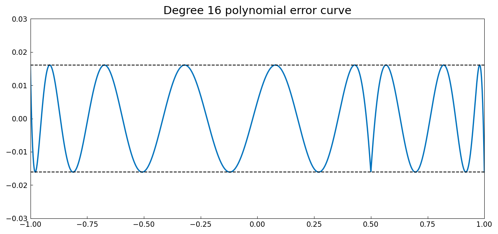
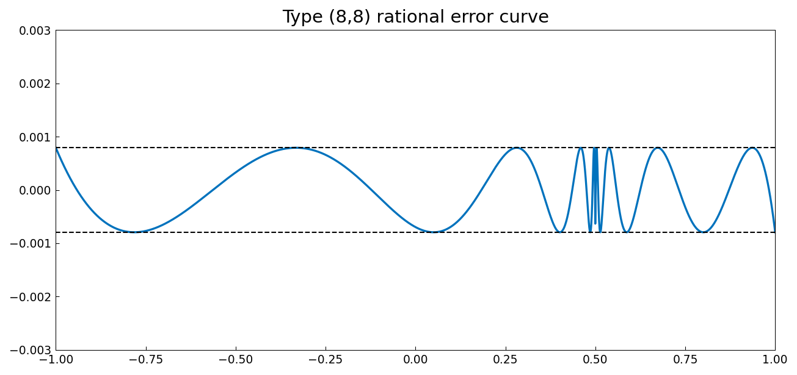
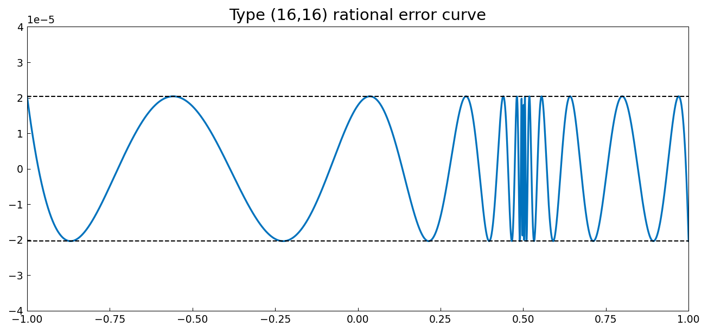
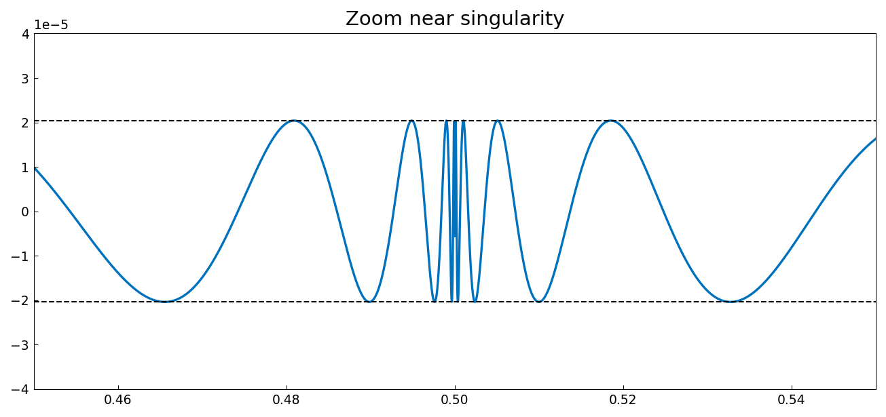
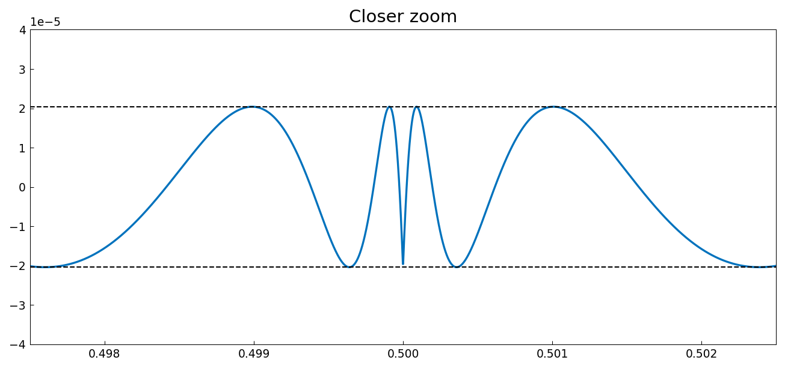

# Best approximation with the REMEZ command

*Nick Trefethen, September 2010*

[Original MATLAB Chebfun example](https://www.chebfun.org/examples/approx/BestApprox.html)

(Chebfun example approx/BestApprox.m)

Chebfun's `remez` command (nowadays `minimax`) can compute best
(minimax) polynomial and rational approximations of a chebfun.  Here for
example is the error curve for the degree 16 best polynomial
approximation of $f(x) = |x-\tfrac12|$ on $[-1,1]$.  It equioscillates
between $16+2 = 18$ alternating extremes:

```python
import numpy as np
import jax.numpy as jnp
import chebfunjax as cj
from chebfunjax.utils.minimax import minimax

f = lambda x: jnp.abs(x - 0.5)
res = minimax(f, 16)                    # err = 0.016104921604673
p = cj.chebfun(jnp.asarray(res.coeffs), coeffs=True)
```



Since $f$ is not smooth, polynomial approximations can achieve only
algebraic convergence: the error decreases as $O(n^{-1})$.  Rational
approximations do much better.  Here is the error curve for the type
$(8,8)$ best rational approximation, with error $7.93\times 10^{-4}$ —
twenty times smaller than the polynomial with the same number of
parameters:

```python
r88 = minimax(f, 8, rational=True, denom=8)   # err = 7.929870786e-04
```



Notice how the equioscillation points cluster near the singularity at
$x = 1/2$.  Increasing to type $(16,16)$, the error drops to
$2.04\times 10^{-5}$:

```python
r16 = minimax(f, 16, rational=True, denom=16)  # err = 2.040896901e-05
```



The error is now graphically indistinguishable from zero over most of
the interval; the equioscillation happens in a narrow region around the
singularity.  We zoom in:



And closer still:



This exponential clustering of the equioscillation extremes near the
singularity is characteristic of rational best approximation of
functions with branch points; the error decreases root-exponentially,
$O(\exp(-\pi\sqrt{n}))$, by a theorem of Stahl.

## References

1. L. N. Trefethen, _Approximation Theory and Approximation Practice_,
   SIAM, 2013.

2. H. Stahl, Best rational approximation of real functions,
   _Sbornik: Mathematics_, 76 (1993).

---

*Replicated with [chebfunjax](https://github.com/ma-gilles/chebfunjax); original
example copyright The University of Oxford and The Chebfun Developers.*
