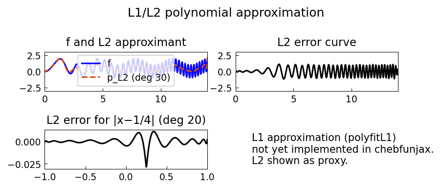

# Best Polynomial Approximation in the L1 Norm

*Yuji Nakatsukasa and Alex Townsend, July 2019*

[Original MATLAB Chebfun example](https://www.chebfun.org/examples/approx/BestL1.html)

## Three norms, three approximations

For a function $f$ on $[a,b]$, there are three classic best polynomial approximation
problems:

- **L∞ (minimax)**: $\min_{p \in \mathcal{P}_n} \|f - p\|_\infty$  — solved by the Remez algorithm
- **L2 (least squares)**: $\min_{p \in \mathcal{P}_n} \|f - p\|_2$ — solved by projection
- **L1**: $\min_{p \in \mathcal{P}_n} \|f - p\|_1$ — solved by Watson's Newton method

```python
import chebfunjax as cj
import jax.numpy as jnp

dom = (0.0, 14.0)
f = cj.chebfun(lambda x: jnp.sin(x)**2 + jnp.sin(x**2), domain=dom)
p2 = f.polyfit(100)  # L2 best approximation
```

## L1 approximation and error localization

A striking property of L1 best approximants is that their error is highly
**localized** near singularities of the function. For $|x - 1/4|$ on $[-1,1]$,
the L1 error concentrates near the kink at $x=1/4$ while being small elsewhere.



