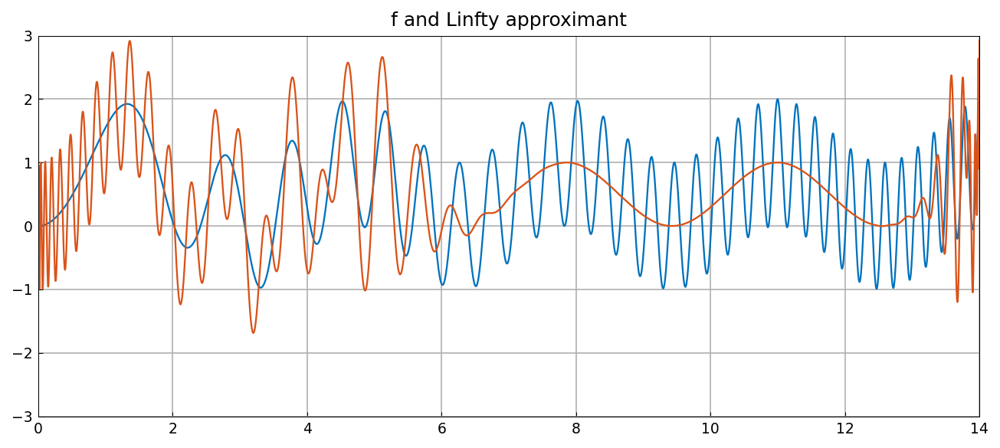
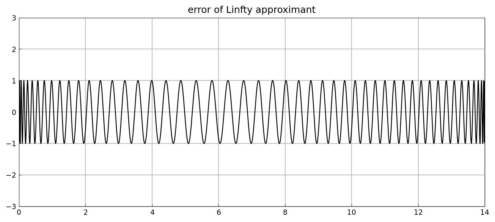
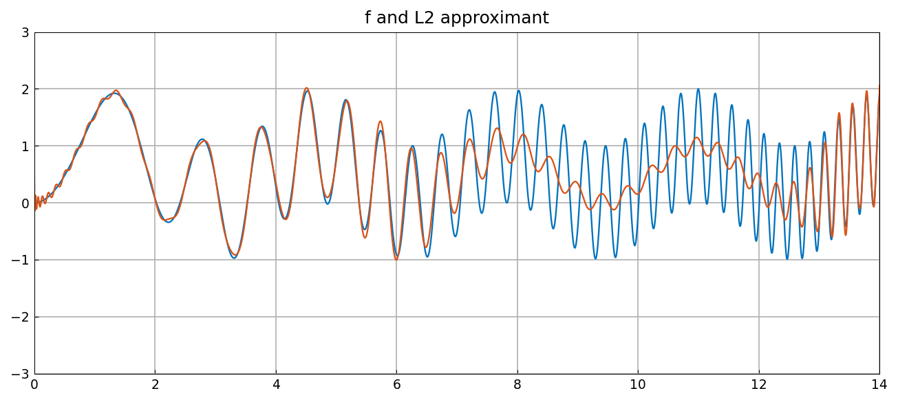
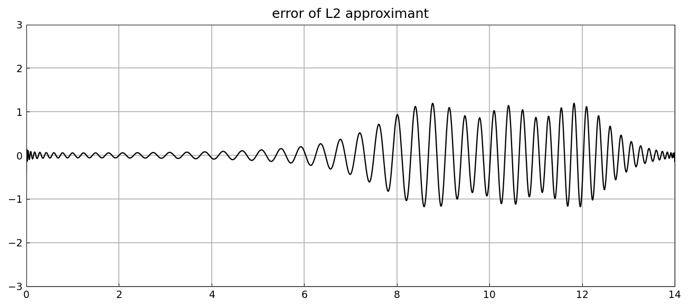
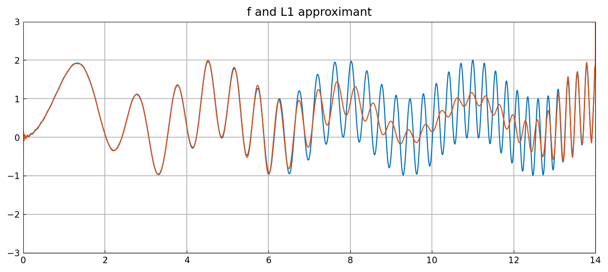
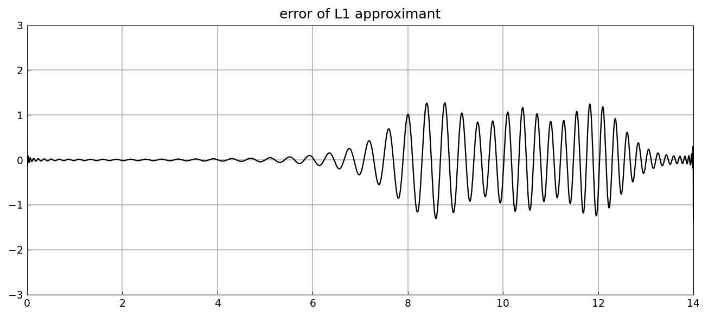
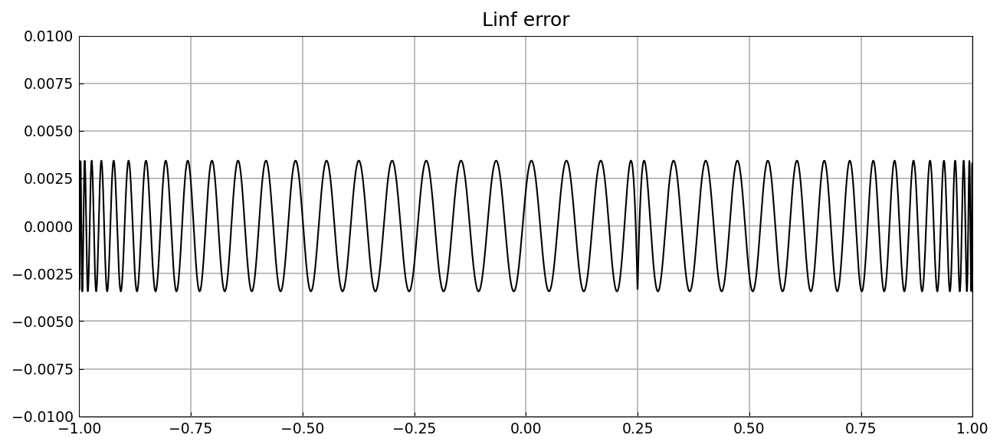
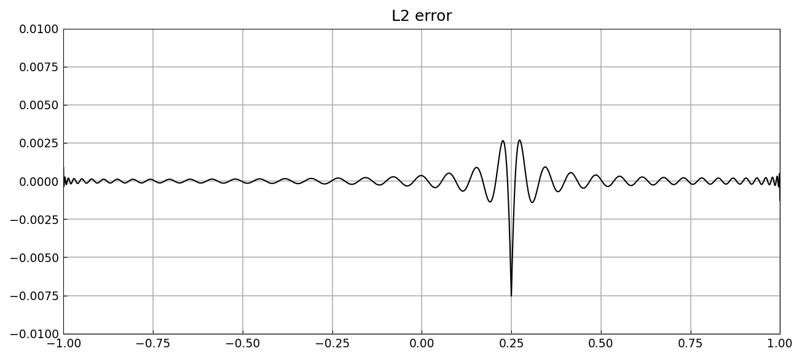
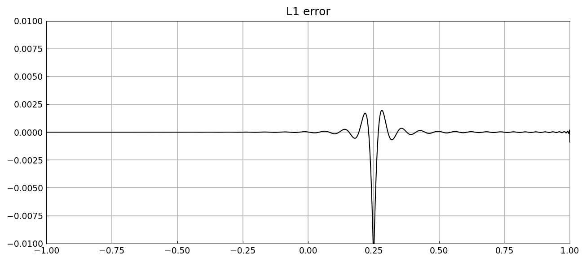
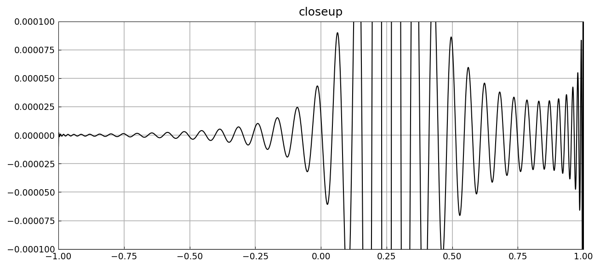

# Best polynomial approximation in the L1 norm

*Yuji Nakatsukasa and Alex Townsend, July 2019*

[Original MATLAB Chebfun example](https://www.chebfun.org/examples/approx/BestL1.html)

(Chebfun example approx/BestL1.m)

## Polynomial approximation in the $L^\infty$ norm

Given a continuous real-valued function $f$ on $[a,b]$, finding the
best polynomial approximant to $f$ in the $L^\infty$-norm is the
minimax approximation problem.  Let's revisit
[approx/ResolutionWiggly](ResolutionWiggly.md) and compute a best
polynomial approximant of degree 100:

```python
import jax.numpy as jnp
import chebfunjax as cj
from chebfunjax.utils.minimax import minimax

fop = lambda x: jnp.sin(x)**2 + jnp.sin(x**2)
f = cj.chebfun(fop, domain=(0.0, 14.0))
res = minimax(fop, 100, domain=(0.0, 14.0), tol=1e-8)
```



The error $f-p_\infty$ exhibits the beautiful equioscillation
phenomenon:



## Polynomial approximation in the $L^2$ norm

The best polynomial approximant in the $L^2$-norm is the orthogonal
projection, via `polyfit`:



The error curve is strikingly different — slightly larger at its
largest, but not by much:



## Polynomial approximation in the $L^1$ norm

The `polyfitL1` command computes best polynomial approximants in the
$L^1$-norm (see Pinkus [2] for a survey; Watson's Newton-based
algorithm [4] underlies the computation).  Compressed sensing has made
the $L^1$ norm an important tool as it promotes sparsity in the
residual:

```python
p1 = f.polyfitL1(100)
```





## A function with a singularity

The differences become dramatic for $f = |x-1/4|$ at degree 80.  The
$L^\infty$ error equioscillates globally:



The $L^2$ error is spread out too:



But the $L^1$ error is *localized*: large only in a small neighborhood
of the singular point $x=1/4$,



and tiny everywhere else, as the closeup shows:



This error localization is the subject of [1].

## References

1. Y. Nakatsukasa and A. Townsend, Error localization of best $L_1$
   polynomial approximants, arXiv:1902.02664.

2. A. Pinkus, _On L1-Approximation_, Cambridge University Press, 1989.

3. L. N. Trefethen, _Approximation Theory and Approximation Practice_,
   SIAM, 2013.

4. G. A. Watson, An algorithm for linear $L_1$ approximation of
   continuous functions, _IMA J. Numer. Anal._, 1 (1981), 157-167.

---

*Replicated with [chebfunjax](https://github.com/ma-gilles/chebfunjax); original
example copyright The University of Oxford and The Chebfun Developers.*
