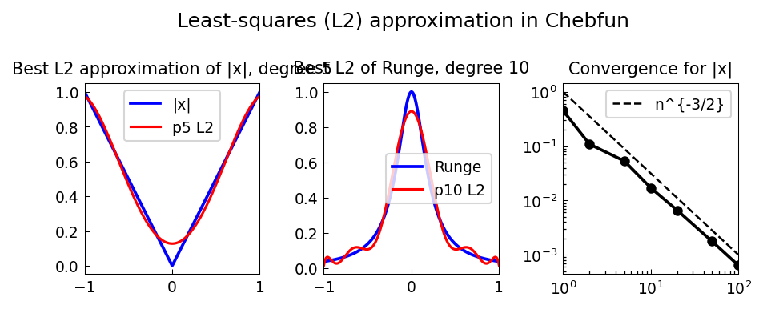

# Least-Squares Approximation in Chebfun

*Alex Townsend, October 2013*

[Original MATLAB Chebfun example](https://www.chebfun.org/examples/approx/BestL2Approximation.html)

## Least-squares polynomial approximation

The best $L^2$ approximation of degree $n$ to $f$ is the polynomial $p_n$
minimizing $\|f - p_n\|_2$.  It equals the orthogonal projection of $f$
onto $\mathcal{P}_n$:
$$p_n = \sum_{k=0}^n \langle f, P_k \rangle P_k,$$
where $P_k$ are the Legendre polynomials.

In chebfunjax, `f.polyfit(n)` computes this efficiently:

```python
import chebfunjax as cj
import jax.numpy as jnp

f = cj.chebfun(jnp.abs)
p5 = f.polyfit(5)
print(f"L2 error: {float((f - p5).norm(2)):.4f}")
```

## Convergence rate

For the absolute value function $|x|$ (not analytic), the $L^2$ convergence rate
is $O(n^{-3/2})$ — reflecting the one-sided singularity (a corner) at $x=0$.

For smooth functions the convergence is geometric: $O(\rho^{-n})$ for some $\rho > 1$.



