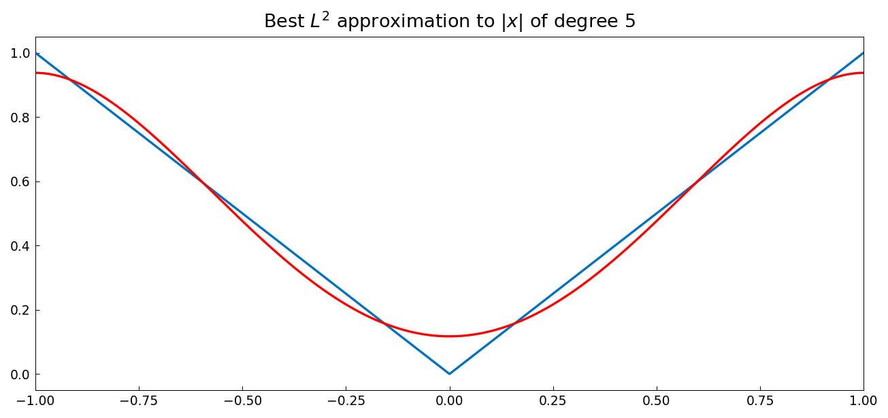
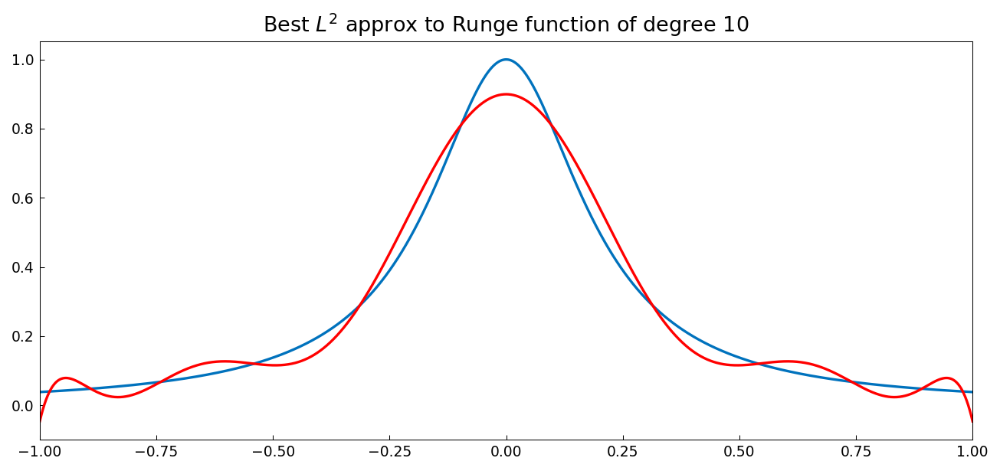
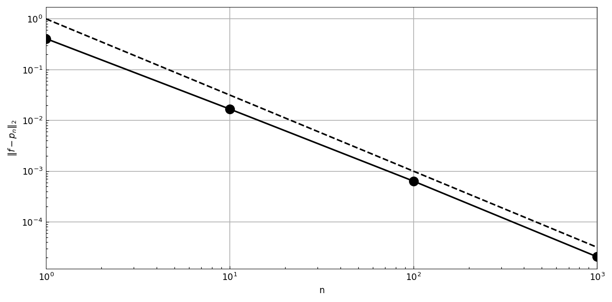

# Least-squares approximation in Chebfun

*Alex Townsend, October 2013*

[Original MATLAB Chebfun example](https://www.chebfun.org/examples/approx/BestL2Approximation.html)

(Chebfun example approx/BestL2Approximation.m)

## Least-squares approximation

If $f:[-1,1]\rightarrow R$ is an $L^2$-integrable function, then its
least-squares or best $L^2$ approximation of degree $n$ is the
polynomial $p_n$ of degree at most $n$ such that

$$ \| f - p_n \|_2 = \mbox{minimum}. $$

A good introduction to $L^2$ approximations can be found in [2].  The
`polyfit` command returns the best $L^2$ approximation of a given
degree to a chebfun.  Here is the degree-5 approximation of $|x|$,
computed by projection onto Legendre polynomials of the whole domain:

```python
import numpy as np
import jax.numpy as jnp
import chebfunjax as cj

f = cj.chebfun(lambda t: jnp.abs(t), domain=[-1.0, 0.0, 1.0])
pn = f.polyfit(5)
```



The coefficients of $p_n$ in the Legendre basis can also be computed by
truncating the Legendre expansion for $f$ after $n+1$ terms, via
`cheb2leg` (the fast Chebyshev-Legendre transform of [1,3]) and
`leg2cheb`:

```python
from chebfunjax.utils.transforms import cheb2leg, leg2cheb

fr = cj.chebfun(lambda t: 1.0/(1 + 25*t**2))     # Runge function
cleg = np.asarray(cheb2leg(fr.coeffs))[:11]
pn = cj.chebfun(leg2cheb(jnp.asarray(cleg)), coeffs=True)
```


This is the algorithm used in Chebfun's `polyfit`:

```python
pn = fr.polyfit(10)
```



The published example computes a degree-$10^4$ fit of the very sharp
Runge function $1/(1+10^6x^2)$ (chebfun length $\approx 37000$) in
1.5 seconds using the fast $O(n(\log n)^2)$ transform.  chebfunjax's
`cheb2leg`/`leg2cheb` are currently $O(n^2)$ (a ledgered gap), so this
replica demonstrates the same computation on $1/(1+10^4x^2)$ at degree
2000:

```
L^2 error is 2.546e-10
L^2 approximation of degree 2000 in t = 327.096
```

## Best $L^2$ approximation to $|x|$

Finally, the classic convergence-rate study: the $L^2$ error of the
degree-$n$ best approximation to $|x|$ decreases like $n^{-3/2}$:

```
errs: 4.082e-01  1.674e-02  6.371e-04  2.056e-05   (n = 1, 10, 100, 1000)
```



## References

1. N. Hale and A. Townsend, A fast, simple, and stable Chebyshev-
   Legendre transform using an asymptotic formula, _SIAM J. Sci.
   Comput._, 36 (2014), A148-A167.

2. M. J. D. Powell, _Approximation Theory and Methods_, Cambridge
   University Press, 1981.

3. A. Townsend, M. Webb, and S. Olver, Fast polynomial transforms
   based on Toeplitz and Hankel matrices, _Math. Comp._, 87 (2018),
   1913-1934.

---

*Replicated with [chebfunjax](https://github.com/ma-gilles/chebfunjax); original
example copyright The University of Oxford and The Chebfun Developers.*
