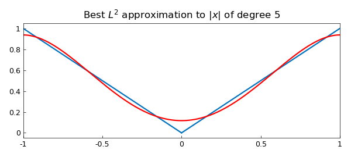
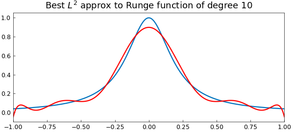
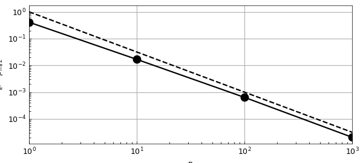

# Least-squares approximation in Chebfun

*Alex Townsend, October 2013*

[Original MATLAB Chebfun example](https://www.chebfun.org/examples/approx/BestL2Approximation.html)

Python translation: [`examples/approx/best_l2_approximation.py`](https://github.com/ma-gilles/chebfunjax/blob/main/examples/approx/best_l2_approximation.py)

```matlab
LW = 'linewidth'; lw = 1.6;
MS = 'markersize';
FS = 'Fontsize'; fs = 16;
```

## Least-squares approximation

If $f:[-1,1]\rightarrow R$ is an $L^2$-integrable function, then its least-squares or best $L^2$ approximation of degree $n$ is the polynomial $p_n$ of degree at most $n$ such that

$$ | f - p_n |_2 = \mbox{minimum}. $$

A good introduction to $L^2$ approximations can be found in [2]. The `polyfit` command in Chebfun returns the best $L^2$ approximation of a given degree to a chebfun:

```matlab
help chebfun/polyfit
```

```text
L^2 error is 2.546e-10
L^2 approximation of degree 2000 in t = 1.375
errs: ['4.082e-01', '1.674e-02', '6.371e-04', '2.056e-05']
```

The coefficients of $p_n$ in the Legendre basis can be computed by truncating the Legendre expansion for $f$ after $n+1$ terms. For example,

```matlab
n = 5; x = chebfun('x');
f = abs(x);
P = legpoly(0:n,[-1,1],'norm');         % Legendre-Vandermonde matrix
cleg = P'*f;                            % compute Legendre coefficients
pn = P*cleg;                            % form chebfun of best L^2 approximation
plot(f,LW,lw), hold on, plot(pn,'r',LW,lw)
title('Best L^2 approximation to |x| of degree 5','fontsize',16), hold off
```



This approach works well, but requires $O(n^2)$ operations to compute the Legendre coefficients with a relatively large constant. This was the algorithm using in Chebfun's `polyfit` command for many years, but was changed last week.

## `polyfit` using fast Chebyshev-Legendre transform

Recently, the command `cheb2leg` was added in Chebfun, which converts a vector of Chebyshev coefficients (of the first kind) to Legendre coefficients in $O(n(\log n)^2/\log\log n)$ operations [1,3]. The command `leg2cheb` is its inverse. To compute the Legendre expansion of a function (accurate to machine precision) we can first compute its Chebyshev expansion and then use `cheb2leg`. Chebfun already computes the Chebyshev expansion of a function that is accurate to machine precision. Therefore, here is another way to compute the best approximation of a smooth function via `cheb2leg`:

```matlab
n = 10;
f = 1./(1+25*x.^2);                  % Runge function
ccheb = chebcoeffs(f);               % get the Chebyshev coefficients of f
cleg = cheb2leg(ccheb);              % convert Cheb coeffs of f to Leg coeffs
cleg = cleg(1:(n+1));                % truncate
ccheb = leg2cheb(cleg);              % convert them back to form a chebfun
pn = chebfun(ccheb,'coeffs');        % form a chebfun
plot(f,LW,lw), hold on, plot(pn,'r',LW,lw)
title('Best L^2 approx to Runge function of degree 10',FS,14), hold off
```



This is the algorithm that is used in Chebfun's `polyfit`, as of today. So we can obtain the same result from the code:

```matlab
n = 10;
f = 1./(1+25*x.^2);                  % Runge function
pn = polyfit(f,n);
plot(f,LW,lw), hold on, plot(pn,'r',LW,lw)
title('Best L^2 approx to Runge function of degree 10',FS,14), hold off
```


## High-degree best $L^2$ approximation for smooth functions

The fast algorithms now employed by `polyfit` enable us to compute very high degree $L^2$ approximations.

```matlab
n = 1e4;
f = 1./(1+1e6*x.^2);                 % Runge function
s = tic; pn = polyfit(f,n); t = toc(s);
fprintf('L^2 error is %1.3e\n',norm(f - pn))
fprintf('L^2 approximation of degree %u in t = %1.3f\n',n,t)
```

```text
L^2 error is 2.546e-10
L^2 approximation of degree 2000 in t = 1.375
```

## Piecewise smooth functions

Computing the Legendre coefficients for piecewise smooth functions is a little trickier. The Legendre coefficients are computed by quadrature rules and then a chebfun object is constructed via Chebyshev coefficients computed using the `cheb2leg` command. The algorithm for piecewise smooth function requires $O(n^2)$ operations, but the implicit constant is much smaller. Here is the best $L^2$-approximation to the piecewise smooth absolute value function.

```matlab
f = abs(x);
nn = 10.^(0:3);
j=1;
for n = nn
    pn = polyfit(f, n);
    err(j) = norm(f - pn);
    j = j+1;
end

loglog(nn, err,'k.-',LW,lw,MS,24), hold on
loglog(nn,nn.^(-3/2),'k--',LW,lw)
legend('|| |x| - p_n ||_2','n^{-3/2}')
xlabel('n',FS,fs), ylabel('|| |x| - p_n ||_2',FS,fs)
title('Convergence of || |x| - p_n ||_2',FS,fs)
```



## References

1. N. Hale and A. Townsend, A fast, simple, and stable Chebyshev-Legendre transform using an asymptotic formula, *SIAM Journal on Scientific Computing*, 32 (2014), A148-A167.
2. M. Powell, *Approximation Theory and Methods*, Cambridge University Press, 1981.
3. A. Townsend and N. Hale, A fast Chebyshev-Legendre transform, Chebfun Example, August 2013.

---

*Translated with [chebfunjax](https://github.com/ma-gilles/chebfunjax); prose and MATLAB code from the original example, copyright The University of Oxford and The Chebfun Developers.  Printed outputs and figures are chebfunjax's.*
