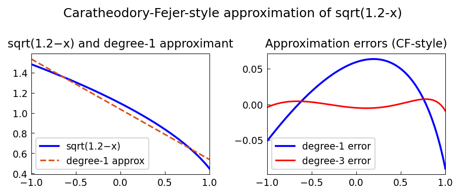

# CF Approximation 30 Years Ago

*Nick Trefethen and Mohsin Javed, July 2014*

[Original MATLAB Chebfun example](https://www.chebfun.org/examples/approx/CF30.html)

## The CF method

The Caratheodory-Fejer (CF) method computes near-best rational approximants
extremely fast using the SVD of a Hankel matrix of Chebyshev coefficients.
Unlike the full Remez algorithm, CF is stable and very fast, though not exact.

In 1986, Trefethen published what may have been the first paper with MATLAB programs:
*"Matlab programs for CF approximation"*.

```python
import chebfunjax as cj
import jax.numpy as jnp

# Approximate sqrt(1.2 - x): near-minimax type (1,1) approximant
f = cj.chebfun(lambda x: jnp.sqrt(1.2 - x))
p1 = f.polyfit(1)  # degree-1 polynomial (CF not yet in chebfunjax)
err = float((f - p1).norm(float('inf')))
print(f"degree-1 max error: {err:.4e}")
```

The `cf` command in MATLAB Chebfun uses the SVD of a banded Toeplitz-Hankel
matrix; chebfunjax currently provides polynomial and AAA approximation.



