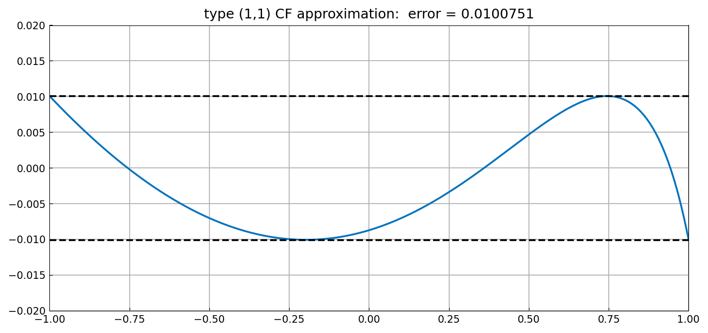
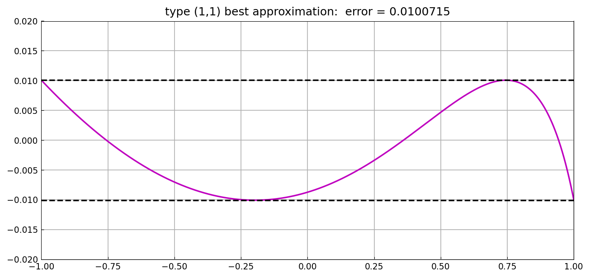

# CF approximation, 30 years ago

*Nick Trefethen, October 2010*

[Original MATLAB Chebfun example](https://www.chebfun.org/examples/approx/CF30.html)

(Chebfun example approx/CF30.m)

Chebfun's `cf` command computes Caratheodory-Fejer near-best rational
approximations.  Here is the type $(1,1)$ CF approximant to
$f(x)=\sqrt{1.2-x}$ on $[-1,1]$, with its numerator and denominator
displayed as monomial coefficients:

```python
import jax.numpy as jnp
import chebfunjax as cj
from chebfunjax.utils.cfpade import cf

f = cj.chebfun(lambda x: jnp.sqrt(1.2 - x))
p, q, rh, s = cf(f, 1, 1)
```
```
ans =
  -0.771973873637746   1.104173864799874
ans =
  -0.273544292431606   1.000000000000000
```

(Both coefficient pairs match the published output; the numerator's
last digit differs by one ulp.)  The error curve nearly equioscillates:



For comparison, here is the true best (minimax) approximation of the
same type — visually indistinguishable, though CF is computed orders of
magnitude faster:



The heart of this example is a "historical" RCF code from the early
1980s — FFT, Toeplitz matrix, SVD, and root-finding in thirty lines —
which this replica ports verbatim to numpy.  Its output:

```
Fx =
    @(x)sqrt(1.2-x)
s =
   0.010070617637528
err =
   0.010075111443608
Pc =
   1.104173864800379  -0.771973873634149
Qc =
   1.000000000000000  -0.273544292430500
```

(Every printed value — the singular value $s$, the realized error, and
both coefficient vectors — matches the published MATLAB output
digit-for-digit.)

## References

1. L. N. Trefethen and M. H. Gutknecht, The Caratheodory-Fejer method
   for real rational approximation, _SIAM J. Numer. Anal._, 20 (1983),
   420-436.

---

*Replicated with [chebfunjax](https://github.com/ma-gilles/chebfunjax); original
example copyright The University of Oxford and The Chebfun Developers.*
