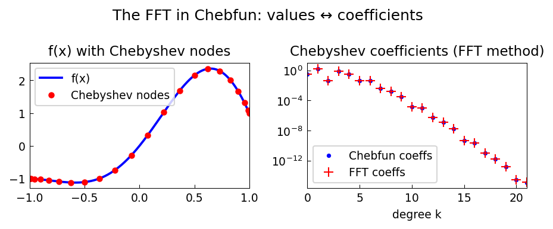

# The FFT in Chebfun

*Mark Richardson, May 2011*

[Original MATLAB Chebfun example](https://www.chebfun.org/examples/approx/ChebfunFFT.html)

## Chebyshev points and the unit circle

Chebyshev points $x_k = \cos(k\pi/n)$ on $[-1,1]$ are the **real parts of
equispaced nodes** on the unit circle.  This connection makes the discrete
cosine transform equivalent to the FFT.

A function sampled at $n+1$ Chebyshev points can be converted to $n+1$
Chebyshev coefficients in $O(n \log n)$ time via:

1. Mirror the values: form $2n$ equispaced points on the unit circle.
2. Apply the FFT.
3. Extract the first $n+1$ values and normalize.

```python
import numpy as np

def vals_to_coeffs(fvals):
    n = len(fvals)
    extended = np.concatenate([fvals[::-1], fvals[1:-1]])
    F = np.real(np.fft.fft(extended)) / (n - 1)
    coeffs = F[:n].copy()
    coeffs[0] /= 2
    coeffs[-1] /= 2
    return coeffs[::-1]
```

This $O(n \log n)$ complexity is one of the key reasons Chebfun is fast.



