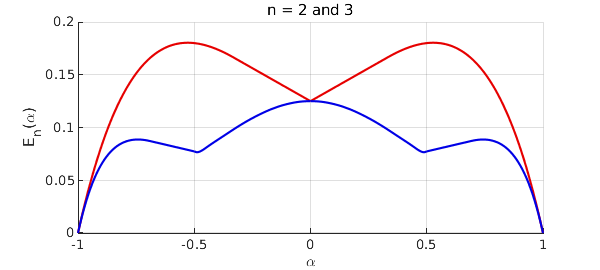
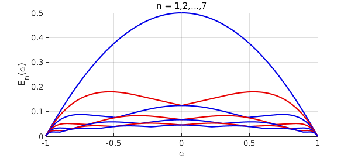

<!-- Generated by scripts/sync_chebfun_examples.py. -->
<!-- Source: https://www.chebfun.org/examples/approx/Checkmark.html -->

<h1>Approximation of the checkmark function</h1>
<h2>Nick Trefethen, January 2022 in <a href='../'>approx</a><a href='/examples/approx/Checkmark.m'>download</a>&middot;<a href='//github.com/chebfun/examples/blob/master/approx/Checkmark.m'>view on GitHub</a></h2>

A paper has appeared as arXiv:2102.09502v1 by P. D. Dragnev, A. R. Legg, and R. Orive, called "On the best uniform polynomial approximation to the checkmark function." The problem considered in this paper is degree $n$ best polynomial approximation of the function $f(x) = |x-\alpha|$ on $[-1,1]$.  The authors ask, how does the error $E_n(\alpha)$ depend on $\alpha$?

With Chebfun we can compute $E_n(\alpha)$ in a few lines of code. We do this here for $n = 1, 2, \dots , 7$.

<pre class="mcode-input">tic
x = chebfun('x');
f = @(a) abs(x-a);
p = @(a,n) minimax(f(a),n);
e = @(a,n) norm(p(a,n)-f(a),inf);
chebfuneps 1e-6, splitting on
E = [];
for n = 1:7
   en = chebfun(@(a) e(a,n),[0,1]);
   en = newDomain(join(flipud(en),en),[-1 1]);
   E = [E en];
end
chebfuneps factory, splitting off</pre>

Here is a plot for $n = 2$ and $3$, which matches Figure 1 of the paper.

<pre class="mcode-input">red = [.9 0 0]; blue = [0 0 .9];
ax = axes; ax.ColorOrder = [red; blue]; hold on
plot(E(:,2:3)), grid on
xlabel('\alpha'), ylabel('E_n(\alpha)')
title('n = 2 and 3')</pre>

As a numerical check, let us look at the breakpoints in the curve for $n=3$:

<pre class="mcode-input">[val,pos] = min(E(:,3),'local')</pre>

<pre class="mcode-output">val =
  -0.000001852321553
   0.076583110838880
   0.076583110838880
  -0.000001852321553
pos =
  -1.000000000000000
  -0.487847794735245
   0.487847794735245
   1.000000000000000
</pre>

Higher precision calculation suggests that they lie near $\pm 0.4804754$ and with an error of about $0.0763434$.

Here we plot all seven curves to match Figure 2 of Dragnev, et al.

<pre class="mcode-input">close, ax = axes; ax.ColorOrder = [blue; red]; hold on
plot(E), grid on
xlabel('\alpha'), ylabel('E_n(\alpha)')
title('n = 1,2,...,7'), ylim([0 .5]), hold off</pre>

Unfortunately, although all this is very compact and natural for Chebfun, it is quite slow, because of the need to sample a function with "splitting on" that itself can only be evaluated slowly with the <code>minimax</code> command.  This is why the Chebfun tolerance was loosened above to 1e-6.  Here is the time required for this example:

<pre class="mcode-input">toc</pre>

<pre class="mcode-output">Elapsed time is 122.492424 seconds.
</pre>

        

    

