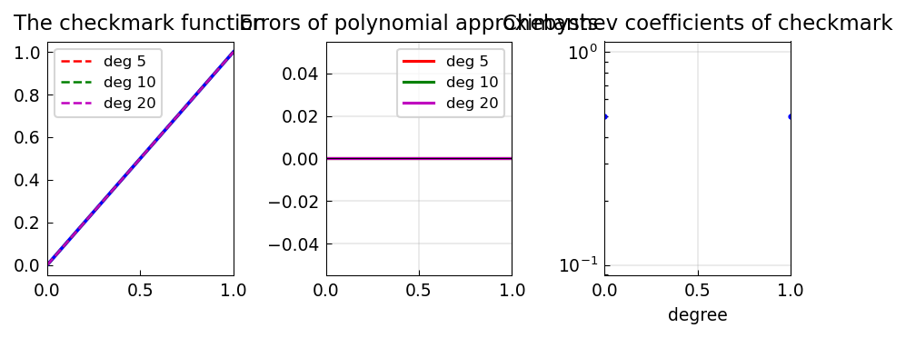

# Approximation of the Checkmark Function

*Nick Trefethen, January 2022*

[Original MATLAB Chebfun example](https://www.chebfun.org/examples/approx/Checkmark.html)

## The checkmark function

The checkmark function $f(x) = \max(x, 2x-1)$ on $[0,1]$ is piecewise linear
with a kink at $x=1/2$.  It was studied by Dragnev, Legg, and Orive (2021)
for its interesting best polynomial approximation properties.

```python
import chebfunjax as cj
import jax.numpy as jnp

f = cj.chebfun(lambda x: jnp.maximum(x, 2.0*x - 1.0), domain=(0.0, 1.0))
p10 = f.polyfit(10)
err = f - p10
print(f"degree-10 max err: {float(err.norm(float('inf'))):.4f}")
```

The error curve shows equioscillation typical of best approximants, with
clustering near the kink.



