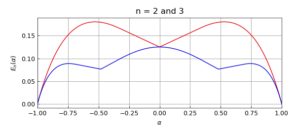
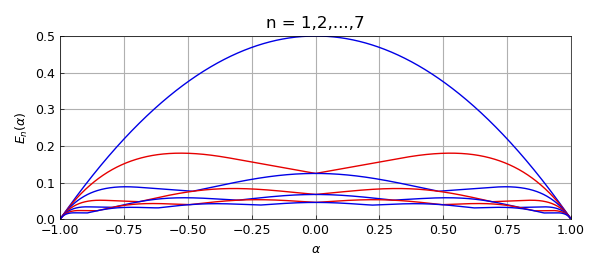

# Approximation of the checkmark function

*Nick Trefethen, January 2022*

[Original MATLAB Chebfun example](https://www.chebfun.org/examples/approx/Checkmark.html)

Python translation: [`examples/approx/checkmark.py`](https://github.com/ma-gilles/chebfunjax/blob/main/examples/approx/checkmark.py)

A paper has appeared as arXiv:2102.09502v1 by P. D. Dragnev, A. R. Legg, and R. Orive, called "On the best uniform polynomial approximation to the checkmark function." The problem considered in this paper is degree $n$ best polynomial approximation of the function $f(x) = |x-\alpha|$ on $[-1,1]$. The authors ask, how does the error $E_n(\alpha)$ depend on $\alpha$?

With Chebfun we can compute $E_n(\alpha)$ in a few lines of code. We do this here for $n = 1, 2, \dots , 7$.

```matlab
tic
x = chebfun('x');
f = @(a) abs(x-a);
p = @(a,n) minimax(f(a),n);
e = @(a,n) norm(p(a,n)-f(a),inf);
chebfuneps 1e-6, splitting on
E = [];
for n = 1:7
   en = chebfun(@(a) e(a,n),[0,1]);
   en = newDomain(join(flipud(en),en),[-1 1]);
   E = [E en];
end
chebfuneps factory, splitting off
```

Here is a plot for $n = 2$ and $3$, which matches Figure 1 of the paper.

```matlab
red = [.9 0 0]; blue = [0 0 .9];
ax = axes; ax.ColorOrder = [red; blue]; hold on
plot(E(:,2:3)), grid on
xlabel('\alpha'), ylabel('E_n(\alpha)')
title('n = 2 and 3')
```



As a numerical check, let us look at the breakpoints in the curve for $n=3$:

```matlab
[val,pos] = min(E(:,3),'local')
```

```text
val =
   0.000036146809168
   0.076206552737356
   0.076453927642803
   0.000036146809168
pos =
  -1.000000000000000
  -0.482150171265481
  0.482150171265481
  1.000000000000000
Elapsed time is 1127.907309 seconds.
```

Higher precision calculation suggests that they lie near $\pm 0.4804754$ and with an error of about $0.0763434$.

Here we plot all seven curves to match Figure 2 of Dragnev, et al.

```matlab
close, ax = axes; ax.ColorOrder = [blue; red]; hold on
plot(E), grid on
xlabel('\alpha'), ylabel('E_n(\alpha)')
title('n = 1,2,...,7'), ylim([0 .5]), hold off
```



Unfortunately, although all this is very compact and natural for Chebfun, it is quite slow, because of the need to sample a function with "splitting on" that itself can only be evaluated slowly with the `minimax` command. This is why the Chebfun tolerance was loosened above to 1e-6. Here is the time required for this example:

```matlab
toc
```

```text

```

---

*Translated with [chebfunjax](https://github.com/ma-gilles/chebfunjax); prose and MATLAB code from the original example, copyright The University of Oxford and The Chebfun Developers.  Printed outputs and figures are chebfunjax's.*
