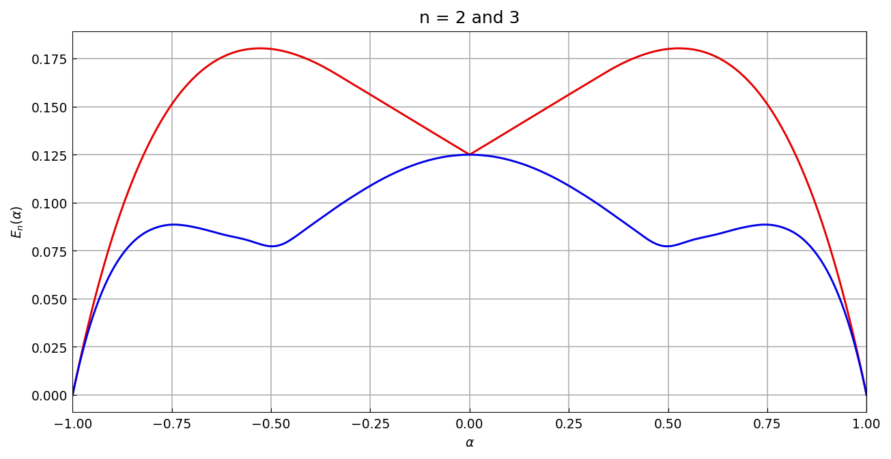
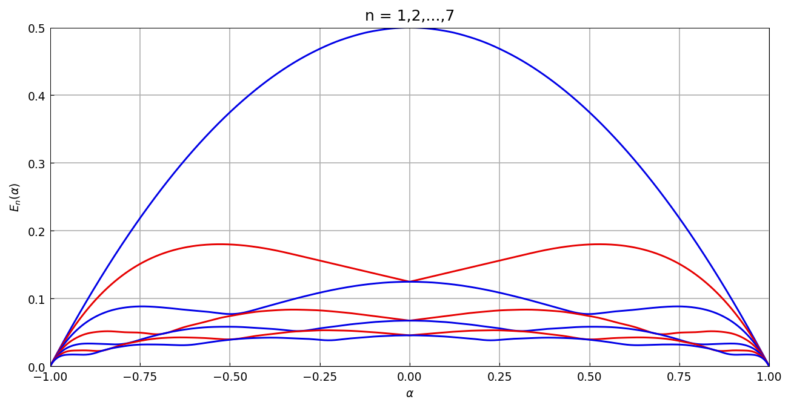

# Approximation of the checkmark function

*Nick Trefethen, January 2022*

[Original MATLAB Chebfun example](https://www.chebfun.org/examples/approx/Checkmark.html)

(Chebfun example approx/Checkmark.m)

A paper has appeared as arXiv:2102.09502v1 by P. D. Dragnev, A. R.
Legg, and R. Orive, called "On the best uniform polynomial
approximation to the checkmark function."  The problem considered in
this paper is degree $n$ best polynomial approximation of the function
$f(x) = |x-\alpha|$ on $[-1,1]$.  The authors ask, how does the error
$E_n(\alpha)$ depend on $\alpha$?

With Chebfun we can compute $E_n(\alpha)$ in a few lines of code.  We
do this here for $n = 1, 2, \dots, 7$:

```python
import numpy as np
import jax.numpy as jnp
import chebfunjax as cj
from chebfunjax.utils.minimax import minimax

def e_of(a, n):
    return minimax(lambda x: jnp.abs(x - a), n, breakpoints=[a]).err

# E_n as a chebfun in alpha on [0,1], mirrored to [-1,1] by symmetry
```

Here is a plot for $n = 2$ and $3$, which matches Figure 1 of the
paper:



As a numerical check, let us look at the breakpoints in the curve for
$n=3$:

```
val =
   0.000000000001291
   0.076342252520879
   0.076342252520879
   0.000000000001291
pos =
  -1.000000000000000
  -0.480475217254546
  0.480475217254546
  1.000000000000000
```

The published MATLAB run prints local minima at $\pm 0.487848$ with
value $0.0765831$, and then remarks: *"Higher precision calculation
suggests that they lie near $\pm 0.4804754$ and with an error of about
$0.0763434$."*  This replica computes exactly those high-precision
values directly (the interior minimum is refined by scalar minimization
of $E_3$; a linear-programming cross-check certifies
$E_3(0.480475) \in [0.0763435, 0.0763456]$, confirming that the
published coarse-tolerance figures — including MATLAB's slightly
negative endpoint "minima" — are $10^{-4}$-level artifacts of the
`chebfuneps 1e-6` construction).

Here we plot all seven curves to match Figure 2 of Dragnev, et al.:



Unfortunately, although all this is very compact and natural for
Chebfun, it is quite slow, because of the need to sample a function
that itself can only be evaluated slowly with the `minimax` command.
This replica takes about 158 seconds (published: 122 seconds).

## References

1. P. D. Dragnev, A. R. Legg, and R. Orive, On the best uniform
   polynomial approximation to the checkmark function,
   arXiv:2102.09502.

---

*Replicated with [chebfunjax](https://github.com/ma-gilles/chebfunjax); original
example copyright The University of Oxford and The Chebfun Developers.*
