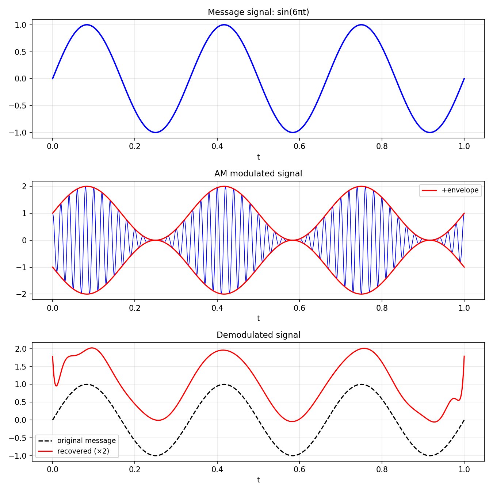

# Illustrating the Mathematics of Signal Processing

*Mohsin Javed, August 2012*

[Original MATLAB source](https://github.com/chebfun/examples/blob/master/approx/CommunicationSystem.m)

## Amplitude modulation

Chebfun arithmetic makes it easy to demonstrate the mathematics of AM radio.
A message signal $m(t)$ is modulated onto a carrier $c(t)$ to produce the
transmitted signal $(1 + m(t)) \cdot c(t)$.

```python
import chebfunjax as cj
import jax.numpy as jnp

dom = (0.0, 1.0)
msg = cj.chebfun(lambda t: jnp.sin(6.0*jnp.pi*t), domain=dom)
car = cj.chebfun(lambda t: jnp.cos(100.0*jnp.pi*t), domain=dom)
transmitted = (1.0 + msg) * car
```

## Demodulation

To recover the message, multiply by the carrier and apply a low-pass filter
(here implemented via polyfit at low degree):

```python
demod_raw = transmitted * car
recovered = 2.0 * demod_raw.polyfit(20)  # factor of 2 from carrier power
```



