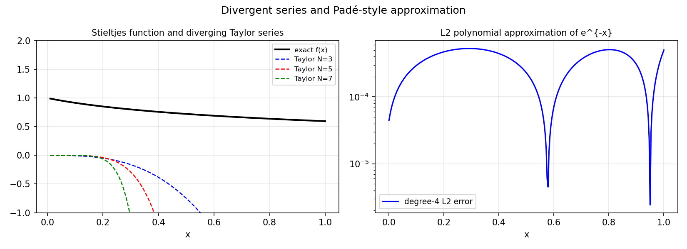

# Summing a Divergent Series

*Nick Trefethen and Stefan Guettel, April 2012*

[Original MATLAB Chebfun example](https://www.chebfun.org/examples/approx/DivergentSeries.html)

## The Stieltjes function

The function
$$f(x) = \int_0^\infty \frac{e^{-t}}{1+xt}\,dt$$
has a formal asymptotic expansion $f(x) \sim \sum_{k=0}^\infty (-1)^k k!\, x^k$,
which **diverges** for every $x \ne 0$. Yet the Padé approximants formed from
this series converge to $f$ as the degree grows!

```python
from scipy.integrate import quad
import numpy as np

def stieltjes(x):
    val, _ = quad(lambda t: np.exp(-t)/(1 + x*t), 0, 50)
    return val

print(f"f(1) = {stieltjes(1.0):.6f}")
```

Padé approximants are the rational analogue of Taylor series and capture
the true function even when the series diverges.



